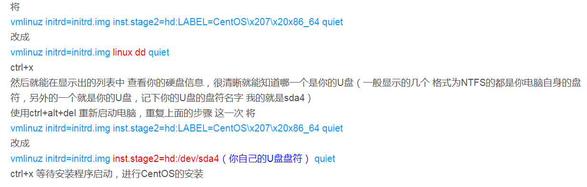

# 记一次在服务器上安装Centos7的经历

1、使用 UltraISO 做盘。

2、到机房后，找准机器，准备好键盘、鼠标和屏幕。

3、插入 U 盘，进 bios 设置 U 盘开机启动。

4、进入到 `Install Centos 7` 的安装界面，先不点安装，按下 tab 键修改配置。描述如下图：

↑ 上图写的是按 e 键，实际操作是按 tab 键，修改完后，按 enter 键。

5、进行安装系统，设置用户、磁盘和网络（要自己设置ip地址，子网掩码，网关，dns）

6、安装完成后，试着 ping 百度，如果失败，设置 ifcfg-eno 类似的文件。如果成功，即完成安装。

7、设置远程登录

8、因为不能在外部直接连接服务器，所以需要借助跳板机。

9、因为没有在服务器上设置一个普通用户，所以，下面的第 10 步操作需要在 root 下执行(在跳板机上执行 `sudo su`)，ssh 免密登录(如，`ssh node2`)也在 root下执行。

10、在服务器上设置所有服务器的主机名和 ip 地址的映射。

11、设置和跳板机的 ssh 免密登录。分别在服务器和跳板机执行 ssh-keygen，然后使机器相互间都有其公钥。

12、注意：因为机房和公司地址较远，且进入机房有权限，所以一定先做好沟通，协调好和机房管理人员的时间。

13、参考链接：

安装 Centos7:

[https://blog.csdn.net/haungzonglong/article/details/88699772?utm_medium=distribute.pc_relevant_t0.none-task-blog-2%7Edefault%7EBlogCommendFromMachineLearnPai2%7Edefault-1.control&dist_request_id=&depth_1-utm_source=distribute.pc_relevant_t0.none-task-blog-2%7Edefault%7EBlogCommendFromMachineLearnPai2%7Edefault-1.control](https://blog.csdn.net/haungzonglong/article/details/88699772?utm_medium=distribute.pc_relevant_t0.none-task-blog-2%7Edefault%7EBlogCommendFromMachineLearnPai2%7Edefault-1.control&dist_request_id=&depth_1-utm_source=distribute.pc_relevant_t0.none-task-blog-2%7Edefault%7EBlogCommendFromMachineLearnPai2%7Edefault-1.control)

[https://feiutech.blog.csdn.net/article/details/78684534?utm_medium=distribute.pc_relevant.none-task-blog-2%7Edefault%7EBlogCommendFromBaidu%7Edefault-17.control&dist_request_id=&depth_1-utm_source=distribute.pc_relevant.none-task-blog-2%7Edefault%7EBlogCommendFromBaidu%7Edefault-17.control](https://feiutech.blog.csdn.net/article/details/78684534?utm_medium=distribute.pc_relevant.none-task-blog-2%7Edefault%7EBlogCommendFromBaidu%7Edefault-17.control&dist_request_id=&depth_1-utm_source=distribute.pc_relevant.none-task-blog-2%7Edefault%7EBlogCommendFromBaidu%7Edefault-17.control)

设置远程登录：

[https://www.cnblogs.com/wangboyu/articles/11611925.html](https://www.cnblogs.com/wangboyu/articles/11611925.html)