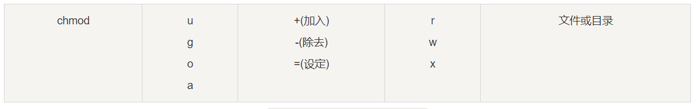

# 文件属性

[TOC]

## 1、文件基本属性

Linux 系统是一种典型的多用户系统，不同的用户处于不同的地位，拥有不同的权限。

为了保护系统的安全性，Linux 系统对不同的用户访问同一文件（包括目录文件）的权限做了不同的规定。

```sh
[root@zgg ~]# ll
总用量 4
-rw-------. 1 root root 1223 5月   8 10:41 anaconda-ks.cfg
drwxr-xr-x. 2 root root  167 8月  28 18:57 data
drwxr-xr-x. 3 root root   32 9月   3 00:33 run_env
drwxr-xr-x. 4 root root  169 9月   6 10:54 script
```
**第一个字符**代表这个文件是目录、文件或链接文件等等：

- [ d ]：目录

- [ - ]：文件

- [ l ]：链接文档(link file)

- [ b ]：装置文件里面的可供储存的接口设备(可随机存取装置)

- [ c ]：装置文件里面的串行端口设备，例如键盘、鼠标(一次性读取装置)

**接下来的字符**中，以三个为一组，且均为『rwx』 的三个参数的组合，其中：

- [ r ]：可读(read)

- [ w ]：可写(write)

- [ x ]：可执行(execute)


要注意的是：这三个权限的位置不会改变，如果没有权限，就会出现减号[ - ]而已。

**文件属性的描述如下图所示：**


- 第0位：文件类型

- 第1-3位：属主（该文件的所有者）拥有该文件的权限

- 第4-6位：属组（所有者的同组用户）拥有该文件的权限

- 第7-9位：其他用户拥有该文件的权限

		其中：
			第1、4、7位表示读权限，如果用"r"字符表示，则有读权限，如果用"-"字符表示，则没有读权限；

			第2、5、8位表示写权限，如果用"w"字符表示，则有写权限，如果用"-"字符表示没有写权限；

			第3、6、9位表示可执行权限，如果用"x"字符表示，则有执行权限，如果用"-"字符表示，则没有执行权限。

## 2、文件属主和属组

对于文件来说，它都有一个特定的所有者，也就是对该文件具有所有权的用户。

同时，**在Linux系统中，用户是按组分类的，一个用户属于一个或多个组。**

文件所有者以外的用户又可以分为文件所有者的同组用户和其他用户。

因此，Linux系统按文件所有者、文件所有者同组用户和其他用户来规定了不同的文件访问权限。

```sh
[root@www /]# ls -l
total 64
drwxr-xr-x 2 root  root  4096 Feb 15 14:46 cron
drwxr-xr-x 3 mysql mysql 4096 Apr 21  2014 mysql
……
```

mysql 文件是一个目录文件，属主和属组都为 mysql，属主有可读、可写、可执行的权限；与属主同组的其他用户有可读和可执行的权限；其他用户也有可读和可执行的权限。

对于 root 用户来说，一般情况下，文件的权限对其不起作用。

## 3、更改文件属性

### 3.1、chgrp：更改文件属组

语法：

	chgrp [-R] 属组名 文件名

参数选项

	-R：递归更改文件属组，就是在更改某个目录文件的属组时，如果加上-R的参数，那么该目录下的所有文件的属组都会更改。

### 3.2、chown：更改文件属主，也可以同时更改文件属组

语法：

	chown [–R] 属主名 文件名
	chown [-R] 属主名：属组名 文件名

进入 /root 目录将install.log的拥有者改为bin这个账号：

```sh
[root@www ~] cd ~
[root@www ~]# chown bin install.log
[root@www ~]# ls -l
-rw-r--r--  1 bin  users 68495 Jun 25 08:53 install.log
```

将install.log的拥有者与群组改回为root：

```sh
[root@www ~]# chown root:root install.log
[root@www ~]# ls -l
-rw-r--r--  1 root root 68495 Jun 25 08:53 install.log
```

### 3.3、chmod：更改文件9个属性

Linux文件属性有两种设置方法，一种是数字，一种是符号。

#### 3.3.1、数字

各权限的分数对照表如下：

- r:4

- w:2

- x:1

每种身份(owner/group/others)各自的三个权限(r/w/x)分数是需要累加的，例如当权限为： `[-rwxrwx---]` 分数则是：

- owner = rwx = 4+2+1 = 7

- group = rwx = 4+2+1 = 7

- others= --- = 0+0+0 = 0

所以等一下我们设定权限的变更时，该文件的权限数字就是770啦！

变更权限的指令chmod的语法是这样的：

	chmod [-R] xyz 文件或目录

选项与参数：

	xyz : 就是刚刚提到的数字类型的权限属性，为 rwx 属性数值的相加。
	-R : 进行递归(recursive)的持续变更，亦即连同次目录下的所有文件都会变更

举例来说，如果要将.bashrc这个文件所有的权限都设定启用，那么命令如下：

```sh
[root@www ~]# ls -al .bashrc
-rw-r--r--  1 root root 395 Jul  4 11:45 .bashrc
[root@www ~]# chmod 777 .bashrc
[root@www ~]# ls -al .bashrc
-rwxrwxrwx  1 root root 395 Jul  4 11:45 .bashrc
```
那如果要将权限变成 -rwxr-xr-- 呢？那么权限的分数就成为 [4+2+1][4+0+1][4+0+0]=754。

#### 3.3.2、符号

**`user、group、others` 分别使用 `u、g、o` 来代表三种身份的权限。此外，a 代表 all，即全部的身份。**



如果我们需要将文件权限设置为 -rwxr-xr-- ，可以使用 chmod u=rwx,g=rx,o=r 文件名 来设定:

```sh
#  touch test1    // 创建 test1 文件
# ls -al test1    // 查看 test1 默认权限
-rw-r--r-- 1 root root 0 Nov 15 10:32 test1
# chmod u=rwx,g=rx,o=r  test1    // 修改 test1 权限
# ls -al test1
-rwxr-xr-- 1 root root 0 Nov 15 10:32 test1
```
而如果是要将权限去掉而不改变其他已存在的权限呢？例如要拿掉全部人的可执行权限，则：

```sh
#  chmod  a-x test1
# ls -al test1
-rw-r--r-- 1 root root 0 Nov 15 10:32 test1
```

[原文链接](https://www.runoob.com/linux/linux-file-attr-permission.html)

[chmod命令](https://www.runoob.com/linux/linux-comm-chmod.html)