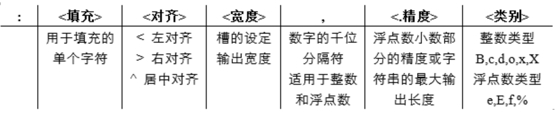

# 三种格式控制

## 1、简单使用

```python

s1 = "zhangsan:%d,lisi:%d" % (12,13) 

s2 = "zhangsan:{},lisi:{}".format(12,13)

a1 = 12;a2 = 13
s3 = f"zhangsan:{a1},lisi:{a2}"

print(s1)
print(s2)
print(s3)

# zhangsan:12,lisi:13
# zhangsan:12,lisi:13
# zhangsan:12,lisi:13

```

## 2、printf 风格的字符串格式化

	%[(name)][flags][width].[precision] typecode

- '%' 字符，用于标记转换符的起始。

- 参数的名称（可选），由加圆括号的字符序列组成 (例如 (somename))。

- 转换标记（可选），用于影响某些转换类型的结果。

- 最小字段宽度（可选）。 如果指定为 `*` (星号)，则实际宽度会从值元组的下一元素中读取，要转换的对象则为最小字段宽度和可选的精度之后的元素。

- 精度（可选），在 `.` (点号)之后加精度值的形式给出。 如果指定为 `*` (星号)，则实际精度会从值元组的下一元素中读取，要转换的对象则为精度之后的元素。

- 长度修饰符（可选）。

- 格式化符号

```python
s4 = "he has %(amount)+3.2f yuan" % {"amount":333.222}
s5 = "he has %3.2f yuan" % 333.22
print(s4)
print(s5)
# he has +333.22 yuan
# he has 333.22 yuan

```

## 3、.format字符串类型格式化

	<模板字符串>.format(<逗号分隔的参数>)

`<模板字符串>`的槽除了包括参数序号，还可以包括格式控制信息。此时，槽的内部样式如下：

	{<参数序号>: <格式控制标记>}   # 中间使用了一个冒号哦！

其中，`<格式控制标记>`用来控制参数显示时的格式，包括：`<填充><对齐><宽度><,><.精度><类型>`6 个字段，这些字段都是可选的，可以组合使用。



- <填充>：指<宽度>内除了参数外的字符采用什么方式表示，默认采用空格，可以通过<填充>更换。

- <对齐>：指参数在<宽度>内输出时的对齐方式，分别使用<、>和^三个符号表示左对齐、右对齐和居中对齐。

- <宽度>：指当前槽的设定输出字符宽度，如果该槽对应的format()参数长度比<宽度>设定值大，则使用参数实际长度。如果该值的实际位数小于指定宽度，则位数将被默认以空格字符补充。

```python
s6 = "he is a {0:*^10},has {1:#>10.2f}".format("man",3.412)
print(s6)
# he is a ***man****,has ######3.41
```

参考：[https://blog.csdn.net/qq_27825451/article/details/105652244](https://blog.csdn.net/qq_27825451/article/details/105652244)

更多示例：[https://docs.python.org/3.8/library/string.html#formatexamples](https://docs.python.org/3.8/library/string.html#formatexamples)

--------------------------------------------------------

格式化操作符辅助指令:

符号 | 功能
---  |:---
* | 定义宽度或者小数点精度
- | 用做左对齐
+ | 在正数前面显示加号( + )
`<sp>` | 在正数前面显示空格
\# | 在八进制数前面显示零('0')，在十六进制前面显示'0x'或者'0X'(取决于用的是'x'还是'X')
0 | 显示的数字前面填充'0'而不是默认的空格
% | '%%'输出一个单一的'%'
(var) | 映射变量(字典参数)
m.n. | m 是显示的最小总宽度,n 是小数点后的位数(如果可用的话)

字符串格式化符号:

符号 | 描述
---  |:---
%c | 格式化字符及其ASCII码
%s | 格式化字符串
%d | 格式化整数
%u | 格式化无符号整型
%o | 格式化无符号八进制数
%x | 格式化无符号十六进制数
%X | 格式化无符号十六进制数（大写）
%f | 格式化浮点数字，可指定小数点后的精度
%e | 用科学计数法格式化浮点数
%E | 作用同%e，用科学计数法格式化浮点数
%g | %f和%e的简写
%G | %F 和 %E 的简写
%p | 用十六进制数格式化变量的地址


[printf风格的字符串格式化中文官方文档](https://docs.python.org/zh-cn/3.8/library/stdtypes.html#printf-style-string-formatting)

[printf风格的字符串格式化英文官方文档](https://docs.python.org/3.8/library/stdtypes.html#printf-style-string-formatting)

[.format字符串类型格式化中文官方文档](https://docs.python.org/zh-cn/3.8/library/string.html#formatstrings)

[.format字符串类型格式化英文官方文档](https://docs.python.org/3.8/library/string.html#formatstrings)