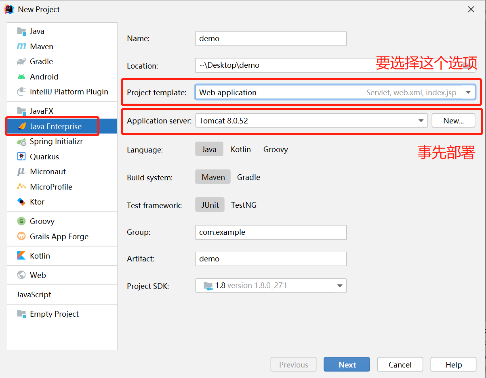
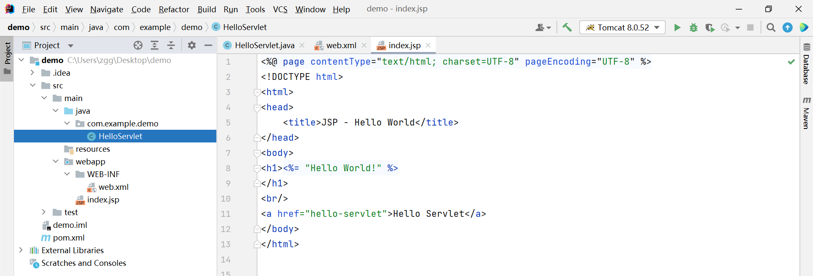
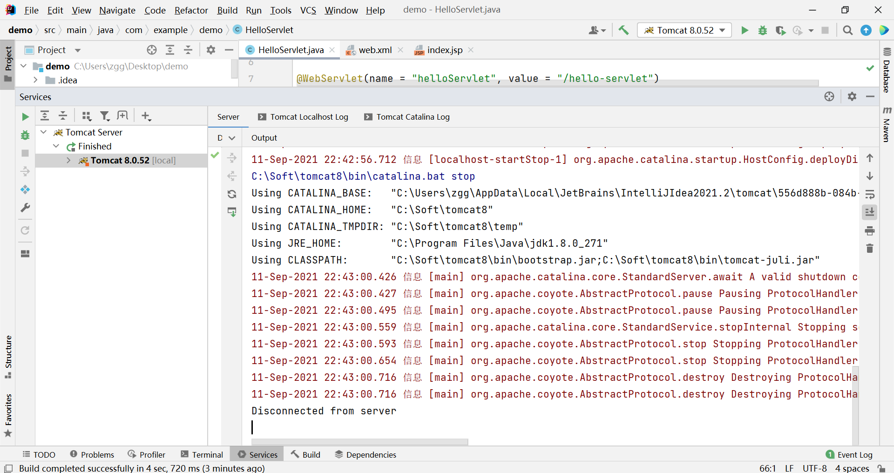
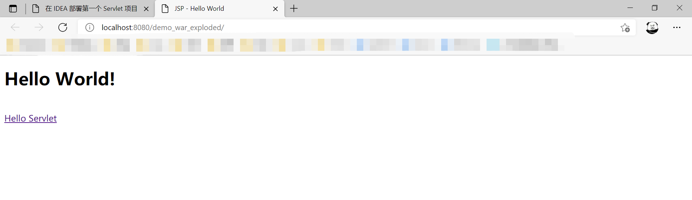
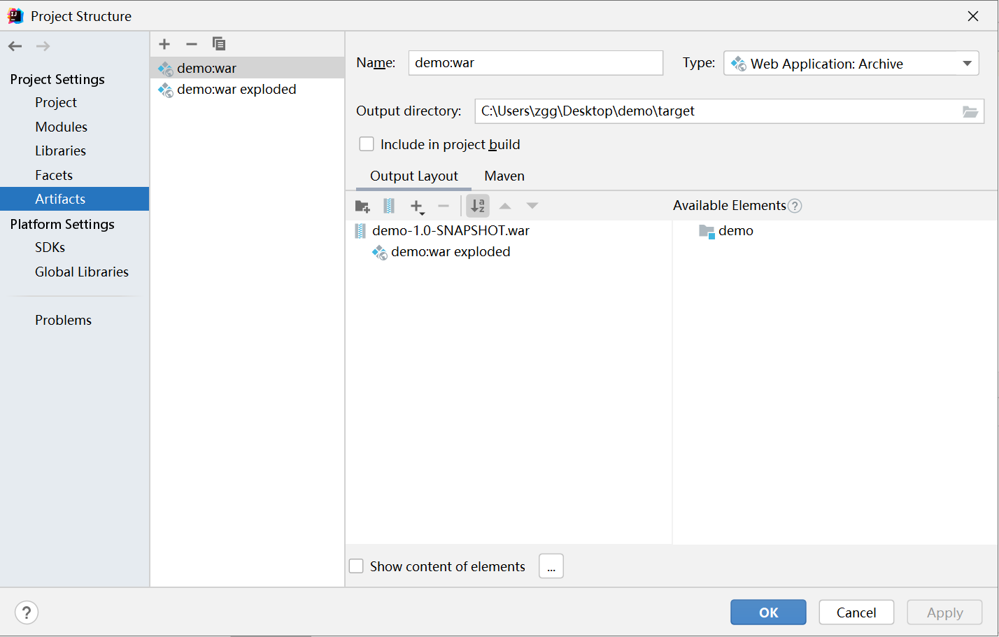
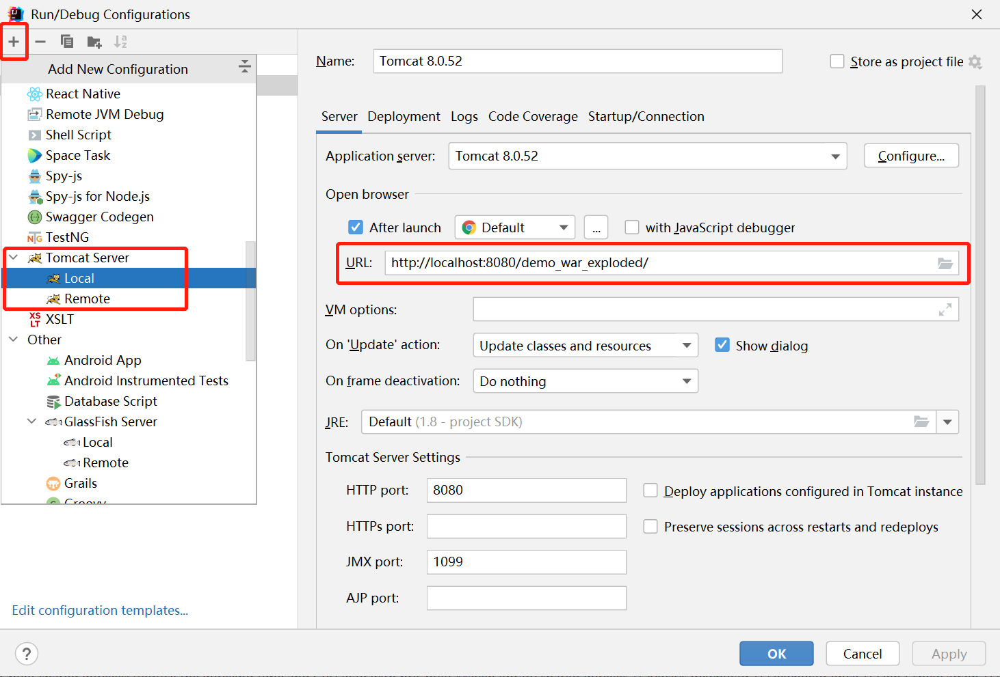
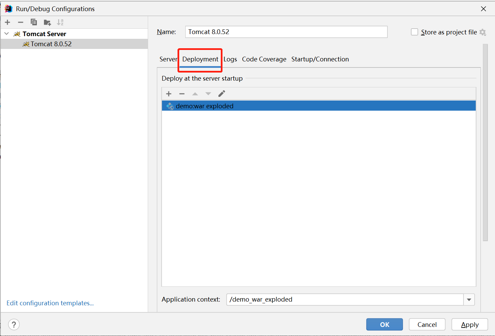

# 在 IDEA 部署第一个 Servlet 项目

注：要使用 IDEA Ultimate 版本。

新建工程，一直 next 即可。



新建后的目录结构如下：



新建后的工程，会自动创建 HelloServlet.java，此时可以直接点击 `Run --> Run 'Tomcat 8.0.52'` 执行。执行结果如下：





不过，可以执行如下几项配置：

1. 在 `Project Structure --> Artifacts` 下可以配置打包方式。

	提供了 `web application exploded` 和 `web application archive` 两种，默认选择了第一种，具体见下一条的 `Deployment` 部分。

	区别见：[https://blog.csdn.net/ejiao1233/article/details/80444845](https://blog.csdn.net/ejiao1233/article/details/80444845)



2. 在 `Run --> Edit Configurations` 下配置 Tomcat。

	因为在新建工程时已选择 Tomcat，所以这里就已存在。可以点击 `+ --> Tomcat Servers` 来添加。

	在 `Server` 选项卡中可以配置在浏览器输入的 URL 和 HTTP Port 等。

	`Deployment` 选项卡中选择前面的 Artifact。这里默认是 `web application exploded`。





3. 可以在 `WEB-INF` 目录下的 `web.xml` 文件中添加如下内容：

```xml
<servlet>
   <servlet-name>HelloServlet</servlet-name>
   <servlet-class>HelloServlet</servlet-class>
</servlet>
<servlet-mapping>
   <servlet-name>HelloServlet</servlet-name>
   <!-- 访问网址的地址的后半部分，即 http://localhost:8080/demo_war_exploded/hello-servlet-->
   <url-pattern>/hello-servlet</url-pattern>
</servlet-mapping>
```

新建的工程已在 `HelloServlet.java` 中默认添加了 `@WebServlet(name = "helloServlet", value = "/hello-servlet")`，能启到同样的效果。