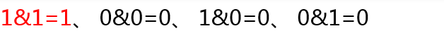
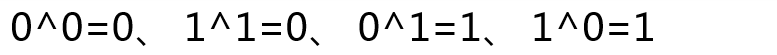

# 深入理解位运算符

在 Java 语言中，提供了7种位运算符，如下表。这些运算符当中，仅有`~`是单目运算符，其他运算符均为双目运算符。

操作符 | 描述 | 例子
---|:---|:---
＆  | 如果相对应位都是1，则结果为1，否则为0	     | (A＆B)得到12，即0000 1100
\|  | 如果相对应位都是 0，则结果为 0，否则为 1	 | (A|B)得到61，即0011 1101
^   | 如果相对应位值相同，则结果为0，否则为1	 | (A^B)得到49，即0011 0001
~	| 按位取反运算符翻转操作数的每一位，即0变成1，1变成0。| (~A)得到-61，即1100 0011
<< 	| 按位左移运算符。左操作数按位左移右操作数指定的位数。 | 	A<<2得到240，即1111 0000
>>  | 按位右移运算符。左操作数按位右移右操作数指定的位数。 | 	A>>2得到15，即1111
>>> | 	按位右移补零操作符。左操作数的值按右操作数指定的位数右移，移动得到的空位以零填充。| 	A>>>2得到15，即0000 1111

## 1、位与



如果两个二进制位上的数都是1，那么运算结果为1，其他情况运算结果均为0。


	把5和6这两个数字转换为补码；

	还要把这两个数字按位对齐；，

	一一把两个相应的二进制位上的数字进行按位与运算，运算得到的二进制串就是最终的结果；

	按照补码反向转换为十进制数字的规则，可以计算出5&6的运算结果是4；

在这里要提醒大家一句：

	进行位运算的时候，最左边的符号位也是要参与运算的。

## 2、位或


两个二进制位上的数字如果都为0，那么运算结果为0，否则运算结果是1。同按位与运算一样，符号位也要参与运算。


	把这两个数字转换成补码形式；

	把相应的二进制位上的数字进行按位或运算；

	按照规则把每一位上的数字都计算一遍后，得到二进制的运算结果是111，转换为十进制数是7。

## 3、位异或



两个二进制位上的数字如果相同，则运算结果为0，如果两个二进制位上的数字不相同，则运算结果为1。


	把这两个数字转换成补码形式；

	把相应的二进制位上的数字进行异或运算；

	按照规则把每一位上的数字都计算一遍后，得到二进制的运算结果是11，转换为十进制数是3。

### 3.1、特性

**(1)满足交换律**

`a^b` 与 `b^a` 是等价的，运算结果相同。

如果有N个变量都参与了异或运算，那么它们的位置无论如何交换，运算的结果都是相同的。

```java
    public static void main(String[] args) {

        System.out.println(5^2);  //7
        System.out.println(2^5);  //7

        System.out.println(3^5^2); //4
        System.out.println(5^3^2); //4

    }
```

**(2)任何两个相同的数字进行异或操作，所得到的结果都必然为0**

因为两个相同的数字，换算成补码后，每个二进制位上的数也都相同，再进行异或运算时，按照运算规则，每个二进制位上得到的运算结果也都是0，这N个0所组成的二进制串就是数字0的补码。

利用这个特性快速的判断两个整数是否相同。

还可以实现内存的快速清零操作，比如我们可以在代码中写上`a=a^a;`，能快速的把变量a所占据的那几个字节的内存迅速清零。

```java
    public static void main(String[] args) {

        System.out.println(3^3); //0
    }
```

**(3)对于任意一个二进制位来说，这个位上的数与0进行异或运算，运算结果与这个二进制位上的数是相同的，而与1进行异或运算，结果与这个二进制位上的数字相反**

注意，现在说的是二进制位上的数字，

所谓相反不是说原来这个位上是1，运算结果是-1，而是说原来是1，运算结果为0，原来如果是0，运算结果是1。

**(4)对于任何两个整数a和b，`a^b^b=a`**

因为b^b的结果为0，而任何一个数与0进行按位异或操作，结果仍然是这个数本身，所以，`a^b^b=a`。

这个特性还可以推出另外一个结论：对于任何两个整数a和b，`a^b^a=b`。

因为按照交换律，a^b与b^a的运算结果是一样的，所以a^b^a等价于b^a^a，这个表达式中出现了a^a，a^a的值也为0，所以整个表达式的其实就相当于b^0，最终结果还是b。

## 4、位取反

原来二进制位上如果是0，那么就变成1，反之，如果原来二进制位上是1，那么就变为0。


	把数字5转换成补码形式；

	把每个二进制位上的数字进行取反，运算结果被还原为十进制数是-6。


如果是对变量进行取反操作，那么经过操作之后，变量的值并不会发生变化！

取反运算并没有对变量重新赋值的功能，取反运算的结果只是临时保存在操作数栈中，变量本身的值不会因取反操作而发生改变。

## 5、左移

把二进制数据在内存空间中向左边移动。

例如：5<<2就表示对数字5进行左移2位的操作。


这个二进制串在内存中整体向左移动了两位，那么最左边的两位就跑到内存单元的外面去了，这两位数字将会被舍弃，右边空出的两位用0补齐。

左移运算有乘以2的N次方的效果。

一个数向左移动1位，就相当于乘以2的1次方，移动两位就相当于乘以2的2次方，也就是乘以4。

位移操作在实际运算时远远快于乘法操作，所以在某些对运算速度要求非常高的场合，可以考虑用左移代替乘以2的N次方的乘法操作。但是需要提醒大家注意三个细节：

首先：位移操作同取反操作一样，并不能改变变量本身的值，所能改变的仅是存储在操作数栈中那个数据的值：


其次：当位移的位数很多时，导致最左边的符号位发生变化，就不再具有乘以2的N次方的效果了。

比如十进制的5转换为补码形式是：前面29个0最后3位是101，如果移动29位，那么最前面的符号位就变成了1，此时运算的结果就成为了一个负数，不再是5乘以2的29次方的乘法结果。

最后：对于byte/short/int三种类型的数据，Java语言最多支持31位的位移运算，对于long类型的数据而言，最多支持63位的位移运算。这可能是因为Java语言的设计者认为位移的偏移量已经超过存储数据本身的长度，没有什么意义。


## 6、带符号右移

右移运算分为两种，分别是带符号右移和无符号右移。

带符号右移就是指当二进制串向右边移动以后，左边空出的位用“符号位上的数字”填充，说的更直白一点，如果是正数，二进制串右移的时候用0来填充左边的空位，而对于负数而言，右移的时候用1来填充左边的空位。


带符号右移也具有”类似”除以2的N次方的效果。

因为对于正数而言，带符号右移之后产生的数字确实等于除以2的N次方，但是对于负数而言，带符号右移是在除以2的N次方的结果之上还要减去1。

比如对于正5，带符号右移两位的结果是1，而对于-5，带符号右移两位的结果是-2，也就是-5被2的2次方整除再减去1的结果。

带符号右移的操作可以保证移动之前和移动之后数字的正负属性不变，原来是正数，不管移动多少位，移动之后还是正数，原来是负数，移动之后还是负数。

对于任何一个byte、short或者int类型的数据而言，带符号右移31位之后，得到的必然是0或者是-1。

对于long类型的数据而言，带符号右移63位之后，得到的也必然是0或者是-1。

能够得出这个结论的依据也很简单，就是因为对于byte、short和int类型的变量而言，如果是正数，带符号右移31位之后产生的二进制串必然全部是0，转换成对应的十进制数就是0；而对于负数而言，带符号右移31位之后产生的二进制串必然全部是1，转换成十进制数就是-1。对于long类型的数据，带符号右移63位也具有相同效果。

## 7、无符号右移

无符号右移在二进制串移动之后，空位由0来补充，与符号位是0还是1毫无关系。


对于正数而言，无符号右移和带符号右移没有什么区别，而对于负数而言，经过无符号右移会产生一个正数，因为最左边的符号位被0填充了。

## 8、一些用途

(1)判断int型变量a是奇数还是偶数 

	a&1 = 0 偶数 
	a&1 = 1 奇数 

(2)求平均值

比如有两个int类型变量x、y,首先要求x+y的和，再除以2，但是有可能x+y的结果会超过int的最大表示范围。

	(x&y)+((x^y)>>1); 

(3)对于一个大于0的整数，判断它是不是2的几次方 

	((x&(x-1))==0)&&(x!=0);

(4)比如有两个int类型变量x、y,要求两者数字交换，位运算的实现方法：

	x ^= y; 
	y ^= x; 
	x ^= y; 

(5)求绝对值 

	int abs( int x ) { 
		int y ; 
		y = x >> 31 ; 
		return (x^y)-y ; //or: (x+y)^y 
	} 

(6)取模运算，采用位运算

	a % (2^n) 等价于 a & (2^n - 1) 

(7)乘法运算，采用位运算

	a * (2^n) 等价于 a << n 

(8) 除法运算，采用位运算 

	a / (2^n) 等价于 a>> n 

(9)求相反数 

	(~x+1) 

(10) a % 2 等价于 a & 1


原文链接：[https://zhuanlan.zhihu.com/p/106893096](https://zhuanlan.zhihu.com/p/106893096)、[https://blog.csdn.net/yejun940864018/article/details/84736836](https://blog.csdn.net/yejun940864018/article/details/84736836)