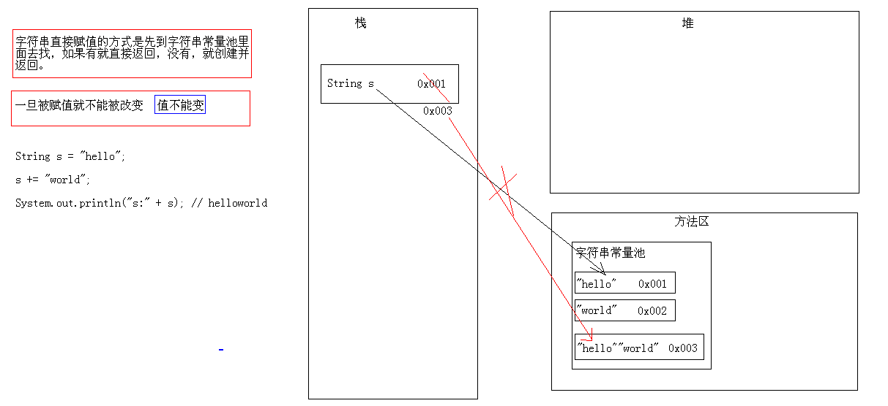

# 类：String、StringBuffer

[TOC]

## 1、String类

字符串是由多个字符组成的一串数据(字符序列)

字符串可以看成是字符数组

	A:字符串字面值"abc"也可以看成是一个字符串对象。
	B:字符串是常量，一旦被赋值，就不能被改变。

### 1.1、构造方法

	public String():空构造
	public String(byte[] bytes):把字节数组转成字符串
	public String(byte[] bytes,int index,int length):把字节数组的一部分转成字符串
	public String(char[] value):把字符数组转成字符串
	public String(char[] value,int index,int count):把字符数组的一部分转成字符串
	public String(String original):把字符串常量值转成字符串

```java
public static void main(String[] args) {
	// public String():空构造
	String s1 = new String();
	System.out.println("s1:" + s1);
	System.out.println("s1.length():" + s1.length());
	System.out.println("--------------------------");

	// public String(byte[] bytes):把字节数组转成字符串
	byte[] bys = { 97, 98, 99, 100, 101 };
	String s2 = new String(bys);
	System.out.println("s2:" + s2);
	System.out.println("s2.length():" + s2.length());
	System.out.println("--------------------------");

	// public String(byte[] bytes,int index,int length):把字节数组的一部分转成字符串
	// 我想得到字符串"bcd"
	String s3 = new String(bys, 1, 3);
	System.out.println("s3:" + s3);
	System.out.println("s3.length():" + s3.length());
	System.out.println("--------------------------");

	// public String(char[] value):把字符数组转成字符串
	char[] chs = { 'a', 'b', 'c', 'd', 'e', '爱', '林', '亲' };
	String s4 = new String(chs);
	System.out.println("s4:" + s4);
	System.out.println("s4.length():" + s4.length());
	System.out.println("--------------------------");

	// public String(char[] value,int index,int count):把字符数组的一部分转成字符串
	String s5 = new String(chs, 2, 4);
	System.out.println("s5:" + s5);
	System.out.println("s5.length():" + s5.length());
	System.out.println("--------------------------");
		
	//public String(String original):把字符串常量值转成字符串
	String s6 = new String("abcde");
	System.out.println("s6:" + s6);
	System.out.println("s6.length():" + s6.length());
	System.out.println("--------------------------");
		
	//字符串字面值"abc"也可以看成是一个字符串对象。
	String s7 = "abcde";
	System.out.println("s7:"+s7);
	System.out.println("s7.length():"+s7.length());
}
```
### 1.2、面试题

（1）String s = “hello”; s += “world”; 问s的结果是多少?

```java
public static void main(String[] args) {
	String s = "hello";
	s += "world";
	System.out.println("s:" + s); // helloworld
	}

```




（2）String s = new String(“hello”)和String s = “hello”;的区别?

```java
public static void main(String[] args) {
	String s1 = new String("hello");
	String s2 = "hello";

	System.out.println(s1 == s2);// false
	System.out.println(s1.equals(s2));// true
	}
```
参考上图：有。前者会创建2个对象，后者创建1个对象。

（3）字符串比较之看程序写结果

```java
public static void main(String[] args) {
	String s1 = new String("hello");
	String s2 = new String("hello");
	System.out.println(s1 == s2);// false
	System.out.println(s1.equals(s2));// true

	String s3 = new String("hello");
	String s4 = "hello";
	System.out.println(s3 == s4);// false
	System.out.println(s3.equals(s4));// true

	String s5 = "hello";
	String s6 = "hello";
	System.out.println(s5 == s6);// true
	System.out.println(s5.equals(s6));// true
	}
```
（4）字符串拼接之看程序写结果

```java
public static void main(String[] args) {
	String s1 = "hello";
	String s2 = "world";
	String s3 = "helloworld";
	System.out.println(s3 == s1 + s2);// false
	System.out.println(s3.equals((s1 + s2)));// true

	System.out.println(s3 == "hello" + "world");// true
	System.out.println(s3.equals("hello" + "world"));// true

	// 通过反编译看源码，我们知道这里已经做好了处理。
	// System.out.println(s3 == "helloworld");
	// System.out.println(s3.equals("helloworld"));
	}
```
字符串如果是变量相加，先开空间，在拼接。

字符串如果是常量相加，是先加，然后在常量池找，如果有就直接返回，否则，就创建。

### 1.3、成员方法

```java
/*
 * String类的判断功能：
 * boolean equals(Object obj):比较字符串的内容是否相同,区分大小写
 * boolean equalsIgnoreCase(String str):比较字符串的内容是否相同,忽略大小写
 * boolean contains(String str):判断大字符串中是否包含小字符串
 * boolean startsWith(String str):判断字符串是否以某个指定的字符串开头
 * boolean endsWith(String str):判断字符串是否以某个指定的字符串结尾
 * boolean isEmpty():判断字符串是否为空。
 * 
 * 注意：
 * 		字符串内容为空和字符串对象为空。
 * 		String s = "";
 * 		String s = null;
 */
public class StringDemo {
	public static void main(String[] args) {
		// 创建字符串对象
		String s1 = "helloworld";
		String s2 = "helloworld";
		String s3 = "HelloWorld";

		// boolean equals(Object obj):比较字符串的内容是否相同,区分大小写
		System.out.println("equals:" + s1.equals(s2));
		System.out.println("equals:" + s1.equals(s3));
		System.out.println("-----------------------");

		// boolean equalsIgnoreCase(String str):比较字符串的内容是否相同,忽略大小写
		System.out.println("equals:" + s1.equalsIgnoreCase(s2));
		System.out.println("equals:" + s1.equalsIgnoreCase(s3));
		System.out.println("-----------------------");

		// boolean contains(String str):判断大字符串中是否包含小字符串
		System.out.println("contains:" + s1.contains("hello"));
		System.out.println("contains:" + s1.contains("hw"));
		System.out.println("-----------------------");

		// boolean startsWith(String str):判断字符串是否以某个指定的字符串开头
		System.out.println("startsWith:" + s1.startsWith("h"));
		System.out.println("startsWith:" + s1.startsWith("hello"));
		System.out.println("startsWith:" + s1.startsWith("world"));
		System.out.println("-----------------------");

		// boolean isEmpty():判断字符串是否为空。
		System.out.println("isEmpty:" + s1.isEmpty());

		String s4 = "";
		String s5 = null;
		System.out.println("isEmpty:" + s4.isEmpty());
		// NullPointerException
		// s5对象都不存在，所以不能调用方法，空指针异常
		System.out.println("isEmpty:" + s5.isEmpty());
	}
}
```

```java
/*
 * String类的获取功能
 * int length():获取字符串的长度。
 * char charAt(int index):获取指定索引位置的字符
 * int indexOf(int ch):返回指定字符在此字符串中第一次出现处的索引。
 * 		为什么这里是int类型，而不是char类型?
 * 		原因是：'a'和97其实都可以代表'a'
 * int indexOf(String str):返回指定字符串在此字符串中第一次出现处的索引。
 * int indexOf(int ch,int fromIndex):返回指定字符在此字符串中从指定位置后第一次出现处的索引。
 * int indexOf(String str,int fromIndex):返回指定字符串在此字符串中从指定位置后第一次出现处的索引。
 * String substring(int start):从指定位置开始截取字符串,默认到末尾,包含start这个索引。
 * String substring(int start,int end):从指定位置开始到指定位置结束截取字符串,包括start索引但是不包end索引。
 */
public class StringDemo {
	public static void main(String[] args) {
		// 定义一个字符串对象
		String s = "helloworld";

		// int length():获取字符串的长度。
		System.out.println("s.length:" + s.length());
		System.out.println("----------------------");

		// char charAt(int index):获取指定索引位置的字符
		System.out.println("charAt:" + s.charAt(7));
		System.out.println("----------------------");

		// int indexOf(int ch):返回指定字符在此字符串中第一次出现处的索引。
		System.out.println("indexOf:" + s.indexOf('l'));
		System.out.println("----------------------");

		// int indexOf(String str):返回指定字符串在此字符串中第一次出现处的索引。
		System.out.println("indexOf:" + s.indexOf("owo"));
		System.out.println("----------------------");

		// int indexOf(int ch,int fromIndex):返回指定字符在此字符串中从指定位置后第一次出现处的索引。
		System.out.println("indexOf:" + s.indexOf('l', 4));
		System.out.println("indexOf:" + s.indexOf('k', 4)); // -1
		System.out.println("indexOf:" + s.indexOf('l', 40)); // -1
		System.out.println("----------------------");

		// String substring(int start):从指定位置开始截取字符串,默认到末尾。包含start这个索引
		System.out.println("substring:" + s.substring(5));
		System.out.println("substring:" + s.substring(0));
		System.out.println("----------------------");

		// String substring(int start,int
		// end):从指定位置开始到指定位置结束截取字符串。包括start索引但是不包end索引
		System.out.println("substring:" + s.substring(3, 8));
		System.out.println("substring:" + s.substring(0, s.length()));
	}
}
```
```java
for (int x = 0; x < s.length(); x++) {
	// char ch = s.charAt(x);
	// System.out.println(ch);
	// 仅仅是输出，我就直接输出了
	System.out.println(s.charAt(x));
}
```

```java
/*
 * String的转换功能：
 * byte[] getBytes():把字符串转换为字节数组。
 * char[] toCharArray():把字符串转换为字符数组。
 * static String valueOf(char[] chs):把字符数组转成字符串。
 * static String valueOf(int i):把int类型的数据转成字符串。
 * 		注意：String类的valueOf方法可以把任意类型的数据转成字符串。（包括引用类型）
 * String toLowerCase():把字符串转成小写。
 * String toUpperCase():把字符串转成大写。
 * String concat(String str):把字符串拼接。
 */
public class StringDemo {
	public static void main(String[] args) {
		// 定义一个字符串对象
		String s = "JavaSE";

		// byte[] getBytes():把字符串转换为字节数组。输出对应的ascii码
		byte[] bys = s.getBytes();
		for (int x = 0; x < bys.length; x++) {
			System.out.println(bys[x]);
		}
		System.out.println("----------------");

		// char[] toCharArray():把字符串转换为字符数组。
		char[] chs = s.toCharArray();
		for (int x = 0; x < chs.length; x++) {
			System.out.println(chs[x]);
		}
		System.out.println("----------------");

		// static String valueOf(char[] chs):把字符数组转成字符串。
		String ss = String.valueOf(chs);
		System.out.println(ss);
		System.out.println("----------------");

		// static String valueOf(int i):把int类型的数据转成字符串。
		int i = 100;
		String sss = String.valueOf(i);
		System.out.println(sss);
		System.out.println("----------------");

		// String toLowerCase():把字符串转成小写。
		System.out.println("toLowerCase:" + s.toLowerCase());
		System.out.println("s:" + s);
		// System.out.println("----------------");
		// String toUpperCase():把字符串转成大写。
		System.out.println("toUpperCase:" + s.toUpperCase());
		System.out.println("----------------");

		// String concat(String str):把字符串拼接。
		String s1 = "hello";
		String s2 = "world";
		String s3 = s1 + s2;
		String s4 = s1.concat(s2);
		System.out.println("s3:"+s3);
		System.out.println("s4:"+s4);
	}
}

```

```java
/*
 * String类的其他功能：
 * 
 * 替换功能：
 * String replace(char old,char new)
 * String replace(String old,String new)
 *
 * 去除字符串两空格	
 * String trim()
 * 
 * 按字典顺序比较两个字符串  
 * int compareTo(String str)
 * int compareToIgnoreCase(String str)
 */
public class StringDemo {
	public static void main(String[] args) {
		// 替换功能
		String s1 = "helloworld";
		String s2 = s1.replace('l', 'k');
		String s3 = s1.replace("owo", "ak47");
		System.out.println("s1:" + s1);
		System.out.println("s2:" + s2);
		System.out.println("s3:" + s3);
		System.out.println("---------------");

		// 去除字符串两空格
		String s4 = " hello world  ";
		String s5 = s4.trim();
		System.out.println("s4:" + s4 + "---");
		System.out.println("s5:" + s5 + "---");

		// 按字典顺序比较两个字符串
		String s6 = "hello";
		String s7 = "hello";
		String s8 = "abc";
		String s9 = "xyz";
		System.out.println(s6.compareTo(s7));// 0
		System.out.println(s6.compareTo(s8));// 7
		System.out.println(s6.compareTo(s9));// -16
	}
}

```
### 1.4、String类的compareTo方法的源码解析

```java
private final char value[];
  
//字符串会自动转换为一个字符数组。
  
public int compareTo(String anotherString) {
	//this -- s1 -- "hello"
	//anotherString -- s2 -- "hel"
  
	int len1 = value.length; //this.value.length--s1.toCharArray().length--5
	int len2 = anotherString.value.length;//s2.value.length -- s2.toCharArray().length--3
	int lim = Math.min(len1, len2); //Math.min(5,3); -- lim=3;
	char v1[] = value; //s1.toCharArray()
	char v2[] = anotherString.value;
        
	//char v1[] = {'h','e','l','l','o'};
	//char v2[] = {'h','e','l'};

	int k = 0;
	while (k < lim) {
		char c1 = v1[k]; //c1='h','e','l'
		char c2 = v2[k]; //c2='h','e','l'
		if (c1 != c2) {
			return c1 - c2;
		}
		k++;
	}
	return len1 - len2; //5-3=2;
}
	
	//两个字符串长度不同，返回长度差值。
	//相同的话，依次比较对应位上的字符的ascii码，遇到不同的，就返回其差值。
	String s1 = "hello";
	String s2 = "hel";
	System.out.println(s1.compareTo(s2)); // 2
```
### 1.5、案例

```java
/*
 * 字符串反转
 * 举例：键盘录入”abc”		
 * 输出结果：”cba”
 * 
 * 分析：
 * 		A:键盘录入一个字符串
 * 		B:定义一个新字符串
 * 		C:倒着遍历字符串，得到每一个字符
 * 			a:length()和charAt()结合
 * 			b:把字符串转成字符数组
 * 		D:用新字符串把每一个字符拼接起来
 * 		E:输出新串
 */
public class StringTest3 {
	public static void main(String[] args) {
		// 键盘录入一个字符串
		Scanner sc = new Scanner(System.in);
		System.out.println("请输入一个字符串：");
		String line = sc.nextLine();

		String s = myReverse(line);
		System.out.println("实现功能后的结果是：" + s);
	}

	/*
	 * 两个明确： 返回值类型：String 参数列表：String
	 */
	public static String myReverse(String s) {
		// 定义一个新字符串
		String result = "";

		// 把字符串转成字符数组
		char[] chs = s.toCharArray();

		// 倒着遍历字符串，得到每一个字符
		for (int x = chs.length - 1; x >= 0; x--) {
			// 用新字符串把每一个字符拼接起来
			result += chs[x];
		}
		return result;
	}
}

```

```java
/*
 * 统计大串中小串出现的次数
 * 举例：
 * 		在字符串"woaijavawozhenaijavawozhendeaijavawozhendehenaijavaxinbuxinwoaijavagun"
 * 结果：
 * 		java出现了5次
 * 
 * 分析：
 * 		前提：是已经知道了大串和小串。
 * 
 * 		A:定义一个统计变量，初始化值是0
 * 		B:先在大串中查找一次小串第一次出现的位置
 * 			a:索引是-1，说明不存在了，就返回统计变量
 * 			b:索引不是-1，说明存在，统计变量++
 * 		C:把刚才的索引+小串的长度作为开始位置截取上一次的大串，返回一个新的字符串，并把该字符串的值重新赋值给大串
 * 		D:回到B
 */
public class StringTest4 {
	public static void main(String[] args) {
		// 定义大串
		String maxString = "woaijavawozhenaijavawozhendeaijavawozhendehenaijavaxinbuxinwoaijavagun";
		// 定义小串
		String minString = "java";

		// 写功能实现
		int count1 = getCount1(maxString, minString);
		int count2 = getCount2(maxString, minString);

		System.out.println("Java在大串中出现了：" + count1 + "次");
		System.out.println("Java在大串中出现了：" + count2 + "次");

	}

	/*
	 * 两个明确： 返回值类型：int 参数列表：两个字符串
	 */
	//循环
	public static int getCount1(String maxString, String minString) {
		// 定义一个统计变量，初始化值是0
		int count = 0;

		// 先在大串中查找一次小串第一次出现的位置
		int index = maxString.indexOf(minString);

		// 索引不是-1，说明存在，统计变量++
		while (index != -1) {
			count++;
			// 把刚才的索引+小串的长度作为开始位置截取上一次的大串，返回一个新的字符串，并把该字符串的值重新赋值给大串
			int startIndex = index + minString.length();
			maxString = maxString.substring(startIndex);
			// 继续查
			index = maxString.indexOf(minString);
		}

		return count;
	}
	//优化
	public static int getCount2(String maxString, String minString) {
		// 定义一个统计变量，初始化值是0
		int count = 0;
		int index;
		//先查，赋值，判断
		while((index=maxString.indexOf(minString))!=-1){
			count++;
			maxString = maxString.substring(index + minString.length());
		}

		return count;
}

```

## 2、StringBuffer类

我们如果对字符串进行拼接操作，每次拼接，都会构建一个新的String对象，既耗时，又浪费空间。而StringBuffer就可以解决这个问题

线程安全的可变字符序列

### 2.1、构造方法

```java
/*
 * 线程安全(多线程讲解)
 * 安全 -- 同步 -- 一次只做一件事 --数据是安全的
 * 不安全 -- 不同步 -- 中间做插入其他事 -- 效率高一些
 * 安全和效率问题是永远困扰我们的问题。
 * 安全：医院的网站，银行网站
 * 效率：新闻网站，论坛之类的
 * 
 * StringBuffer:
 * 		线程安全的可变字符串。
 * 
 * StringBuffer和String的区别?
 * 前者长度和内容可变，后者不可变。
 * 如果使用前者做字符串的拼接，不会浪费太多的资源。
 * 
 * StringBuffer的构造方法：
 * 		public StringBuffer():无参构造方法，其初始容量为 16 个字符。
 *		public StringBuffer(int capacity):指定容量的字符串缓冲区对象
 *		public StringBuffer(String str):指定字符串内容的字符串缓冲区对象。
 *                                      该字符串的初始容量为 16 加上字符串参数的长度。
 *
 * StringBuffer的方法：
 *		public int capacity()：返回当前容量。容量指可用于最新插入的字符的存储量，超过这一容量就需要再次进行分配。 	理论值
 *		public int length():返回长度（字符数）。 实际值
 */
public class StringBufferDemo {
	public static void main(String[] args) {
		// public StringBuffer():无参构造方法
		StringBuffer sb = new StringBuffer();
		System.out.println("sb:" + sb);
		System.out.println("sb.capacity():" + sb.capacity()); //16 
		System.out.println("sb.length():" + sb.length());  //0
		System.out.println("--------------------------");

		// public StringBuffer(int capacity):指定容量的字符串缓冲区对象
		StringBuffer sb2 = new StringBuffer(50);
		System.out.println("sb2:" + sb2);
		System.out.println("sb2.capacity():" + sb2.capacity());  //50
		System.out.println("sb2.length():" + sb2.length()); //0
		System.out.println("--------------------------");

		// public StringBuffer(String str):指定字符串内容的字符串缓冲区对象
		StringBuffer sb3 = new StringBuffer("hello");
		System.out.println("sb3:" + sb3);
		System.out.println("sb3.capacity():" + sb3.capacity());  //21
		System.out.println("sb3.length():" + sb3.length()); //5
	}
}
```
### 2.2、成员方法

添加功能

```java
/*
 * public StringBuffer append(String str):
 *   可以把任意类型数据追加到字符串缓冲区里面,并返回字符串缓冲区本身
 * 
 * public StringBuffer insert(int offset,String str):
 *   在指定位置把任意类型的数据插入到字符串缓冲区里面,并返回字符串缓冲区本身
 */
public class StringBufferDemo {
	public static void main(String[] args) {
		// 创建字符串缓冲区对象
		StringBuffer sb = new StringBuffer();

		// public StringBuffer append(String str)
		// StringBuffer sb2 = sb.append("hello");
		// System.out.println("sb:" + sb);
		// System.out.println("sb2:" + sb2);
		// System.out.println(sb == sb2); // true

		// 一步一步的添加数据
		// sb.append("hello");
		// sb.append(true);
		// sb.append(12);
		// sb.append(34.56);

		// 链式编程
		sb.append("hello").append(true).append(12).append(34.56);
		System.out.println("sb:" + sb);

		// public StringBuffer insert(int offset,String
		// str):在指定位置把任意类型的数据插入到字符串缓冲区里面,并返回字符串缓冲区本身
		sb.insert(5, "world");
		System.out.println("sb:" + sb);
	}
}

```
删除功能

```java
/*
 * public StringBuffer deleteCharAt(int index):
 *		删除指定位置的字符，并返回本身
 * public StringBuffer delete(int start,int end):
 *		删除从指定位置开始指定位置结束的内容，并返回本身
 */
public class StringBufferDemo {
	public static void main(String[] args) {
		// 创建对象
		StringBuffer sb = new StringBuffer();

		// 添加功能
		sb.append("hello").append("world").append("java");
		System.out.println("sb:" + sb);

		// public StringBuffer deleteCharAt(int index):删除指定位置的字符，并返回本身
		// 需求：我要删除e这个字符，肿么办?
		// sb.deleteCharAt(1);
		// 需求:我要删除第一个l这个字符，肿么办?
		// sb.deleteCharAt(1);

		// public StringBuffer delete(int start,int
		// end):删除从指定位置开始指定位置结束的内容，并返回本身
		// 需求：我要删除world这个字符串，肿么办?
		// sb.delete(5, 10);

		// 需求:我要删除所有的数据
		sb.delete(0, sb.length());

		System.out.println("sb:" + sb);
	}
}
```
替换功能

```java
/*
 * StringBuffer的替换功能：
 * public StringBuffer replace(int start,int end,String str):
 *	 从start开始到end用str替换
 */
public class StringBufferDemo {
	public static void main(String[] args) {
		// 创建字符串缓冲区对象
		StringBuffer sb = new StringBuffer();

		// 添加数据
		sb.append("hello");
		sb.append("world");
		sb.append("java");
		System.out.println("sb:" + sb);

		// public StringBuffer replace(int start,int end,String
		// str):从start开始到end用str替换
		// 需求：我要把world这个数据替换为"节日快乐"
		sb.replace(5, 10, "节日快乐");
		System.out.println("sb:" + sb);
	}
}

```
反转功能

```java
/*
 * public StringBuffer reverse()
 */
public class StringBufferDemo {
	public static void main(String[] args) {
		// 创建字符串缓冲区对象
		StringBuffer sb = new StringBuffer();

		// 添加数据
		sb.append("霞青林爱我");
		System.out.println("sb:" + sb);

		// public StringBuffer reverse()
		sb.reverse();
		System.out.println("sb:" + sb);
	}
}
```
截取功能

```java
/*
 * 注意返回值类型不再是StringBuffer本身了
 * public String substring(int start)
 * public String substring(int start,int end)
 */
public class StringBufferDemo {
	public static void main(String[] args) {
		// 创建字符串缓冲区对象
		StringBuffer sb = new StringBuffer();

		// 添加元素
		sb.append("hello").append("world").append("java");
		System.out.println("sb:" + sb);

		// 截取功能
		// public String substring(int start)
		String s = sb.substring(5);
		System.out.println("s:" + s);
		System.out.println("sb:" + sb);

		// public String substring(int start,int end)
		String ss = sb.substring(5, 10);
		System.out.println("ss:" + ss);
		System.out.println("sb:" + sb);
	}
}

```

### 2.3、案例

String和StringBuffer的相互转换

String --> StringBuffer

	方式1:通过构造方法
	方式2：通过append()方法

StringBuffer --> String

	方式1:通过构造方法
	方式2：通过toString()方法

```java
public class StringBufferTest {
	public static void main(String[] args) {
		// String -- StringBuffer
		String s = "hello";
		// 注意：不能把字符串的值直接赋值给StringBuffer
		// StringBuffer sb = "hello";
		// StringBuffer sb = s;
		// String --> StringBuffer  方式1:通过构造方法
		StringBuffer sb = new StringBuffer(s);
		// String --> StringBuffer  方式2：通过append()方法
		StringBuffer sb2 = new StringBuffer();
		sb2.append(s);
		System.out.println("sb:" + sb);
		System.out.println("sb2:" + sb2);
		System.out.println("---------------");

		// StringBuffer -- String
		StringBuffer buffer = new StringBuffer("java");
		// String(StringBuffer buffer)
		// StringBuffer --> String  方式1:通过构造方法
		String str = new String(buffer);
		// StringBuffer --> String  方式2：通过toString()方法
		String str2 = buffer.toString();
		System.out.println("str:" + str);
		System.out.println("str2:" + str2);
	}
}

```

把数组拼接成一个字符串

```java
public class StringBufferTest2 {
	public static void main(String[] args) {
		// 定义一个数组
		int[] arr = { 44, 33, 55, 11, 22 };

		// 定义功能
		// 方式1：用String做拼接的方式
		String s1 = arrayToString(arr);
		System.out.println("s1:" + s1);

		// 方式2:用StringBuffer做拼接的方式
		String s2 = arrayToString2(arr);
		System.out.println("s2:" + s2);
	}

	// 用StringBuffer做拼接的方式
	public static String arrayToString2(int[] arr) {
		StringBuffer sb = new StringBuffer();

		sb.append("[");
		for (int x = 0; x < arr.length; x++) {
			if (x == arr.length - 1) {
				sb.append(arr[x]);
			} else {
				sb.append(arr[x]).append(", ");
			}
		}
		sb.append("]");

		return sb.toString();
	}

	// 用String做拼接的方式
	public static String arrayToString(int[] arr) {
		String s = "";

		s += "[";
		for (int x = 0; x < arr.length; x++) {
			if (x == arr.length - 1) {
				s += arr[x];
			} else {
				s += arr[x];
				s += ", ";
			}
		}
		s += "]";

		return s;
	}
}

```
把字符串反转

```java
import java.util.Scanner;

public class StringBufferTest3 {
	public static void main(String[] args) {
		// 键盘录入数据
		Scanner sc = new Scanner(System.in);
		System.out.println("请输入数据：");
		String s = sc.nextLine();

		// 方式1：用String做拼接
		String s1 = myReverse(s);
		System.out.println("s1:" + s1);
		// 方式2：用StringBuffer的reverse()功能
		String s2 = myReverse2(s);
		System.out.println("s2:" + s2);
	}

	// 用StringBuffer的reverse()功能
	public static String myReverse2(String s) {

		return new StringBuffer(s).reverse().toString();
	}

	// 用String做拼接
	public static String myReverse(String s) {
		String result = "";

		char[] chs = s.toCharArray();
		for (int x = chs.length - 1; x >= 0; x--) {
			result += chs[x];
		}

		return result;
	}
}

```

判断一个字符串是否是对称字符串

```java
import java.util.Scanner;

/*
 * 例如"abc"不是对称字符串，"aba"、"abba"、"aaa"、"mnanm"是对称字符串
 * 
 * 分析：
 * 		判断一个字符串是否是对称的字符串，我只需要把
 * 			第一个和最后一个比较
 * 			第二个和倒数第二个比较
 * 			...
 * 		比较的次数是长度除以2。
 */
public class StringBufferTest4 {
	public static void main(String[] args) {
		// 创建键盘录入对象
		Scanner sc = new Scanner(System.in);
		System.out.println("请输入一个字符串：");
		String s = sc.nextLine();

		// 一个一个的比较
		boolean b = isSame(s);
		System.out.println("b:" + b);
		
		//用字符串缓冲区的反转功能
		boolean b2 = isSame2(s);
		System.out.println("b2:"+b2);
	}
	
	public static boolean isSame2(String s) {
		return new StringBuffer(s).reverse().toString().equals(s);
	}
	
	public static boolean isSame(String s) {
		boolean flag = true;

		// 把字符串转成字符数组
		char[] chs = s.toCharArray();

		for (int start = 0, end = chs.length - 1; start <= end; start++, end--) {
			if (chs[start] != chs[end]) {
				flag = false;
				break;
			}
		}

		return flag;
	}
}

```
### 2.4、面试题

```java
/*
 * 面试题：
 * 1：String,StringBuffer,StringBuilder的区别?
 * A:String是内容不可变的，而StringBuffer,StringBuilder都是内容可变的。
 * B:StringBuffer是同步的，数据安全,效率低;
 *  StringBuilder是不同步的,数据不安全,效率高
 * 
 * 2：StringBuffer和数组的区别?
 * 二者都可以看出是一个容器，装其他的数据。
 * 但是呢,StringBuffer的数据最终是一个字符串数据。
 * 而数组可以放置多种数据，但必须是同一种数据类型的。
 * 
 * 3:形式参数问题  ？？？
 * String作为参数传递
 * StringBuffer作为参数传递 
 * 
 * 
 */
public class StringBufferDemo {
	public static void main(String[] args) {
		String s1 = "hello";
		String s2 = "world";
		System.out.println(s1 + "---" + s2);// hello---world
		change(s1, s2);
		System.out.println(s1 + "---" + s2);// hello---world

		StringBuffer sb1 = new StringBuffer("hello");
		StringBuffer sb2 = new StringBuffer("world");
		System.out.println(sb1 + "---" + sb2);// hello---world
		change(sb1, sb2);
		System.out.println(sb1 + "---" + sb2);// hello---worldworld

	}

	public static void change(StringBuffer sb1, StringBuffer sb2) {
		sb1 = sb2;
		sb2.append(sb1);
	}

	public static void change(String s1, String s2) {
		s1 = s2;
		s2 = s1 + s2;
	}
}

```