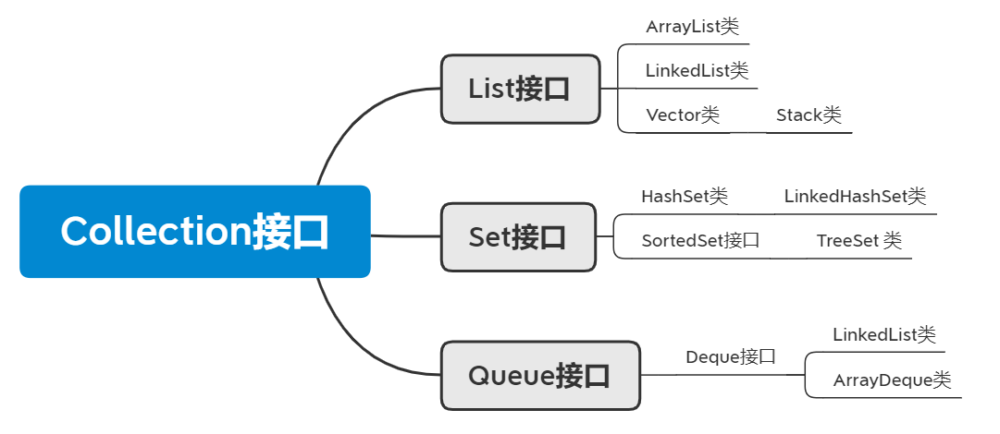

# 集合01：Collection和Iterator接口

[TOC]

## 1、集合类

为什么出现集合类？

	我们学习的是面向对象语言，而面向对象语言对事物的描述是通过对象体现的，
	为了方便对多个对象进行操作，我们就必须把这多个对象进行存储。
	而要想存储多个对象，就不能是一个基本的变量，而应该是一个容器类型的变量，
	在我们目前所学过的知识里面，有哪些是容器类型的呢?
	数组和StringBuffer。但是呢?StringBuffer的结果是一个字符串，
	不一定满足我们的要求，所以我们只能选择数组，这就是对象数组。
	而对象数组又不能适应变化的需求，因为数组的长度是固定的，这个时候，
	为了适应变化的需求，Java就提供了集合类供我们使用。

数组和集合的区别

	A:长度区别
		数组的长度固定
		集合长度可变
	B:内容不同
		数组存储的是同一种类型的元素
		而集合可以存储不同类型的元素
	C:元素的数据类型问题	
		数组可以存储基本数据类型，也可以存储引用数据类型
		集合只能存储引用类型

集合类的特点

	集合只用于存储对象，集合长度是可变的，集合可以存储不同类型的对象。

## 2、Collection接口

	public interface Collection<E> 
	extends Iterable<E>

Collection 层次结构中的**根接口**。

Collection 表示一组对象，这些对象也称为 collection 的元素。

	一些 collection 允许有重复的元素，而另一些则不允许。

	一些 collection 是有序的，而另一些则是无序的。

JDK 不提供此接口的任何直接实现：它提供更具体的子接口（如 Set 和 List）实现。

包 (bag) 或多集合 (multiset)（可能包含重复元素的无序 collection）应该直接实现此接口。 

	public interface Bag extends Collection
	public interface Multiset<E> extends Collection<E>

所有通用的 Collection 实现类应该提供两个“标准”构造方法：

	一个是 void（无参数）构造方法，用于创建空 collection；
	另一个是带有 Collection 类型单参数的构造方法，用于创建一个具有与其参数相同元素新的 collection。



**方法测试**

```java
//package javabase.collection;

/*
* 测试不带All的方法
* */
public class CollectionDemo01 {
    public static void main(String[] args) {

        // 创建集合对象
        // Collection c = new Collection(); //错误，因为接口不能实例化
        Collection<String> c = new ArrayList<String>();

        // 1. boolean add(Object obj):添加一个元素
        
        // System.out.println("add:"+c.add("hello"));
        c.add("hello");
        c.add("world");
        c.add("java");

        // 2. void clear():移除所有元素
        
        // c.clear();

        // 3. boolean remove(Object o):移除一个元素
        
        // System.out.println("remove:" + c.remove("hello"));
        // System.out.println("remove:" + c.remove("javaee"));

        // 4. boolean contains(Object o)：判断集合中是否包含指定的元素
        
        // System.out.println("contains:"+c.contains("hello"));
        // System.out.println("contains:"+c.contains("android"));

        // 5. boolean isEmpty()：判断集合是否为空
        
        // System.out.println("isEmpty:"+c.isEmpty());

        //6. int size():元素的个数
        System.out.println("size:"+c.size());

        System.out.println("c:" + c);
    }
}

```

```java
//package javabase.collection;

/*
* 测试带All的方法
 * */
public class CollectionDemo02 {
    public static void main(String[] args) {
        // 创建集合1
        Collection<String> c1 = new ArrayList<String>();

        c1.add("abc1");
        c1.add("abc2");
        c1.add("abc3");
        c1.add("abc4");

        // 创建集合2
        Collection<String> c2 = new ArrayList<String>();
//		c2.add("abc1");
//		c2.add("abc2");
//		c2.add("abc3");
//		c2.add("abc4");
        c2.add("abc5");
        c2.add("abc6");
        c2.add("abc7");

        // 1. boolean addAll(Collection c):添加一个集合的元素

        // System.out.println("addAll:" + c1.addAll(c2));

        //2. boolean removeAll(Collection c):移除一个集合的元素(是一个还是所有)

        //只要有一个元素被移除了，就返回true。
        //System.out.println("removeAll:"+c1.removeAll(c2));

        //3. boolean containsAll(Collection c)：判断集合中是否包含指定的集合元素(是一个还是所有)

        //只有包含所有的元素，才叫包含
        // System.out.println("containsAll:"+c1.containsAll(c2));

        //4. boolean retainAll(Collection c):保留此集合中那些也包含在指定集合的元素

        // 思考元素去哪了，返回的boolean又是什么意思呢?
        //假设有两个集合A，B。
        //A对B做交集，最终的结果保存在A中，B不变。
        //返回值表示的是A是否发生过改变。
        System.out.println("retainAll:" + c1.retainAll(c2));

        System.out.println("c1:" + c1);
        System.out.println("c2:" + c2);

    }
}

```

```java
//package javabase.collection;


/*
* 集合遍历
* */
public class CollectionDemo03 {
    public static void main(String[] args) {
        // 创建集合对象
        Collection<String> c = new ArrayList<String>();

        // 添加元素
        c.add("hello"); // Object obj = "hello"; 向上转型
        c.add("world");
        c.add("java");

        /*
        * 1. 转成数组遍历
        *     Object[] toArray():把集合转成数组，可以实现集合的遍历
        *     <T> T[] toArray(T[] a) 返回数组的运行时类型与指定数组的运行时类型相同。
        * */

        Object[] objs = c.toArray();
        for (int x = 0; x < objs.length; x++) {
            // System.out.println(objs[x]);
            // 我知道元素是字符串，我在获取到元素的的同时，还想知道元素的长度。
            // System.out.println(objs[x] + "---" + objs[x].length());
            // 上面的实现不了，原因是Object中没有length()方法
            // 我们要想使用字符串的方法，就必须把元素还原成字符串
            // 向下转型
            String s = (String) objs[x];
            System.out.println(s + "---" + s.length());
        }
        //        String[] ss = c.toArray(new String[0]);
//        for(int i=0;i<ss.length;i++){
//            String s = ss[i];
//            System.out.println(s);
//        }

        /*
         * 2.迭代器遍历:
         * Iterator iterator():迭代器，集合的专用遍历方式
   		 *      Object next():获取元素,并移动到下一个位置。
   		 *	         NoSuchElementException：没有这样的元素，因为你已经找到最后了。
         *      boolean hasNext():如果仍有元素可以迭代，则返回 true。
         */

        Iterator it = c.iterator(); // 实际返回的肯定是子类对象，这里是多态
        while(it.hasNext()){
            String s = (String)it.next();
            System.out.println(s + "---" + s.length());
        }
    }
}

```

```java
//package javabase.collection;

public class Student {
    // 成员变量
    private String name;
    private int age;

    // 构造方法
    public Student() {
        super();
    }

    public Student(String name, int age) {
        super();
        this.name = name;
        this.age = age;
    }

    // 成员方法
    // getXxx()/setXxx()
    public String getName() {
        return name;
    }

    public void setName(String name) {
        this.name = name;
    }

    public int getAge() {
        return age;
    }

    public void setAge(int age) {
        this.age = age;
    }

    @Override
    public String toString() {
        return "Student [name=" + name + ", age=" + age + "]";
    }
}


public class CollectionDemo04 {
    public static void main(String[] args) {
        // 创建集合对象
        Collection<Student> c = new ArrayList<Student>();

        // 创建学生对象
        Student s1 = new Student("林青霞", 27);
        Student s2 = new Student("风清扬", 30);
        Student s3 = new Student("令狐冲", 33);
        Student s4 = new Student("武鑫", 25);
        Student s5 = new Student("刘晓曲", 22);

        // 把学生添加到集合中
        c.add(s1);
        c.add(s2);
        c.add(s3);
        c.add(s4);
        c.add(s5);

        // 2.迭代器遍历
        Iterator it = c.iterator();
        while (it.hasNext()) {
            // System.out.println(it.next());
            Student s = (Student) it.next();
            System.out.println(s.getName() + "---" + s.getAge());
            //林青霞---27
            //风清扬---30
            //令狐冲---33
            //武鑫---25
            //刘晓曲---22
        }
        //从迭代器指向的 collection 中移除迭代器返回的最后一个元素（可选操作）。
        // 每次调用 next 只能调用一次此方法。
        it.remove();  

        // 1.把集合转成数组
        Object[] objs = c.toArray();
        // 遍历数组
        for (int x = 0; x < objs.length; x++) {
            // System.out.println(objs[x]);

            Student s = (Student) objs[x];
            System.out.println(s.getName() + "---" + s.getAge());
            //林青霞---27
            //风清扬---30
            //令狐冲---33
            //武鑫---25
        }

        // for循环改写
        // for(Iterator it = c.iterator();it.hasNext();){
        // Student s = (Student) it.next();
        // System.out.println(s.getName() + "---" + s.getAge());
        // }
    }
}
```

## 3、Iterator接口

	public interface Iterator<E>

对 collection 进行迭代的迭代器。

迭代器取代了 Java Collections Framework 中的 Enumeration。

迭代器与枚举有两点不同： 

	迭代器允许调用者利用定义良好的语义在迭代期间从迭代器所指向的 collection 移除元素。 (remove方法)

	方法名称得到了改进。 

### 3.1、Iterator接口的使用讲解


### 3.2、Iterator接口的源码讲解

```
public interface Inteator {
	boolean hasNext();
	Object next(); 
}

public interface Iterable {
    Iterator iterator();
}

public interface Collection extends Iterable {
	Iterator iterator();
}

public interface List extends Collection {
	Iterator iterator();
}

public class ArrayList implements List {
	public Iterator iterator() {
        return new Itr();
    }
    
    private class Itr implements Iterator {
    	public boolean hasNext() {}
		public Object next(){} 
    }
}


Collection c = new ArrayList();
c.add("hello");
c.add("world");
c.add("java");
Iterator it = c.iterator();	 //new Itr();
while(it.hasNext()) {
	String s = (String)it.next();
	System.out.println(s);
}
```