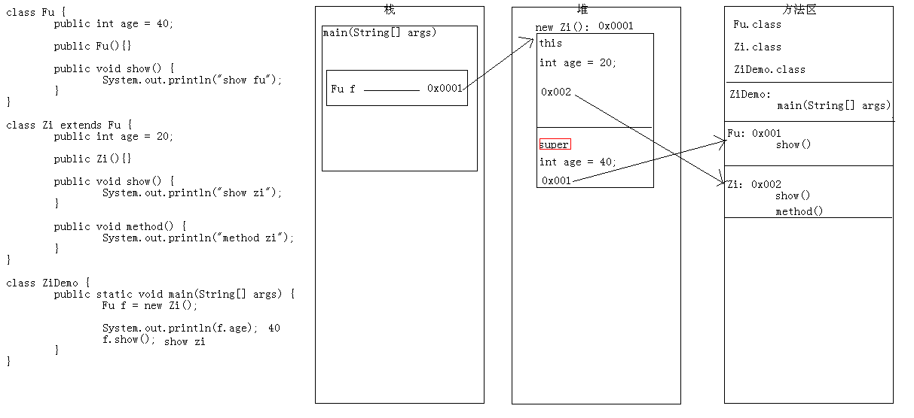
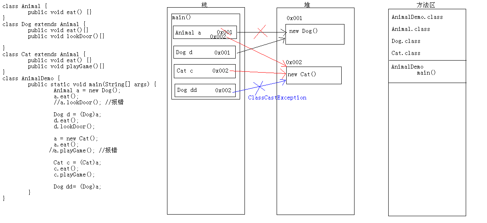

# 面向对象：多态

[TOC]

## 1、final关键字

由于继承中方法有一个现象：方法重写。所以，父类的功能，就会被子类给覆盖掉。有些时候，我们不想让子类去覆盖掉父类的功能，只能让他使用。针对这种情况，Java就提供了一个关键字：final

final:最终的意思。常见的是它可以修饰类，成员变量，成员方法。

### 1.1、特点

	A:它修饰的类，不能被继承。
	B:它修饰的成员方法，不能被重写。
	C:它修饰的成员变量，是一个常量。
	D:它修饰的对象，该对象的引用地址不能改变；

### 1.2、面试相关

final修饰局部变量

	a:当局部变量是基本类型时，值不能发生改变
	b:当局部变量是引用类型时，地址值不能发生改变，但是对象的内容是可以改变的

```java
class Student {
	int age = 10;
}

class FinalTest {
	public static void main(String[] args) {
		//局部变量是基本数据类型
		int x = 10;
		x = 100;
		System.out.println(x);  //100
		final int y = 10;
		//无法为最终变量y分配值
		//y = 100;
		System.out.println(y);  //报错
		System.out.println("--------------");

		//局部变量是引用数据类型
		Student s = new Student();
		System.out.println(s.age);  //10
		s.age = 100;
		System.out.println(s.age);  //100
		System.out.println("--------------");

        final Student ss = new Student();
        System.out.println(ss.age); //10
        System.out.println(s); //javabase.finaldemo.FinalDemo$Student@4c98385c
        ss.age = 100;
        System.out.println(ss.age); //100
        System.out.println(s);//javabase.finaldemo.FinalDemo$Student@4c98385c

        //重新分配内存空间
        //无法为最终变量ss分配值
//        ss = new Student();  //报错
	}
}
```
### 1.3、初始化时机

	a:只能初始化一次。
	b:常见的给值
		定义的时候。(推荐) final int num2 = 20;
		构造方法中。

```java
class Demo {
	//int num = 10;
	//final int num2 = 20;

	int num;
	final int num2;

	{
		num2 = 10;
	}

	public Demo() {
		num = 100;
		//无法为最终变量num2分配值
		num2 = 200;
	}
}

class FinalTest2 {
	public static void main(String[] args) {
		Demo d = new Demo();
		System.out.println(d.num);//100
        System.out.println(d.num2); //10
	}
}
```

## 2、多态

同一个对象在不同时刻体现出来的不同状态。

### 2.1、基础

#### 2.1.1、多态的前提

	A:有继承或者实现关系。
	B:有父类或者父接口引用指向子类对象。
	C:有方法重写。

```java
class Fu {
	public void show() {
		System.out.println("show Fu");
	}
}

class Zi extends Fu {

	public void show() {
		System.out.println("show Zi");
	}
}

class DuoTaiDemo {
	public static void main(String[] args) {
		//要有父类引用指向子类对象。
		Fu f = new Zi();

	}
}
```
#### 2.2.2、多态的分类

a:具体类多态

	class Fu {}
	class Zi extends Fu {}

	Fu f = new Zi();

b:抽象类多态

	abstract class Fu {}
	class Zi extends Fu {}

	Fu f = new Zi();

c:接口多态

	interface Fu {}
	class Zi implements Fu {}

	Fu f = new Zi();

#### 2.2.3、多态的优缺点

优点：

	A:提高代码的维护性(继承体现)
	B:提高代码的扩展性(多态体现)

缺点：

	父不能使用子的特有功能。(成员方法的使用)

	现象：
		子可以当作父使用，父不能当作子使用。

### 2.3、多态中的成员访问特点

**成员变量：编译看左边，运行看左边（编译是否成功看左边，运行的结果看左边）**

```java
class Fu {
	public int num = 100;
}

class Zi extends Fu {
	public int num = 1000;
	public int num2 = 200;
}

class DuoTaiDemo {
	public static void main(String[] args) {
		//要有父类引用指向子类对象。
		Fu f = new Zi();
		System.out.println(f.num); //100
		//编译报错：找不到符号
		//System.out.println(f.num2);
	}
}
```

**构造方法：子类的构造都会默认访问父类无参构造**

```java
class Fu {
    public Fu(){
        System.out.println("show Fu");
    }
    public Fu(int age){
            System.out.println("show Fu age");
    }
}
class Zi extends Fu {
    public Zi(){
        System.out.println("show Zi");
    }
    public Zi(int age){
        System.out.println("show Zi age");
    }
}
class DuoTaiDemo {
    public static void main(String[] args) {
            Fu f = new Zi();
        }
    }
//输出：show Fu  show Zi
```

**成员方法：编译看左边，运行看右边**

```java
class Fu {
	public void show() {
		System.out.println("show Fu");
	}
}

class Zi extends Fu {
	public void show() {
		System.out.println("show Zi");
	}
  public void method() {
		System.out.println("method zi");
	}
}

class DuoTaiDemo {
	public static void main(String[] args) {
		Fu f = new Zi();
		f.show(); //show Zi
    //编译报错：找不到符号
		//f.method();
	}
}
```

**静态方法：编译看左边，运行看左边**

```java
class Fu {
	public static void function() {
		System.out.println("function Fu");
	}
}

class Zi extends Fu {
	public static void function() {
		System.out.println("function Zi");
	}
}

class DuoTaiDemo {
	public static void main(String[] args) {
		Fu f = new Zi();
		f.function(); //function Fu
	}
}
```

### 2.4、多态中的转型

	A:向上转型
		从子到父

	B:向下转型
		从父到子

```java
class Fu {
	public void show() {
		System.out.println("show fu");
	}
}

class Zi extends Fu {
	public void show() {
		System.out.println("show zi");
	}

	public void method() {
		System.out.println("method zi");
	}

}

class DuoTaiDemo4 {
	public static void main(String[] args) {
		//测试
		Fu f = new Zi();
		f.show();
		//f.method();

		//想用子类的特有功能时

		//1.创建子类对象。(可以，但是很多时候不合理。而且，太占内存了)
		//Zi z = new Zi();
		//z.show();
		//z.method();

		//2.你能够把子的对象赋值给父亲，那么我能不能把父的引用赋值给子的引用呢?
		//如果可以，但是如下
		Zi z = (Zi)f;
		z.show();
		z.method();
	}
}
```

```java
public class CollectionDemo03 {
    public static void main(String[] args) {
        Collection<String> c = new ArrayList<String>();
        c.add("hello");
        c.add("world");
        c.add("java");

        /*
        * 1. 转成数组遍历
        *     Object[] toArray():把集合转成数组，可以实现集合的遍历
        *     <T> T[] toArray(T[] a) 返回数组的运行时类型与指定数组的运行时类型相同。
        * */

        Object[] objs = c.toArray();
        for (int x = 0; x < objs.length; x++) {
            // System.out.println(objs[x]);
            // 我知道元素是字符串，我在获取到元素的的同时，还想知道元素的长度。
            // System.out.println(objs[x] + "---" + objs[x].length());
            // 上面的实现不了，原因是Object中没有length()方法
            // 我们要想使用字符串的方法，就必须把元素还原成字符串
            // 向下转型
            String s = (String) objs[x];
            System.out.println(s + "---" + s.length());
        }

    }
}

```

### 2.5、子装爹的案例帮助大家理解多态

```java

class 孔子爹 {
	public int age = 40;
	public void teach() {
		System.out.println("讲解JavaSE");
	}
}

class 孔子 extends 孔子爹 {
	public int age = 20;
	public void teach() {
		System.out.println("讲解论语");
	}
	public void playGame() {
		System.out.println("英雄联盟");
	}
}

	//Java培训特别火,很多人来请孔子爹去讲课，这一天孔子爹被请走了
	//但是还有人来请，就剩孔子在家，价格还挺高。孔子一想，我是不是可以考虑去呢?
	//然后就穿上爹的衣服，带上爹的眼睛，粘上爹的胡子。就开始装爹
	//向上转型
	孔子爹 k爹 = new 孔子();
	//到人家那里去了
	System.out.println(k爹.age); //40
	k爹.teach(); //讲解论语
	//k爹.playGame(); //这是儿子才能做的   结合多态的缺点那里理解


	//讲完了，下班回家了
	//脱下爹的装备，换上自己的装备
	//向下转型
	孔子 k = (孔子) k爹;
	System.out.println(k.age); //20
	k.teach(); //讲解论语
	k.playGame(); //英雄联盟
```

### 2.6、图解





### 2.7、看程序写结果

```java
/*
	看程序写结果:先判断有没有问题，如果没有，写出结果

	多态的成员访问特点：
		方法：编译看左边，运行看右边。

	继承的时候：
		子类中有和父类中一样的方法，叫重写。
		子类中没有父亲中出现过的方法，方法就被继承过来了。
*/
class A {
	public void show() {
		show2();
	}
	public void show2() {
		System.out.println("我");
	}
}
class B extends A {
	/*
	public void show() {
		show2();
	}
	*/

	public void show2() {
		System.out.println("爱");
	}
}
class C extends B {
	public void show() {
		super.show();
	}
	public void show2() {
		System.out.println("你");
	}
}
public class DuoTaiTest4 {
	public static void main(String[] args) {
		A a = new B();
		a.show();  //爱

		B b = new C();
		b.show();  //你
	}
}
```