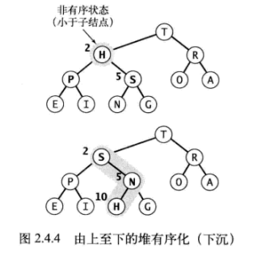

# 排序：堆排序

## 1、二叉堆

在二叉堆的数组中，每个元素都要保证大于等于另两个特定位置的元素。相应的，这些位置的元素又至少大于等于数组中另两个元素，以此类推。

堆有序：当一颗二叉树的每个结点都大于等于它的两个子节点时，称为堆有序。

	- 同理：在堆有序的二叉树中，每个结点都小于等于它的父节点。
	- 在任意结点向上，都能得到一列非递减的元素；
	- 在任意结点向下，都能得到一列非递增的元素；
	- 根结点是堆有序的二叉树中的最大结点

二叉堆：一组能用堆有序的完全二叉树排序的元素，并在长度为N+1的数组中按照层级存储，堆元素存放在pq[1]至pq[N]

先定下根结点，然后一层一层的由上向下，由左至右，在每个结点的
			  下方连接两个更小的结点，直至将N个结点全部连接完毕。


**位置为k的结点的父结点的位置为k/2向下取整。它的两个子结点的位置分别为2k和2k+1。**

## 2、堆的有序化

先打破堆的状态，然后再遍历堆，并按照要求将堆得状态恢复。

### 2.1、由下至上的堆有序化

当某个结点的优先级上升（或在堆底加入新的元素时），需要由下至上恢复堆的顺序。

恢复方法：

	判断该结点是不是大于其父结点，如果是，交换它和它的父结点，完成后，
	这个结点比它的两个子节点都大。
	但仍有可能该结点还比它现在的父结点大，那么就继续交换，直到遇到一个更大的父结点。


关键:

	位置k的结点的父结点的位置是 k/2向下取整

```java
    public void swim(int[] pq,int k){
        while(k>1 && less(pq,k/2,k)){
            exch(pq,k/2,k);
            k=k/2;
        }
    }
```


### 2.2、由上至下的堆有序化

当某个结点的优先级下降（例如，在根结点替换为一个较小的元素时），需要由上至下恢复堆得顺序。

恢复方法：

	如果该结点比它的两个子结点，或其中之一都小，那么该结点和 两个子结点中的最大结点 交换。
	如果交换后，依旧比子结点小，那么继续往下交换。
	直至它的子结点都比它小，或到达堆底部。




关键:

	位置为k的结点的两个子结点的位置分别为2k和2k+1。

```java
    private static void sink(int[] pq, int k, int n) {
        while (2*k <= n) {
            int j = 2*k;
            if (j < n && less(pq, j, j+1)) j++;//判断两个子结点哪个大，用较大的来交换它们的父结点
            if (!less(pq, k, j)) break;
            exch(pq, k, j);
            k = j;
        }
    }
```

## 3、堆排序

(1)构造堆：将原始数组重新组织进一个堆中
 		
(2)下沉排序:重复删除最大元素，放入堆缩小后数组中空出的位置
 		
```java
    public static void sort(Comparable[] pq) {
        int n = pq.length;
        for (int k = n/2; k >= 1; k--)
            sink(pq, k, n);
        while (n > 1) {
            exch(pq, 1, n--);
            sink(pq, 1, n);
        }
    }
```


### 3.1、复杂度

	时间复杂度:
		平均情况：O(nlogn)
		最好情况：O(nlogn)
		最坏情况：O(nlogn) 
    空间复杂度：O(1)
