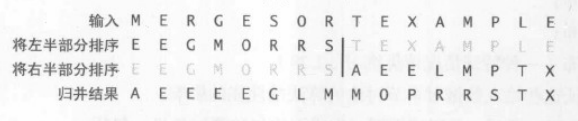

# 排序：归并排序

[TOC]

将一个数组排序，可用先(递归地)将它分成两半分别排序，然后将结果归并起来。



优点：保证任意长度为 N 的数组排序所需时间和 NlogN 成正比。

缺点：所需空间和 N 成正比

## 1、自顶向下的归并排序

如果能将两个子数组排序，它就能通过归并两个子数组来将整个数组排序。

```java
    public static void mergeSort(int[] arr){
    	if(arr.length == 0) return;

        int[] aux = new int[arr.length];
        sort(arr,aux,0,arr.length-1);
    }

    private static void sort(int[] arr, int[] aux, int lo, int hi) {

        if (hi <= lo) return;  //停止条件

        int mid = lo + (hi - lo) / 2;
        sort(arr, aux,lo, mid);
        sort(arr, aux,mid + 1, hi);
        merge(arr, aux,lo, mid, hi);
    }
```


命题1：

	长度为 N 的任意数组，自顶向下的归并排序需要(1/2)NlgN 至 NlgN 次比较。

命题2：

	长度为 N 的任意数组，自顶向下的归并排序最多需要访问数组 6NlgN 次。

### 1.2、原地归并

先将前半部分排序，再将后半部分排序，然后在数组中移动元素，而不需要额外的空间。

```java
	private static void merge(int[] a, int[] aux, int lo, int mid, int hi){


		for (int k = lo; k <= hi; k++) {
            aux[k] = a[k];
        }

        int i = lo, j = mid+1;
        for (int k = lo; k <= hi; k++) {  //注意范围
            if      (i > mid)              a[k] = aux[j++];  //左边部分遍历完，将右边部分的值加到aux
            else if (j > hi)               a[k] = aux[i++];  //右边部分遍历完，将左边部分的值加到aux
            else if (aux[j]<aux[i])        a[k] = aux[j++];  //右边当前元素小于左边当前元素，取右边
            else                           a[k] = aux[i++];  //右边当前元素大于等于左边当前元素，取左边
        }
	}
```


## 2、自底向上的归并排序

首先把每个元素当成一个大小为1的数组，进行两两归并，

然后两个大小为2的数组归并成一个有4各元素的数组，

然后八八的归并，一直下去。

在每一轮归并中，最后一次归并的第二个子数组可能比第一个子数组要小，如果不是的化所有归并中两个数组大小应该都一样。，而在下一轮中数组的大小会翻倍。

```java
public static void mergeSort(int[] arr){
        if(arr.length == 0) return;

        sort(arr);
    }

    private static void sort(int[] a) {
        int n = a.length;
        int[] aux = new int[n];
        for (int len = 1; len < n; len *= 2) {   //合并长度为len的序列。len子序列长度 1-2-4-8-16...
            //一次归并排序都是使用2组数据进行排序,所以每次递增2组数据的偏移量
            //取到倒数第二元素
            for (int lo = 0; lo < n-len; lo += len+len) {
                int mid  = lo+len-1;
                int hi = Math.min(lo+len+len-1, n-1);  //剩余的元素进入下一次迭代
                merge(a, aux, lo, mid, hi);
            }
        }
    }

```


命题3：

	长度为 N 的任意数组，自底向上的归并排序需要(1/2)NlgN 至 NlgN 次比较。最多需要访问数组 6NlgN 次。