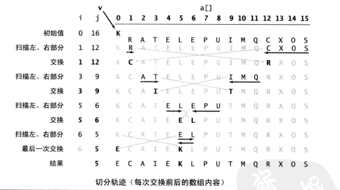

# 排序：快速排序

[TOC]

## 1、原理

	选择一个切分元素，将一个数组分成两个数组，并分别排序，
    使左子数组都小于等于切分元素，使右子数组都大于等于切分元素
    当两个子数组都有序了，组合后的原数组也就有序了。

## 2、示例



## 3、过程

	先随意取一个切分元素 A(如取第一个元素)，
    
    定义两个指针，一个从左至右扫描找大于等于 A 的元素，一个从右到左扫描小于等于 A 的元素，找到后，交换两个值的位置。
         
    如此继续，就可以保证左指针的左侧元素都不大于 A，右指针的左侧元素都不小于 A。
         
    当两个指针相遇交换后，再交换 A 和左子数组的最右侧元素交换。【因为两个指针相遇交换后，左边的元素始终是小于切分元素的】
         
    返回的右侧元素的索引，就是切分元素。
         
    再递归的排序左右子数组。
 
## 4、详细

	算法第四版
 
## 5、优缺点

	优点：
        快速：用一个递增的索引n将数组元素和一个定值比较，这个短小的内循环提高了排序的速度。而希尔和归并排序在内循环中移动了数据，所以相比会慢。
             另一个速度优势就是比较的次数少，而这依赖于切分元素的划分。

    缺点：在切分不平衡时，程序会比较低效。比如 第一次从最小的元素切分，
          第二次从第二小的元素切分，...，每次只移除一个元素，导致一个大子数组切分多次。

## 6、复杂度

	时间复杂度:
		平均情况：O(nlog2(n))
		最好情况：O(nlog2(n))
		最坏情况：O(n^2) 
    空间复杂度：O(nlog2(n))

## 7、程序

```java
private static void sort(int[] a, int lo, int hi) {
        if (hi <= lo) return;
        int j = partition(a, lo, hi);
        sort(a, lo, j-1);
        sort(a, j+1, hi);
	}
	private static int partition(int[] a, int lo, int hi) {
        int i = lo;
        int j = hi + 1;
        int v = a[lo];
        while (true) {
            while (a[++i]< v){
                if (i == hi) break;  // 遍历到 hi 位置，仍比 v 小，就得退出循环，否则数组越界。
            }
            while (v<a[--j]){
                if (j == lo) break;
            }
            if (i >= j){   //  当两个指针i、j相遇交换后，i 大于 j。等于是两指针在同一位置
                break;
            }
            exch(a, i, j);

        }
        exch(a, lo, j); //当两个指针相遇交换后，再交换 A 和左子数组的最右侧元素交换。
        return j;
    }

```

## 7、优化


```java

// 三向切分的快速排序
    public static void quickSort3Way(int[] arr) {
        if(arr.length == 0) return;
	    quickSort3Way(arr, 0, arr.length - 1);
    }
    private static void quickSort3Way(int[] arr, int lo, int hi) {
        if (hi <= lo) return;
        int lt = lo, gt = hi;
        int v = arr[lo];
        int i = lo;
        while (i <= gt) {
            int cmp = arr[i] - v;
            if      (cmp < 0) exch(arr, lt++, i++);
            else if (cmp > 0) exch(arr, i, gt--);
            else              i++;
        }

        // a[lo..lt-1] < v = a[lt..gt] < a[gt+1..hi].
        quickSort3Way(arr, lo, lt-1);
        quickSort3Way(arr, gt+1, hi);
    }
```