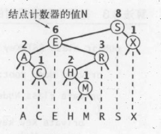
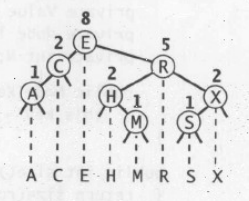
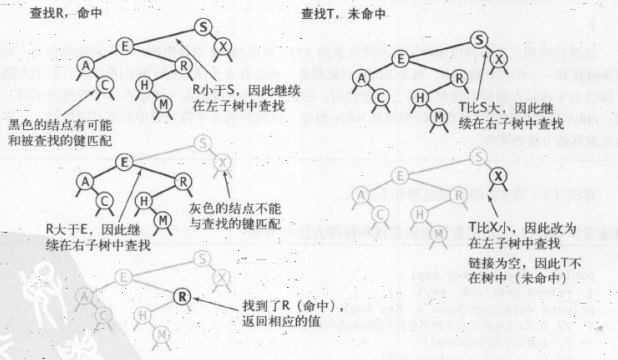
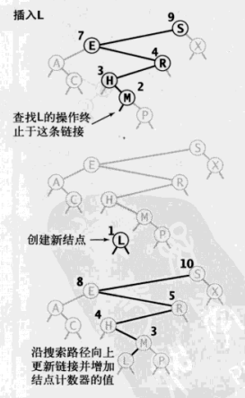

# 树02：二叉查找树

[TOC]

**算法第四版**

## 1、二叉查找树

### 1.1、定义

二叉排序树（Binary Sort Tree），又称二叉查找树（Binary Search Tree），是一颗二叉树，其中每个结点都含有一个Comparable的键（以及相关联的值）且每个结点的键都大于其左子树中的任意结点的键，而小于右子树的任意结点的键。

在如下使用中，定义一个结点包含一个键、一个值、一条左链接、一条右链接和一个结点计数器

```java
    private class Node {
        private Key key;           // sorted by key
        private Value val;         // associated data
        private Node left, right;  // left and right subtrees
        private int size;          // number of nodes in subtree

        public Node(Key key, Value val, int size) {
            this.key = key;
            this.val = val;
            this.size = size;
        }
    }
```

### 1.2、特点

- 在二叉查找树中，每个结点包含一个键和一个值，键之间有顺序之分。

- 一个二叉查找树代表了一组键（及其相关联的值）的集合，而同一集合可以使用不同的二叉查找树表示。将二叉树投影到一条直线上，那么一个结点的左子树中的键在它的左边，右子树的键在右边。

  

### 1.3、查找

在二叉查找树中查找一个键:

- 如果树是空的，则查找未命中；

- 如果被查找的键和根结点的键相等，查找命中，否则就递归地在子树中继续查找。如果被查找的键较小就选择左子树，较大就选择右子树。




```java

	// 递归
	private Value get(Node x, Key key) {
	    if (key == null) throw new IllegalArgumentException("called get() with a null key");
	    if (x == null) return null;
	    int cmp = key.compareTo(x.key);

	    if      (cmp < 0) return get(x.left, key);
	    else if (cmp > 0) return get(x.right, key);
	    else              return x.val;
	}

```

### 1.4、插入

- 如果树是空的，就返回一个含有该键值对的新结点。

- 如果被查找的键小于根结点的键，继续在左子树中插入该键，否则在右子树中插入该键。



```java
    public void put(Key key, Value val) {
        if (key == null) throw new IllegalArgumentException("calledput() with a null key");
        if (val == null) {
            delete(key);
            return;
        }
        root = put(root, key, val);
        assert check();
    }

    private Node put(Node x, Key key, Value val) {
        if (x == null) return new Node(key, val, 1);
        int cmp = key.compareTo(x.key);
        if      (cmp < 0) x.left  = put(x.left,  key, val);
        else if (cmp > 0) x.right = put(x.right, key, val);
        //overwriting the old value with the new value if the symbol table already contains the specified key.
        else              x.val   = val;  
        x.size = 1 + size(x.left) + size(x.right);
        return x;
    }

```

### 1.5 其他功能

见源码 [BST.java](https://algs4.cs.princeton.edu/code/)
