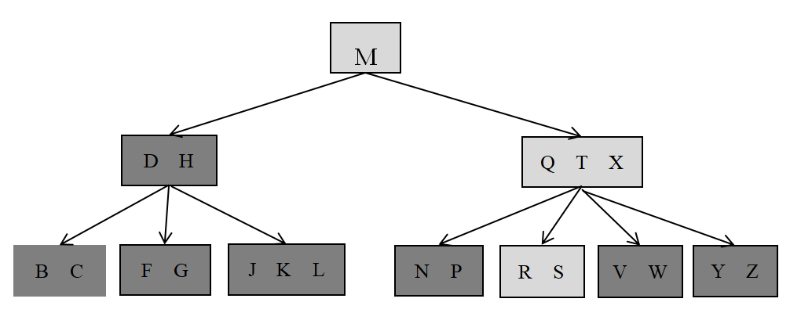
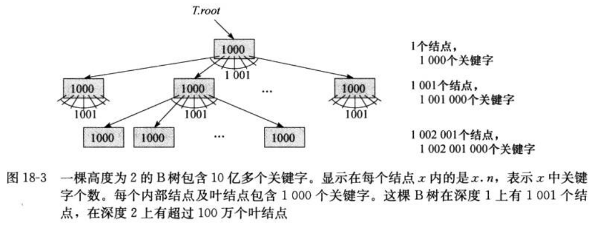
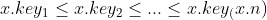
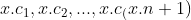
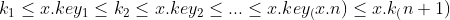
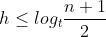
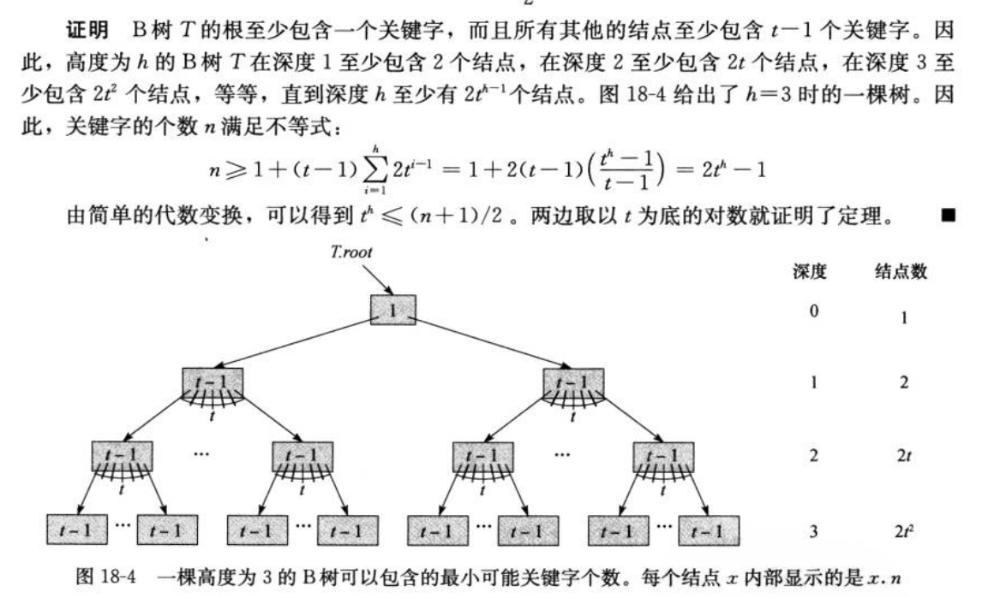
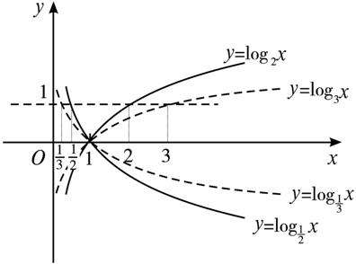

# 树03：B树

[TOC]

**算法导论第三版**

## 1、前提

算法操作的**集合可以随着时间的改变而增大、缩小或产生其他的变化**，称这种集合是**动态集合**。如字典、最小优先队列。

在动态集合中，**每个元素都由一个对象表示**，如果有指向对象的指针，就可以对对象的各属性进行检查和处理。

某些类型的动态集合，假设对象的一个属性是**关键字(key)**。如果关键字全不相同，就可以把此动态集合看成一个关键字值的集合。

一个对象中可以有**卫星数据**，它们随对象的其他属性一起移动，除此之外，集合实现不使用它们。

对象可以有 **由集合运算操作的属性**；这些属性可能包含有关集合中 其他对象的数据和指针。

卫星数据：指一条纪录（一个对象中）中**除关键字key以外的其他数据**。例如在排序算法中，参与排序的数据称做关键字key，而该对象附带的其他数据则称做卫星数据。在排序的过程中，我们只考虑关键字key的大小。形象一点说，其他数据可以看作是关键字key的卫星，反映了其他数据与key的依属关系。

	二叉查找树中，一个结点包括key属性、卫星数据、left属性、right属性、parent属性。

	红黑树中，一个结点包括key属性、color属性、left属性、right属性、parent属性。

## 2、简介

B树是为**磁盘**或其他直接存取 辅助存储设备 而涉及的一种平衡查找树。相比红黑树，它在**降低磁盘 I/O 操作次数**方面更好一些。所以，许多**数据库系统**使用B树或B树的变形来存储信息。

和红黑树的区别是：B树的结点可以有多个孩子，即分支因子，从几个到几千个【多路存储】。这由磁盘特性决定。

和红黑树的相似之处是：每棵含 n 个节点的B树的高度为 O(lgn)，但可能要比一棵红黑树的高度小很多，因其分支因子比较大，所以B树也可以用来在 O(lgn) 时间内，实现许多动态集合操作。(???)

下图为一个简单的B树。

如果B树的内结点 x 包含 x.n 个关键字，则 x 就有 x.n +1 个孩子。

结点 x 中的关键字是分隔点，用来将 x 所处理的关键字属性划分成 x.n +1 个子域，每个子域由 x 中的一个孩子处理。	

## 3、辅存上的数据结构

计算机的存储包括主存和基于磁盘的辅存。辅存的容量比主存大，价格也便宜，但速度慢，因为有机械移动的部分，即盘片旋转和磁臂移动。【寻道：找磁道；定位：磁头定位扇区】

【磁盘驱动器】

所以，**为了平摊等待机械移动所花费的时间，磁盘会一次存取多个数据项，而不仅仅是一个数据项**。

那么，信息被分为一系列相等大小的，在柱面内连续出现的位页面，每次磁盘读或写一个或多个完整的页面。【每次磁盘读或写一个或多个结点】

【页是计算机管理存储器的逻辑块，硬件及操作系统往往将主存和磁盘存储区分割为连续的大小相等的块，每个存储块称为一页（在许多操作系统中，页的大小通常为4k），主存和磁盘以页为单位交换数据。】

对运行时间的衡量主要从以下两个方面考虑：

- 磁盘存取次数：用读出或写入磁盘的信息的页数来衡量
- CPU(计算)时间

注意到，磁盘存取时间并不是常量----它与当前磁道和所需磁道之间的距离以及磁盘的初始旋转状态有关，但是为了简单起见，我们仍然使用读或写的页数作为磁盘存取总时间的近似值。

### 3.1、在B树中的应用

在一个典型的B树应用中，如数据库系统，要处理的数据非常大，所有数据无法一次全部写入主存。

所以，B树算法只将所需的页复制到主存中，而后将修改过的页再写回磁盘。故，**在任意时刻，主存中只有一定数量的页面，要处理的B树不会受主存大小的限制。**

具体操作描述如下：

	x <-- a pointer to some object
	DISK-READ(x) 
	operation that access and/or modify the fields of x
	DISK-WRITE(x)  > Omitted if no fields of x were changed
	other operations that access but do not modify fields of x

x 表示指向一对象的指针。

如果 x 在主存中，那么可以直接引用它的各个属性，如 x.key。

如果在磁盘中，那么需要先执行 DISK-READ(x) ，读到主存中。类似的，DISK-WRITE(x) 用来保存对 x 的域的修改。

由上可知，**B树算法的运行时间由 DISK-READ(x) 和 DISK-WRITE(x) 操作的次数决定，所以为减少允许时间，这些操作需要一次读、写尽可能多的信息。**

因此，B树中，一个结点大小通常相当于一个完整磁盘页，那么一个B树结点拥有的孩子数由磁盘页的大小决定。【一个结点就是一个对象，一次对结点的磁盘操作就是操作一个或多个完整的页面。参考上图的B树示例】

【10.4节：树的结点用对象表示。与链表类似，假设每个结点都有一个关键字属性，其余属性包括指向其他结点的指针，而且要根据不同类型的树而发生变化。】

对于存储在磁盘上的一颗大的B树，分支因子通常取50到2000，具体取值取决于一个关键字相对于一页的大小。【一个关键字的大小占一页大小的比例】

选择一个大的分支因子，能大大降低树的高度，以及寻找任意关键字时所需的磁盘存取次数。【树横向扩展。树的高度越大，向下寻找时，每多一层就多一次磁盘操作】

上图是一棵高度为2(这里根结点为第0层)的B树，分支因子为1001，它可以储存超10亿个关键字。

根结点是保存在主存中的，那么寻找某一关键字，至多只需要2次磁盘存取。

## 4、B树定义及性质

为简单起见，假定，和关键字相联系的卫星数据作为关键字存放在同一结点中。【关键字包括了关键字及其卫星数据】

实际上，人们可能只是为每个关键字处存放了一个指针，这个指针指向存放该关键字的卫星数据的磁盘页。

一个B树 T 是具有如下性质的有根树(根为T.root):

- 每个结点 x 有以下属性：

	a. x.n 当前存储在结点x中的关键字数

	b. x.n 个关键字本身，以非降序存放，即 

	c. x.leaf，是个布尔值，如果 x 是叶子的话，则它为 TRUE，如果是内部结点，则为 FALSE

- 每个内部结点 x 还包含 (x.n)+1 个指向其子女的指针 。叶结点没有子女，故没有指向其子女的指针。

- 关键字 x.keyi 对存储在各子树中的关键字范围进行分割，如果 ki 是存储在以 x.ci 为根的子树中的关键字，则：

     

【类似二叉排序树的特性，左子树小于其父结点，右子树大于其父结点。】

- 每个叶结点具有相同的深度，即树的高度 h 。 

	有的教材规定根结点在第0层，有的则规定根结点在第1层。

	树从根结点开始往下数，叶子结点所在的最大层数称为 树的深度。

	深度定义是从上往下的，高度定义是从下往上的。

	如果根结点第0，层数=深度=高度-1

	如果根结点第1，层数=深度=高度

	[关于树的高度深度的辨别](https://blog.csdn.net/qq_36667170/article/details/84142019)

- 每个结点能包含的关键字数有一个上界和下界。这些界可用一个称为B树的**最小度数**的固定整数 t(t>=2) 表示。

	a. 下界：每个非根的结点必须至少有 t-1 个关键字，那么每个非根的结点至少有 t 个子女。如果树是非空的，则根结点至少包含一个关键字。

	b. 上界：每个结点可包含至多 2t-1 个关键字。所以一个内部结点至多可有 2t 个子女。如果一个结点恰好有 2t-1 个关键字，那么这个结点就是满的。

t=2 时，B树是最简单的，此时，每个内结点有2个、3个或4个子女，亦即一棵 2-3-4树。然而，在实际中，通常采用大得多的 t 值。

关于B树的伪代码中，都隐含的假设了当一个关键字从一个结点移动到另一个结点时，无论是卫星数据，还是指向卫星数据指针，都随关键字一起移动。

**B树的一种变形 -- B+树 ，所有的卫星数据都保存在叶结点中，顺序存放的，只将关键字和孩子指针保存于内部结点里，因此最大化了内部结点的分支因子(横向宽度更宽，更矮胖)**

**B树高度**

B树上大部分操作所需的磁盘存取次数与B树的高度成正比。下面来分析B树的最坏情况的高度。

**定理：如果 n>=1 ，则对任意一棵包含n个关键字、高度为h、最小度数t>=2的B树T，有:**

   

证明：

   

和红黑树相比，二者的高度都是以 O(lgn) 的速度增长(t为常数)，但B树的对数的底要大很多倍。

   

【底越大，增长的越慢】

对大多数的树操作来说，要查找的结点数在B树种要比在红黑树中少大约 lgt 的因子。因为在树种查找任意一个结点通常都需要一次磁盘访问，所以磁盘访问的次数大大地减少了。

## 5、对B树的基本操作