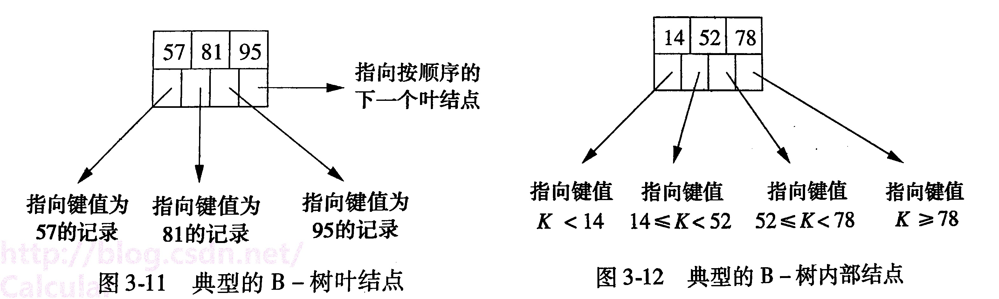

# 树04：B+树

## 1、结点组成

根结点：

- 若树只有一层：仅有根结点，此根结点也是叶结点，根结点中索引值(关键字key)个数无最少限制。

- 若树为两层以及以上：最上面那一层为根结点，根结点属于内部结点，根结点中指针最少为2个。

叶结点：

- 叶结点在B+树的最底层（所有叶节点都在一层）。

- 叶结点中存放**索引值(关键字key)、指向记录的指针、指向下一个叶结点的指针**。

- 叶结点内的索引值(关键字key)顺序存放的，从左到右分布在叶结点中。

内部结点：

- 所有非叶结点都属于内部结点，

- 内部结点中存放索引值(关键字key)、指向某一个结点（可以是叶结点也可以是内部节点）的指针。

   

   

## 2、对B+树的基本操作

[原文链接](https://blog.csdn.net/Calcular/article/details/79328397?utm_medium=distribute.pc_relevant.none-task-blog-BlogCommendFromMachineLearnPai2-2.channel_param&depth_1-utm_source=distribute.pc_relevant.none-task-blog-BlogCommendFromMachineLearnPai2-2.channel_param)