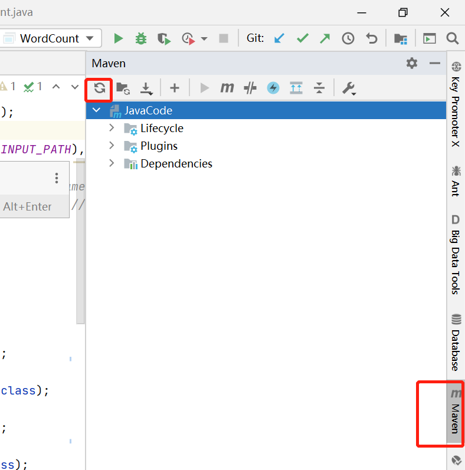

# 在Windows上使用IDEA本地调试Hadoop程序

(1)下载、解压 hadoop-3.2.1.tar.gz

(2)配置环境变量：

    HADOOP_HOME=C:\Soft\hadoop-3.2.1

在 `Path` 环境变量后追加 `;%HADOOP_HOME%\bin`

(3)从 [此地址](https://github.com/steveloughran/winutils) 下载`winutils.exe` 和 `hadoop.dll` 文件，放在 `C:\Soft\hadoop-3.2.1\bin` 目录下，将 `hadoop.dll` 文件放到 `C:\Windows\System32` 目录下。

    如果没有设置以上两步骤，会出现 `HADOOP_HOME and hadoop.home.dir are unset` 错误，
    或者 winutils 的相关错误。

重启电脑后生效。

参考：[https://cwiki.apache.org/confluence/display/HADOOP2/WindowsProblems](https://cwiki.apache.org/confluence/display/HADOOP2/WindowsProblems)

(4)IDEA 下新建 MAVEN 工程，编写 pom.xml 文件，如果写完 pom.xml，依赖没有添加成功，点击如下图标。

(5)写个 wordcount 测试