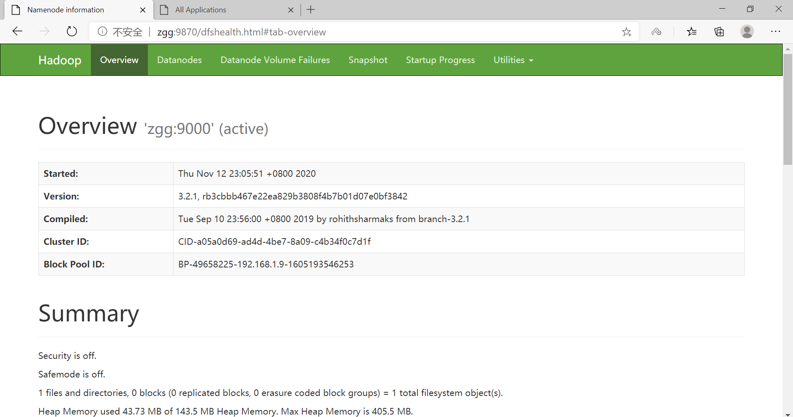
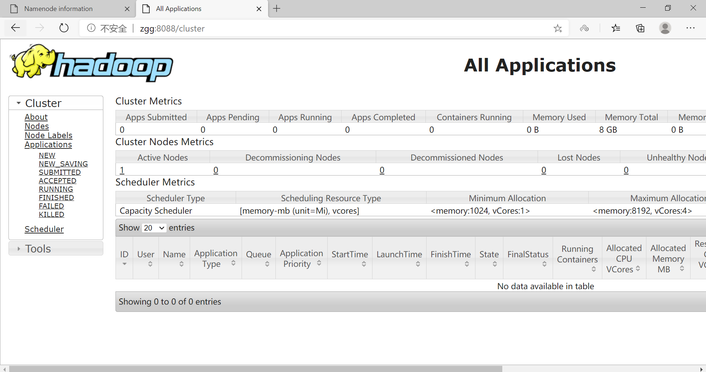

# Hadoop伪分布式环境搭建

[TOC]

## 1、单机与伪分布的区别

单机：在一台单机上运行，没有分布式文件系统hdfs，而是直接读写本地操作系统的文件系统。（只用来执行程序）

伪分布:也是在一台单机上运行，但用不同的 Java 进程模仿分布式运行中的各类结点。

## 2、单机环境搭建

(1)改主机名

(2)主机名和IP绑定

(3)关防火墙

(4)配置SSH

(5)配置宿主机hosts文件

(6)部署软件

## 2、伪分布环境搭建

(1)改主机名

(2)主机名和IP绑定

(3)关防火墙

(4)配置SSH

(5)配置宿主机hosts文件

(6)部署软件

下载、解压

```sh
[root@zgg opt]# tar -zxvf jdk-8u271-linux-x64.tar.gz
...
[root@zgg opt]# tar -zxvf hadoop-3.2.1.tar.gz 
...
```

设置环境变量

```sh
[root@zgg ~]# cat /etc/profile
...
export JAVA_HOME=/opt/jdk1.8.0_271
export HADOOP_HOME=/opt/hadoop-3.2.1

export PATH=.:$HADOOP_HOME/bin:$JAVA_HOME/bin:$PATH

[root@zgg ~]# source /etc/profile
[root@zgg ~]# java -version      
java version "1.8.0_271"
Java(TM) SE Runtime Environment (build 1.8.0_271-b09)
Java HotSpot(TM) 64-Bit Server VM (build 25.271-b09, mixed mode)
```

(7)配置hadoop配置文件

在 `/opt/hadoop-3.2.1/etc/hadoop` 目录下。

```sh
# 将 localhost 换成自己的主机名
[root@zgg hadoop]# cat workers 
zgg
```

```sh
[root@zgg hadoop]# vi hadoop-env.sh
...
export JAVA_HOME=/opt/jdk1.8.0_271

export HDFS_NAMENODE_USER=root
export HDFS_DATANODE_USER=root
export HDFS_SECONDARYNAMENODE_USER=root
export YARN_RESOURCEMANAGER_USER=root
export YARN_NODEMANAGER_USER=root
```

```sh
[root@zgg hadoop]# cat core-site.xml
...
<configuration>
    <property>
        <name>fs.defaultFS</name>
        <value>hdfs://zgg:9000</value>
    </property>
</configuration>
```

```sh
[root@zgg hadoop]# cat hdfs-site.xml 
...
<configuration>
    <property>
        <name>dfs.replication</name>
        <value>1</value>
    </property>
    <property>
        <name>dfs.permissions.enabled</name>
        <value>false</value>
    </property>
</configuration>
```

```sh
[root@zgg hadoop]# cat mapred-site.xml
...
<configuration>
    <property>
        <name>mapreduce.framework.name</name>
        <value>yarn</value>
    </property>
    <property>
        <name>mapreduce.application.classpath</name>
        <value>$HADOOP_MAPRED_HOME/share/hadoop/mapreduce/*:$HADOOP_MAPRED_HOME/share/hadoop/mapreduce/lib/*</value>
    </property>
</configuration>
```

```sh
[root@zgg hadoop]# cat yarn-site.xml 
...
<configuration>
    <property>
        <name>yarn.nodemanager.aux-services</name>
        <value>mapreduce_shuffle</value>
    </property>
    <property>
        <name>yarn.nodemanager.env-whitelist</name>
        <value>JAVA_HOME,HADOOP_COMMON_HOME,HADOOP_HDFS_HOME,HADOOP_CONF_DIR,CLASSPATH_PREPEND_DISTCACHE,HADOOP_YARN_HOME,HADOOP_MAPRED_HOME</value>
    </property>
</configuration>
```

(8)格式化并启动

```sh
[root@zgg hadoop-3.2.1]# hdfs namenode -format
WARNING: /opt/hadoop-3.2.1/logs does not exist. Creating.
2020-11-12 23:03:31,894 INFO namenode.NameNode: STARTUP_MSG: 
/************************************************************
STARTUP_MSG: Starting NameNode
STARTUP_MSG:   host = zgg/192.168.1.9
STARTUP_MSG:   args = [-format]
STARTUP_MSG:   version = 3.2.1
STARTUP_MSG:   classpath = /opt/hadoop-3.2.1/etc/hadoop:
...
2020-11-12 23:03:32,856 INFO common.Storage: Storage directory /tmp/hadoop-root/dfs/name has been successfully formatted.
2020-11-12 23:03:32,885 INFO namenode.FSImageFormatProtobuf: Saving image file /tmp/hadoop-root/dfs/name/current/fsimage.ckpt_0000000000000000000 using no compression
2020-11-12 23:03:32,955 INFO namenode.FSImageFormatProtobuf: Image file /tmp/hadoop-root/dfs/name/current/fsimage.ckpt_0000000000000000000 of size 399 bytes saved in 0 seconds .
2020-11-12 23:03:32,968 INFO namenode.NNStorageRetentionManager: Going to retain 1 images with txid >= 0
2020-11-12 23:03:32,974 INFO namenode.FSImage: FSImageSaver clean checkpoint: txid=0 when meet shutdown.
2020-11-12 23:03:32,974 INFO namenode.NameNode: SHUTDOWN_MSG: 
/************************************************************
SHUTDOWN_MSG: Shutting down NameNode at zgg/192.168.1.9
************************************************************/

[root@zgg hadoop-3.2.1]# sbin/start-all.sh           
Starting namenodes on [zgg]
上一次登录：四 11月 12 22:46:08 CST 2020从 192.168.1.2pts/1 上
Starting datanodes
上一次登录：四 11月 12 23:05:49 CST 2020pts/1 上
Starting secondary namenodes [zgg]
上一次登录：四 11月 12 23:05:52 CST 2020pts/1 上
Starting resourcemanager
上一次登录：四 11月 12 23:05:56 CST 2020pts/1 上
Starting nodemanagers
上一次登录：四 11月 12 23:06:00 CST 2020pts/1 上

[root@zgg hadoop-3.2.1]# jps
10690 DataNode
11284 NodeManager
11142 ResourceManager
11627 Jps
10526 NameNode
10895 SecondaryNameNode
```





(9)测试wordcount

```sh
[root@zgg data]# hadoop jar /opt/hadoop-3.2.1/share/hadoop/mapreduce/hadoop-mapreduce-examples-3.2.1.jar wordcount /in/wc.txt /out
...
```

