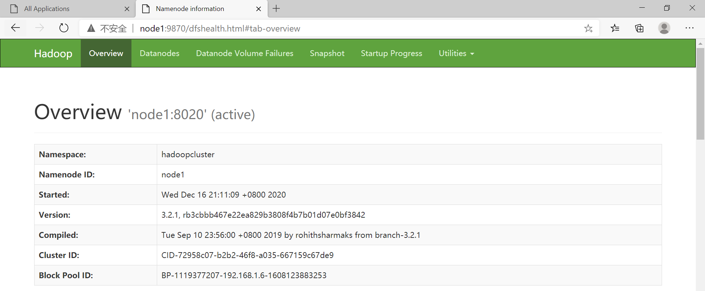
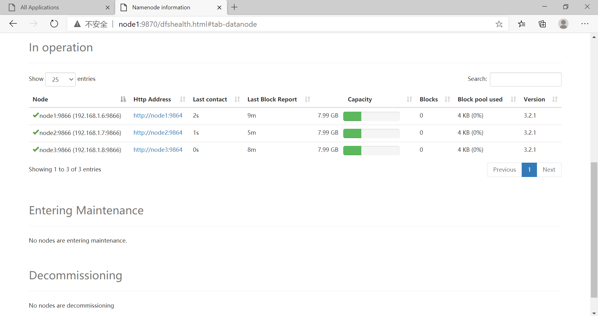
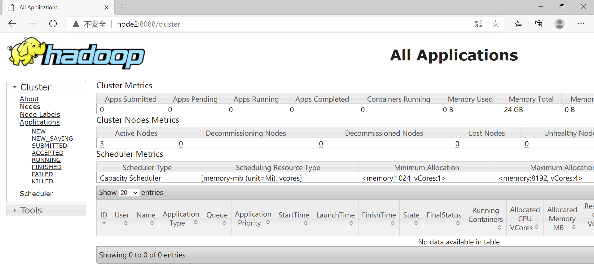

# Hadoop高可用环境搭建 

[TOC]

## 1、硬件配置

采用3台虚拟机

节点名称 | IP地址      | 内存 | 硬盘   | 节点角色
---     |:---         |:--- |:---    |:---
node1   | 192.168.1.6 | 2GB | 10GB   | NameNode、ResoucerManager、ZKFC、DataNode、NodeManager、JournalNode、QuorumPeerMain
node2   | 192.168.1.7 | 2GB | 10GB   | NameNode、ResoucerManager、ZKFC、DataNode、NodeManager、JournalNode、QuorumPeerMain
node3   | 192.168.1.8 | 2GB | 10GB   | DataNode、NodeManager、JournalNode、QuorumPeerMain

## 2、软件版本

软件      |  版本
---       |:---
JDK       | jdk-8u271
HADOOP    | hadoop-3.2.1
ZOOKEEPER | zookeeper-3.5.8

## 3、准备工作

### 3.1、配置网络环境

参考 [Hadoop完全分布式](https://github.com/ZGG2016/knowledgesystem/blob/master/06%20Hadoop/%E7%8E%AF%E5%A2%83%E6%90%AD%E5%BB%BA/%E7%8E%AF%E5%A2%83%E6%90%AD%E5%BB%BA%EF%BC%9A%E5%AE%8C%E5%85%A8%E5%88%86%E5%B8%83.md)

### 3.2、安装JDK

参考 [Hadoop完全分布式](https://github.com/ZGG2016/knowledgesystem/blob/master/06%20Hadoop/%E7%8E%AF%E5%A2%83%E6%90%AD%E5%BB%BA/%E7%8E%AF%E5%A2%83%E6%90%AD%E5%BB%BA%EF%BC%9A%E5%AE%8C%E5%85%A8%E5%88%86%E5%B8%83.md)

### 3.3、安装ZOOKEEPER

参考 [ZOOKEEPER完全分布式](https://github.com/ZGG2016/knowledgesystem/blob/master/19%20Zookeeper/%E7%8E%AF%E5%A2%83%E6%90%AD%E5%BB%BA.md)

```sh
[root@node1 opt]# zkServer.sh start
ZooKeeper JMX enabled by default
Using config: /opt/zookeeper-3.5.8/bin/../conf/zoo.cfg
Starting zookeeper ... STARTED

[root@node1 opt]# zkServer.sh status
ZooKeeper JMX enabled by default
Using config: /opt/zookeeper-3.5.8/bin/../conf/zoo.cfg
Client port found: 2181. Client address: localhost.
Mode: follower

[root@node2 opt]# zkServer.sh start
ZooKeeper JMX enabled by default
Using config: /opt/zookeeper-3.5.8/bin/../conf/zoo.cfg
Starting zookeeper ... STARTED

[root@node2 opt]# zkServer.sh status
ZooKeeper JMX enabled by default
Using config: /opt/zookeeper-3.5.8/bin/../conf/zoo.cfg
Client port found: 2181. Client address: localhost.
Mode: leader

[root@node3 opt]# zkServer.sh start
ZooKeeper JMX enabled by default
Using config: /opt/zookeeper-3.5.8/bin/../conf/zoo.cfg
Starting zookeeper ... STARTED

[root@node3 opt]# jps
7602 Jps
7562 QuorumPeerMain

[root@node3 opt]# zkServer.sh status
ZooKeeper JMX enabled by default
Using config: /opt/zookeeper-3.5.8/bin/../conf/zoo.cfg
Client port found: 2181. Client address: localhost.
Mode: follower
```

## 4、安装Hadoop

配置配置文件，具体见文末。

## 5、启动

(1)分别在 node1、node2、node3 节点上启动 JournalNode 进程：

```sh
[root@node1 hadoop-3.2.1]# bin/hdfs --daemon start journalnode
[root@node1 hadoop-3.2.1]# jps
7890 JournalNode
7629 QuorumPeerMain
7934 Jps

[root@node2 hadoop-3.2.1]# bin/hdfs --daemon start journalnode
[root@node2 hadoop-3.2.1]# jps
7890 JournalNode
7629 QuorumPeerMain
7934 Jps

[root@node3 hadoop-3.2.1]# bin/hdfs --daemon start journalnode
[root@node3 hadoop-3.2.1]# jps
7890 JournalNode
7629 QuorumPeerMain
7934 Jps
```

(2)在其中一台 NameNode 上运行格式化命令：

```sh
[root@node1 hadoop-3.2.1]# bin/hdfs namenode -format
....
2020-12-16 21:04:43,291 INFO common.Storage: Storage directory /opt/hadoop-3.2.1/dfs/namenode has been successfully formatted.
....
```

(3)没有格式化的 NameNode 通过在此机器上运行如下命令，将已格式化的 NameNode 上的元数据目录复制过来：

```sh
[root@node2 hadoop-3.2.1]# bin/hdfs namenode -bootstrapStandby
....
=====================================================
About to bootstrap Standby ID node2 from:
           Nameservice ID: hadoopcluster
        Other Namenode ID: node1
  Other NN's HTTP address: http://node1:9870
  Other NN's IPC  address: node1/192.168.1.6:8020
             Namespace ID: 1789437097
            Block pool ID: BP-1119377207-192.168.1.6-1608123883253
               Cluster ID: CID-72958c07-b2b2-46f8-a035-667159c67de9
           Layout version: -65
       isUpgradeFinalized: true
=====================================================
2020-12-16 21:11:41,726 INFO common.Storage: Storage directory /opt/hadoop-3.2.1/dfs/namenode has been successfully formatted.
2020-12-16 21:11:41,753 INFO common.Util: Assuming 'file' scheme for path /opt/hadoop-3.2.1/dfs/namenode in configuration.
2020-12-16 21:11:41,753 INFO common.Util: Assuming 'file' scheme for path /opt/hadoop-3.2.1/dfs/namenode in configuration.
2020-12-16 21:11:41,805 INFO namenode.FSEditLog: Edit logging is async:true
2020-12-16 21:11:41,908 INFO namenode.TransferFsImage: Opening connection to http://node1:9870/imagetransfer?getimage=1&txid=0&storageInfo=-65:1789437097:1608123883253:CID-72958c07-b2b2-46f8-a035-667159c67de9&bootstrapstandby=true
2020-12-16 21:11:42,009 INFO common.Util: Combined time for file download and fsync to all disks took 0.00s. The file download took 0.00s at 0.00 KB/s. Synchronous (fsync) write to disk of /opt/hadoop-3.2.1/dfs/namenode/current/fsimage.ckpt_0000000000000000000 took 0.00s.
2020-12-16 21:11:42,010 INFO namenode.TransferFsImage: Downloaded file fsimage.ckpt_0000000000000000000 size 399 bytes.
2020-12-16 21:11:42,056 INFO namenode.NameNode: SHUTDOWN_MSG: 
/************************************************************
SHUTDOWN_MSG: Shutting down NameNode at node2/192.168.1.7
************************************************************/
```

(4)在两个 NameNode 节点上启动 NameNode 进程：

```sh
[root@node1 hadoop-3.2.1]# bin/hdfs --daemon start namenode
[root@node1 hadoop-3.2.1]# jps
8705 Jps
7666 QuorumPeerMain
8437 JournalNode
8605 NameNode

[root@node2 hadoop-3.2.1]# bin/hdfs --daemon start namenode
[root@node2 hadoop-3.2.1]# jps
8112 Jps
7890 JournalNode
7629 QuorumPeerMain
8045 NameNode
```

(5)可以在任意 NameNode 所在的主机上运行如下命令来格式化 ZKFC，并在将要运行 NameNode 的机器上启动  ZKFC：

```sh
[root@node1 hadoop-3.2.1]# bin/hdfs zkfc -formatZK
····
2020-12-16 21:18:06,960 INFO ha.ActiveStandbyElector: Successfully created /hadoop-ha/hadoopcluster in ZK.
···· 
```

```sh
[root@node1 hadoop-3.2.1]# bin/hdfs --daemon start zkfc
[root@node1 hadoop-3.2.1]# jps
8848 DFSZKFailoverController
7666 QuorumPeerMain
8898 Jps
8437 JournalNode
8605 NameNode

[root@node2 hadoop-3.2.1]# bin/hdfs --daemon start zkfc
[root@node2 hadoop-3.2.1]# jps
7890 JournalNode
8230 Jps
8199 DFSZKFailoverController
7629 QuorumPeerMain
8045 NameNode
```

(6)启动 datanode

```sh
[root@node1 hadoop-3.2.1]# bin/hdfs --daemon start datanode
[root@node1 hadoop-3.2.1]# jps
8848 DFSZKFailoverController
7666 QuorumPeerMain
9010 Jps
8437 JournalNode
8951 DataNode
8605 NameNode

[root@node2 hadoop-3.2.1]# bin/hdfs --daemon start datanode
[root@node2 hadoop-3.2.1]# jps
7890 JournalNode
8199 DFSZKFailoverController
7629 QuorumPeerMain
8045 NameNode
8398 Jps
8335 DataNode

[root@node3 hadoop-3.2.1]# bin/hdfs --daemon start datanode
[root@node3 hadoop-3.2.1]# jps
7968 DataNode
8000 Jps
7841 JournalNode
7562 QuorumPeerMain
```

(7)启动 ResourceManager 与 NodeManager

```sh
[root@node1 hadoop-3.2.1]# sbin/start-yarn.sh start resoucermanager
Starting resourcemanagers on [ node1 node2]
上一次登录：三 12月 16 19:08:13 CST 2020从 desktop-0ahq4ftpts/2 上
Starting nodemanagers
上一次登录：三 12月 16 21:25:35 CST 2020pts/1 上
[root@node1 hadoop-3.2.1]# jps
8848 DFSZKFailoverController
9472 NodeManager
7666 QuorumPeerMain
8437 JournalNode
8951 DataNode
9627 Jps
9340 ResourceManager
8605 NameNode

[root@node2 hadoop-3.2.1]# jps
7890 JournalNode
8199 DFSZKFailoverController
8552 NodeManager
8475 ResourceManager
7629 QuorumPeerMain
8045 NameNode
8861 Jps
8335 DataNode

[root@node3 hadoop-3.2.1]# jps
7968 DataNode
7841 JournalNode
7562 QuorumPeerMain
8204 Jps
8093 NodeManager
```

(8) web 查看








## 6、问题

(1)配置完配置文件，执行 `bin/hdfs namenode -format`，出现 `a shared edits dir must not be specified if HA is not enabled.` 问题。

原因：配置文件中的这种属性 `dfs.ha.namenodes.[nameservice ID]` 的 [nameservice ID] 没有改成自己的名字。

注意：要配置的属性较多，仔细检查。

(2)配置完配置文件，执行 `bin/hdfs namenode -format`，出现 `Unable to check if JNs are ready for formatting` 问题。

要在各个结点执行 `bin/hdfs --daemon start journalnode` 先启动 journalnode。

## 7、配置文件

**core-site.xml**

```xml
<configuration>
	<property>
            <name>fs.defaultFS</name>  
            <value>hdfs://hadoopcluster</value>  
      	</property>
      	<property>
             <name>io.file.buffer.size</name>
             <value>131072</value>	 
      	</property>
	<property>
            <name>hadoop.tmp.dir</name>
            <value>/opt/hadoop/tmp</value>
        </property> 
        <property>
            <name>ha.zookeeper.quorum</name>
            <value>node1:2181,node2:2181,node3:2181</value>
        </property>
</configuration>
```

**hdfs-site.xml**

```xml
<configuration>
    <property>
		<name>dfs.nameservices</name>
		<value>hadoopcluster</value>
    </property>
    <property>
        <name>dfs.ha.namenodes.hadoopcluster</name>
        <value>node1,node2</value>
    </property>
    <property>
		<name>dfs.namenode.rpc-address.hadoopcluster.node1</name>
		<value>node1:8020</value>
    </property>
    <property>
		<name>dfs.namenode.rpc-address.hadoopcluster.node2</name>
		<value>node2:8020</value>
    </property>
    <property>
		<name>dfs.namenode.http-address.hadoopcluster.node1</name>
		<value>node1:9870</value>
    </property>
    <property>
		<name>dfs.namenode.http-address.hadoopcluster.node2</name>
		<value>node2:9870</value>
    </property>
    <property>
        <name>dfs.namenode.shared.edits.dir</name>
        <value>qjournal://node1:8485;node2:8485;node3:8485/hadoopcluster</value>
    </property>
    <property>
        <name>dfs.client.failover.proxy.provider.hadoopcluster</name>
        <value>org.apache.hadoop.hdfs.server.namenode.ha.ConfiguredFailoverProxyProvider</value>
    </property>
    <property>
        <name>dfs.ha.fencing.methods</name>
        <value>sshfence</value>
        <value>shell(/bin/true)</value>
    </property>
    <property>
        <name>dfs.ha.fencing.ssh.private-key-files</name>
        <value>/root/.ssh/id_dsa</value>
    </property>
    <property>
        <name>dfs.journalnode.edits.dir</name>
        <value>/opt/hadoop-3.2.1/jndata</value>
    </property>
    <property>
        <name>dfs.namenode.name.dir</name>  
        <value>/opt/hadoop-3.2.1/dfs/namenode</value>  
    </property>
    <property>
        <name>dfs.hosts</name>  
        <value>/opt/hadoop-3.2.1/etc/hadoop/workers</value>  
    </property> 
    <property>
        <name>dfs.ha.automatic-failover.enabled</name>
        <value>true</value>
    </property> 
</configuration>

```

**mapred-site.xml**

```xml
<configuration>
    <property>
        <!-- 指定mapreduce框架为yarn方式 -->
        <name>mapreduce.framework.name</name>
        <value>yarn</value>
    </property>
    <property>
        <!-- Directory where history files are written by MapReduce jobs -->
        <name>mapreduce.jobhistory.intermediate-done-dir</name>
        <value>/mr-history/tmp</value>
    </property>
    <property>
        <!-- Directory where history files are managed by the MR JobHistory Server -->
        <name>mapreduce.jobhistory.done-dir</name>
        <value>/mr-history/done</value>
    </property> 
    <property>
        <name>mapreduce.jobhistory.address</name>
        <value>node1:10020</value>
    </property>
    <property>
        <name>mapreduce.jobhistory.webapp.address</name>
        <value>node1:19888</value>
    </property>
</configuration>
```

**yarn-site.xml**

```xml
<configuration>
    <property>
        <name>yarn.resourcemanager.ha.enabled</name>
        <value>true</value>
    </property>
    <property>
        <name>yarn.resourcemanager.cluster-id</name>
        <value>yarncluster</value>
    </property>
    <property>
        <name>yarn.resourcemanager.ha.rm-ids</name>
        <value>rm1,rm2</value>
    </property>
    <property>
        <name>yarn.log-aggregation-enable</name>  
        <value>true</value>  
    </property>
    <property>
        <name>yarn.resourcemanager.hostname.rm1</name>
        <value>node1</value>
        </property>
    <property>
        <name>yarn.resourcemanager.hostname.rm2</name>
        <value>node2</value>
    </property>
    <property>
        <name>yarn.resourcemanager.webapp.address.rm1</name>
        <value>node1:8088</value>
    </property>
    <property>
        <name>yarn.resourcemanager.webapp.address.rm2</name>
        <value>node2:8088</value>
    </property>
    <property>
        <name>yarn.resourcemanager.admin.address.rm1</name>  
        <value>node1:8033</value>  
    </property> 
    <property>
        <name>yarn.resourcemanager.admin.address.rm2</name>  
        <value>node2:8033</value>  
    </property> 
    <property>
        <name>yarn.resourcemanager.address.rm1</name>  
        <value>node1:8032</value>  
    </property> 
    <property>
        <name>yarn.resourcemanager.address.rm2</name>  
        <value>node2:8032</value>  
    </property>
    <property>
        <name>yarn.resourcemanager.scheduler.address.rm1</name>  
        <value>node1:8030</value>  
    </property>
    <property>
        <name>yarn.resourcemanager.scheduler.address.rm2</name>  
        <value>node2:8030</value>  
    </property> 
    <property>
        <name>yarn.resourcemanager.resource-tracker.address.rm1</name>  
        <value>node1:8031</value>  
    </property>
    <property>
        <name>yarn.resourcemanager.resource-tracker.address.rm2</name>  
        <value>node2:8031</value>  
    </property>
    <property>
        <name>yarn.resourcemanager.webapp.address.rm1</name>  
        <value>node1:8088</value>  
    </property>
    <property>
        <name>yarn.resourcemanager.webapp.address.rm2</name>  
        <value>node2:8088</value>  
    </property>
    <property>
        <name>hadoop.zk.address</name>
        <value>node1:2181,node2:2181,node3:2181</value>
    </property>
    <property>
        <name>yarn.resourcemanager.nodes.include-path</name>  
        <value>/opt/hadoop-3.2.1/etc/hadoop/workers</value>  
    </property>
        <property>
        <name>yarn.nodemanager.local-dirs</name>  
        <value>/opt/hadoop-3.2.1/tmp</value>  
    </property> 
    <property>
        <name>yarn.nodemanager.log-dirs</name>  
        <value>/opt/hadoop-3.2.1/logs</value>  
    </property>
    <property>
        <name>yarn.nodemanager.aux-services</name>  
        <value>mapreduce_shuffle</value> 
    </property>
    <property>
        <name>yarn.resourcemanager.ha.automatic-failover.enabled</name>
        <value>true</value>
    </property>
    <property>
        <name>yarn.application.classpath</name>
        <value>/opt/hadoop-3.2.1/etc/hadoop:/opt/hadoop-3.2.1/share/hadoop/common/lib/*:/opt/hadoop-3.2.1/share/hadoop/common/*:/opt/hadoop-3.2.1/share/hadoop/hdfs:/opt/hadoop-3.2.1/share/hadoop/hdfs/lib/*:/opt/hadoop-3.2.1/share/hadoop/hdfs/*:/opt/hadoop-3.2.1/share/hadoop/mapreduce/lib/*:/opt/hadoop-3.2.1/share/hadoop/mapreduce/*:/opt/hadoop-3.2.1/share/hadoop/yarn:/opt/hadoop-3.2.1/share/hadoop/yarn/lib/*:/opt/hadoop-3.2.1/share/hadoop/yarn/*</value>
    </property>
</configuration>
```

**worker**

```xml
node1
node2
node3
```