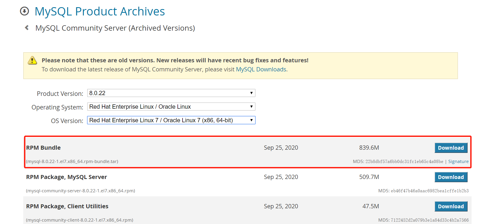

# 环境搭建

[TOC]

## 1、软件版本

软件   | 版本
---    |:---
Hadoop | 3.2.1
MySQL  | 8.0.22
Hive   | 3.1.0

说明：安装中，要注意版本依赖、hive-site.xml的配置、mysql中的配置。

## 2、准备工作

### 2.1、安装 Hadoop

### 2.2、安装 MySQL

下载：[https://downloads.mysql.com/archives/community/](https://downloads.mysql.com/archives/community/)



解压

```sh
tar -xf mysql-8.0.22-1.el7.x86_64.rpm-bundle.tar
# 按照顺序依次执行安装
rpm -ivh mysql-community-common-8.0.22-1.el7.x86_64.rpm
rpm -ivh mysql-community-libs-8.0.22-1.el7.x86_64.rpm
rpm -ivh mysql-community-client-plugins-8.0.22-1.el7.x86_64.rpm
rpm -ivh mysql-community-libs-8.0.22-1.el7.x86_64.rpm
rpm -ivh mysql-community-libs-compat-8.0.22-1.el7.x86_64.rpm
rpm -ivh mysql-community-client-8.0.22-1.el7.x86_64.rpm
rpm -ivh mysql-community-server-8.0.22-1.el7.x86_64.rpm
```

删除 `/etc/my.cnf` 文件中 datadir 指向的目录下的所有内容

```sh
[mysqld]
datadir=/var/lib/mysql

cd /var/lib/mysql
rm -rf *
```

初始化数据库

```sh
mysqld --initialize --user=mysql
```

查看临时生成的 root 用户的密码

```sh
cat /var/log/mysqld.log
```

启动 MySQL 服务
```sh
systemctl start mysqld
```

登录 MySQL 数据库

```sh
mysql -uroot -p
Enter password: 输入临时生成的密码
```

修改 root 用户的密码，否则执行其他的操作会报错

```sh
ALTER USER 'root'@'localhost' IDENTIFIED BY 'root';
```

修改 mysql 库下的 user 表中的 root 用户允许任意 ip 连接

```sh
update mysql.user set host='%' where user='root';

flush privileges;
```

-----------------------------------------------

也可以创建一个普通用户，并授予权限 ⬇

```sql
-- 5.x版本
-- 创建 hive 数据库 
mysql> CREATE DATABASE hive; 

-- 创建 hive 用户，并赋予访问 hive 数据库的权限 
-- zgg为主机名
mysql> GRANT ALL PRIVILEGES ON hive.* TO 'hive'@'zgg' IDENTIFIED BY 'hive';

mysql> FLUSH PRIVILEGES; 
```

```sql
-- 8.0版本
mysql> CREATE DATABASE hive;
Query OK, 1 row affected (0.01 sec)

mysql> ALTER user 'hive'@'zgg' IDENTIFIED WITH mysql_native_password BY 'hive';     -- 用户hive登录mysql的密码，和hive-size.xml中设置的相同          
Query OK, 0 rows affected (0.00 sec)

mysql> grant all privileges on *.* to 'hive'@'zgg' with grant option;         
Query OK, 0 rows affected (0.02 sec)
```

-----------------------------------------------

## 3、安装 Hive

(1)下载、解压、重命名

(2)配置环境变量

```sh
[root@bigdata opt]# vi /etc/profile
[root@bigdata opt]# source /etc/profile
[root@bigdata opt]# cat /etc/profile
# /etc/profile
...

export HIVE_HOME=/opt/hive-3.1.0
export PATH=.:$HIVE_HOME/bin:$PATH
```

(3)配置hive-env.sh

```sh
[root@bigdata conf]# mv hive-env.sh.template hive-env.sh
[root@bigdata conf]# vi hive-env.sh 
[root@bigdata conf]# cat hive-env.sh

export HADOOP_HOME=/opt/hadoop-3.2.1
export HIVE_CONF_DIR=/opt/hive-3.1.0/conf
export HIVE_AUX_JARS_PATH=/opt/hive-3.1.0/lib
```

(4)配置hive-site.xml

```xml
<?xml version="1.0"?>
<?xml-stylesheet type="text/xsl" href="configuration.xsl"?>
<configuration>
 <property>
     <name>javax.jdo.option.ConnectionURL</name>
     <value>jdbc:mysql://bigdata:3306/hive_metastore?useUnicode=true&amp;characterEncoding=utf8&amp;autoReconnect=true&amp;failOverReadOnly=false&amp;allowMultiQueries=true&amp;serverTimezone=UTC&amp;useSSL=false&amp;rewriteBatchedStatements=true</value>
 </property>
 <property>
     <name>javax.jdo.option.ConnectionDriverName</name>
     <value>com.mysql.cj.jdbc.Driver</value>
 </property>
 <property>
    <name>javax.jdo.option.ConnectionUserName</name>
    <value>root</value>
 </property>
 <property>
     <name>javax.jdo.option.ConnectionPassword</name>
     <value>root</value>
 </property>
 <property>
     <name>hive.metastore.schema.verification</name>
     <value>false</value>
 </property>
 <property>
     <name>hive.metastore.event.db.notification.api.auth</name>
     <value>false</value>
 </property>
 <property>
    <name>hive.metastore.warehouse.dir</name>
    <value>/user/hive/warehouse</value>
 </property>
 <property>
    <name>hive.cli.print.header</name>
    <value>true</value>
 </property>
 <property>
    <name>hive.cli.print.current.db</name>
    <value>true</value>
 </property>

# 使用 JDBC 方式访问 Hive，可注释掉
 <property>
     <name>hive.server2.thrift.bind.host</name>
     <value>bigdata</value>
 </property>
 <property>
     <name>hive.server2.thrift.port</name>
     <value>10000</value>
 </property>
 <property>
    <name>hive.server2.transport.mode</name>
    <value>binary</value>
  </property>
</configuration>
```

(5)在 HDFS 中创建数仓目录

```sh
[root@bigdata hive-3.1.0]# hadoop fs -mkdir /user/hive/warehouse
[root@bigdata hive-3.1.0]# hadoop fs -chmod g+w /user/hive/warehouse
```

(6)下载 mysql jdbc jar 包

```sh
cp mysql-connector-java-8.0.22.jar $HIVE_HOME/lib
```

## 4、启动

```sh
# 启动hadoop
[root@bigdata opt]# jps
7889 ResourceManager
8033 NodeManager
10965 Jps
7398 DataNode
7640 SecondaryNameNode
7262 NameNode

# 启动mysql，并新建 Hive 元数据库
[root@bigdata hive-3.1.0]# mysql -uroot -proot
mysql> create database hive_metastore;

[root@bigdata hive-3.1.0]# bin/schematool -dbType mysql -initSchema
...
Metastore connection URL:        jdbc:mysql://bigdata:3306/hive?useUnicode=true&characterEncoding=utf8&autoReconnect=true&failOverReadOnly=false&allowMultiQueries=true&serverTimezone=UTC&useSSL=false&rewriteBatchedStatements=true
Metastore Connection Driver :    com.mysql.cj.jdbc.Driver
Metastore connection User:       hive
Starting metastore schema initialization to 3.1.0
Initialization script hive-schema-3.1.0.mysql.sql
...
Initialization script completed
schemaTool completed

# 启动 Hive 命令行
[root@bigdata hive-3.1.0]# bin/hive
...
Hive Session ID = e43d2d08-5dc9-44a4-876f-068312716d02

Logging initialized using configuration in jar:file:/opt/hive-3.1.0/lib/hive-common-3.1.0.jar!/hive-log4j2.properties Async: true
Hive-on-MR is deprecated in Hive 2 and may not be available in the future versions. Consider using a different execution engine (i.e. spark, tez) or using Hive 1.X releases.
Hive Session ID = 0df84856-2d8a-4f5e-9655-64f633621f6b
hive> show tables;
OK
Time taken: 0.874 seconds

hive> create table test (id int);
hive> insert into test values(1);
hive> select * from test;


# 运行 HiveServer2 和 Beeline
[root@bigdata hive-3.1.0]# bin/hiveserver2
...
Hive Session ID = aac0a1ae-26f5-4a37-8a13-d80acebdc50f
Hive Session ID = 0df1fed5-c977-4ddd-8e04-a20ee3b0e4e5
Hive Session ID = f232fa7f-9b90-4bd6-a286-276ad3aa8eb5
Hive Session ID = 29276d34-c8b6-4ebc-ad32-b82b968ba6f5

-- 可以通过 -n 来指定登入用户
[root@bigdata hive-3.1.0]# bin/beeline -u jdbc:hive2://bigdata:10000/default;auth=noSasl
Connecting to jdbc:hive2://bigdata:10000/default
Connected to: Apache Hive (version 3.1.0)
Driver: Hive JDBC (version 3.1.0)
Transaction isolation: TRANSACTION_REPEATABLE_READ
Beeline version 3.1.0 by Apache Hive
0: jdbc:hive2://bigdata:10000/default> 
```

## 5、问题

(1)启动`bin/hive`时，出现：`Caused by: java.sql.SQLException: Access denied for user 'hive'@'zgg' (using password: YES)`

解决：执行：`GRANT ALL PRIVILEGES ON hive.* TO 'hive'@'zgg' IDENTIFIED BY 'hive';`


(2)启动`bin/hive`时，出现：`ls: 无法访问/opt/spark-2.4.4-bin-hadoop2.7/lib/spark-assembly-*.jar: 没有那个文件或目录`


原因： spark升级到spark2以后，原有lib目录下的大jar包被分散成多个小jar包，原来的`spark-assembly-*.jar`已经不存在，所以hive没有办法找到这个jar包。简单来讲：新版本的spark,hive没有及时支持更新。

解决方法：修改hive的启动脚本

```sh
# add Spark assembly jar to the classpath
if [[ -n "$SPARK_HOME" ]]
then
  sparkAssemblyPath=`ls ${SPARK_HOME}/lib/spark-assembly-*.jar`
  CLASSPATH="${CLASSPATH}:${sparkAssemblyPath}"
fi
```

```sh
# add Spark assembly jar to the classpath
if [[ -n "$SPARK_HOME" ]]
then
  sparkAssemblyPath=`ls ${SPARK_HOME}/jars/*.jar
  CLASSPATH="${CLASSPATH}:${sparkAssemblyPath}"
fi
```

(4)启动`bin/hive`时，出现：`com.ctc.wstx.exc.WstxParsingException: Illegal character entity: expansion character (code 0x8
 at [row,col,system-id]: [3215,96,"file:/opt/hive-3.1.2/conf/hive-site.xml"]`

第3215行的第96列的不合法字符格式，定位到位置发现是`description`，就直接删除，也可以具体调整。

(5)启动`bin/hive`时，出现：`NoSuchMethodError: com.google.common.base.Preconditions.checkArgument(ZLjava/lang/String;Ljava/lang/Object;)V`

该类来自于guava.jar。版本不一致，使用 hadoop 下的 jar 包替换 hive 下的。

```sh
[root@zgg lib]# rm -f guava-19.0.jar
[root@zgg lib]# cp /opt/hadoop-3.2.1/share/hadoop/common/lib/guava-27.0-jre.jar .
```

(6)mysql升级到8.0.21后，启动hive，报错`MySQLNonTransientConnectionException: Could not create connection to database serve`

需要hive-site.xml中的mysql配置，更新其版本。

如果出现`The specified datastore driver ("com.mysql.cj.jdbc.Driver") was not found in...`，说明libs目录下的jar包也要更新。

如果没有在mysql中创建hive用户需要先创建。

```sql
mysql> CREATE DATABASE hive;
Query OK, 1 row affected (0.01 sec)

mysql> ALTER user 'hive'@'zgg' IDENTIFIED WITH mysql_native_password BY 'hive';              
Query OK, 0 rows affected (0.00 sec)

mysql> grant all privileges on *.* to 'hive'@'zgg' with grant option;         
Query OK, 0 rows affected (0.02 sec)
```
(7)schematool 命令初始化时，出现

	org.apache.hadoop.hive.metastore.HiveMetaException: Failed to load driver
	Underlying cause: java.lang.ClassNotFoundException : com.mysql.cj.jdbc.Driver

jdbc 驱动下载错误，应该和 mysql 版本一致。这里应该是 8.x，不是 5.x.

(8)schematool 命令初始化时，出现

	org.apache.hadoop.hive.metastore.HiveMetaException: Failed to get schema version.
	Underlying cause: java.sql.SQLNonTransientConnectionException : Could not create connection to database server. Attempted reconnect 3 times. Giving up.
	SQL Error code: 0

原因是没有在 mysql 配置 hive 数据库。

(9)在 Beeline 下执行 `insert into test values(1);` 命令，出现

	Error: Error while processing statement: FAILED: Execution Error, return code 1 from org.apache.hadoop.hive.ql.exec.mr.MapRedTask. Permission denied: user=anonymous, access=EXECUTE, inode="/tmp":root:supergroup:drwx------

直接在 hdfs 文件系统上修改权限: `hdfs dfs -chmod -R 777 /tmp`

[https://blog.csdn.net/Ntozot/article/details/83031124](https://blog.csdn.net/Ntozot/article/details/83031124)

--------------------------------

参考：

[http://dblab.xmu.edu.cn/blog/2440-2/](http://dblab.xmu.edu.cn/blog/2440-2/)

[尚硅谷hive教程](https://www.bilibili.com/video/BV1EZ4y1G7iL?p=8)