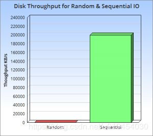
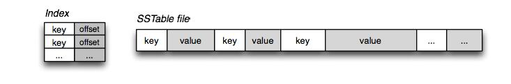
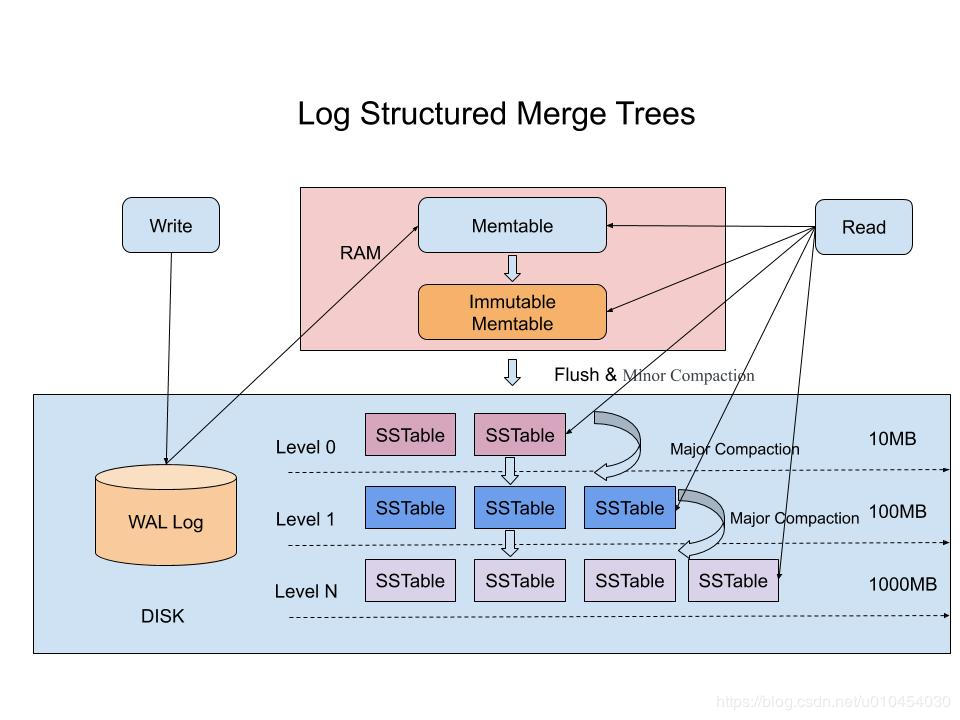

# 深入理解什么是LSM-Tree

## 1、什么是LSM-Tree

LSM-Tree 全称是 Log Structured Merge Tree，是一种分层，有序，面向磁盘的数据结构，其核心思想是充分利用了磁盘批量的顺序写要远比随机写性能高出很多，如下图示：

这种结构的写入，全部都是以 Append 的模式追加，不存在删除和修改。这种结构虽然大大提升了数据的写入能力，却是以牺牲部分读取性能为代价，故此这种结构通常适合于写多读少的场景。故 LSM 被设计来提供比传统的 B+ 树或者 ISAM 更好的写操作吞吐量.

## 2、SSTable 和 LSM-Tree

在 LSM-Tree 里面，核心的数据结构就是 SSTable，全称是 Sorted String Table。

	An SSTable provides a persistent, ordered immutable map from keys to values, where both keys and values are arbitrary byte strings. Operations are provided to look up the value associated with a specified key, and to iterate over all key/value pairs in a specified key range. Internally, each SSTable contains a sequence of blocks (typically each block is 64KB in size, but this is configurable). A block index (stored at the end of the SSTable) is used to locate blocks; the index is loaded into memory when the SSTable is opened. A lookup can be performed with a single disk seek: we first find the appropriate block by performing a binary search in the in-memory index, and then reading the appropriate block from disk. Optionally, an SSTable can be completely mapped into memory, which allows us to perform lookups and scans without touching disk.

如上所述，SSTable 是一种拥有持久化，有序且不可变的的键值存储结构，它的 key 和 value 都是任意的字节数组，并且了提供了按指定 key 查找和指定范围的 key 区间迭代遍历的功能。

SSTable 内部包含了一系列可配置大小的 Block 块，典型的大小是 64KB，关于这些 Block 块的 index 存储在 SSTable 的尾部，用于帮助快速查找特定的 Block。

当一个 SSTable 被打开的时候，index 会被加载到内存，然后根据 key 在内存 index 里面进行一个二分查找，查到该 key 对应的磁盘的 offset 之后，然后去磁盘把响应的块数据读取出来。当然如果内存足够大的话，可以直接把 SSTable 直接通过 MMap 的技术映射到内存中，从而提供更快的查找。 

在 LSM-Tree 里，SSTable 有一份在内存里面，其他的多级在磁盘上，如下图是一份完整的 LSM-Tree 图示：

### 2.1、在LSM-Tree里面如何写数据的？

- 1、当收到一个写请求时，会先把该条数据记录在 WAL Log 里面，用作故障恢复。

- 2、当写完 WAL Log 后，会把该条数据写入内存的 SSTable 里面（删除是墓碑标记，更新是新记录一条的数据），也称 Memtable。注意为了维持有序性在内存里面可以采用红黑树或者跳跃表相关的数据结构。

- 3、当 Memtable 超过一定的大小后，会在内存里面冻结，变成不可变的 Memtable，同时为了不阻塞写操作需要新生成一个 Memtable 继续提供服务。

- 4、把内存里面不可变的 Memtable 给 dump 到硬盘上的 SSTable 层中，此步骤也称为 Minor Compaction ，这里需要注意在 L0 层的 SSTable 是没有进行合并的，所以这里的 key range 在多个 SSTable 中可能会出现重叠，在层数大于0层之后的 SSTable，不存在重叠 key。

- 5、当每层的磁盘上的 SSTable 的体积超过一定的大小或者个数，也会周期的进行合并。此步骤也称为 Major Compaction ，这个阶段会真正的清除掉被标记删除掉的数据以及多版本数据的合并，避免浪费空间，注意由于 SSTable 都是有序的，我们可以直接采用 merge sort 进行高效合并。

### 2.1、在LSM-Tree里面如何读数据的？

- 1、当收到一个读请求的时候，会直接先在内存里面查询，如果查询到就返回。

- 2、如果没有查询到就会依次下沉，知道把所有的Level层查询一遍得到最终结果。

思考查询步骤，我们会发现如果SSTable的分层越多，那么最坏的情况下要把所有的分层扫描一遍，对于这种情况肯定是需要优化的，如何优化？在 Bigtable 论文中提出了几种方式：

1、压缩

SSTable 是可以启用压缩功能的，并且这种压缩不是将整个 SSTable 一起压缩，而是根据 locality 将数据分组，每个组分别压缩，这样的好处当读取数据的时候，我们不需要解压缩整个文件而是解压缩部分 Group 就可以读取。

2、缓存

因为 SSTable 在写入磁盘后，除了 Compaction 之外，是不会变化的，所以我可以将 Scan 的 Block 进行缓存，从而提高检索的效率。

3、索引，Bloom filters

正常情况下，一个读操作是需要读取所有的 SSTable 将结果合并后返回的，但是对于某些 key 而言，有些 SSTable 是根本不包含对应数据的，因此，我们可以对每一个 SSTable 添加 Bloom Filter ，因为布隆过滤器在判断一个 SSTable 不存在某个 key 的时候，那么就一定不会存在，利用这个特性可以减少不必要的磁盘扫描。

4、合并

这个在前面的写入流程中已经介绍过，通过定期合并瘦身， 可以有效的清除无效数据，缩短读取路径，提高磁盘利用空间。但 Compaction 操作是非常消耗CPU和磁盘IO的，尤其是在业务高峰期，如果发生了 Major Compaction ，则会降低整个系统的吞吐量，这也是一些 NoSQL 数据库，比如Hbase里面常常会禁用 Major Compaction ，并在凌晨业务低峰期进行合并的原因。

为什么LSM不直接顺序写入磁盘，而是需要在内存中缓冲一下？ 

单条写的性能肯定没有批量写来的块，这个原理其实在Kafka里面也是一样的，虽然kafka给我们的感觉是写入后就落地，但其实并不是，本身是可以根据条数或者时间比如200ms刷入磁盘一次，这样能大大提升写入效率。此外在LSM中，在磁盘缓冲的另一个好处是，针对新增的数据，可以直接查询返回，能够避免一定的IO操作。

## 3、B+Tree VS LSM-Tree

传统关系型数据采用的底层数据结构是B+树，那么同样是面向磁盘存储的数据结构LSM-Tree相比B+树有什么异同之处呢？

LSM-Tree 的设计思路是，将数据拆分为几百M大小的 Segments，并是顺序写入。

B+Tree 则是将数据拆分为固定大小的 Block 或 Page, 一般是4KB大小，和磁盘一个扇区的大小对应，Page 是读写的最小单位。

在数据的更新和删除方面，B+Tree 可以做到原地更新和删除，这种方式对数据库事务支持更加友好，因为一个 key 只会出现一个 Page 页里面，但由于 LSM-Tree 只能追加写，并且在 L0 层 key 的 rang 会重叠，所以对事务支持较弱，只能在 Segment Compaction 的时候进行真正地更新和删除。

因此 LSM-Tree 的优点是支持高吞吐的写（可认为是O（1）），这个特点在分布式系统上更为看重，当然针对读取普通的 LSM-Tree 结构，读取是 O（N）的复杂度，在使用索引或者缓存优化后的也可以达到 O（logN）的复杂度。

而 B+tree 的优点是支持高效的读（稳定的OlogN），但是在大规模的写请求下（复杂度O(LogN)），效率会变得比较低，因为随着insert的操作，为了维护B+树结构，节点会不断的分裂和合并。操作磁盘的随机读写概率会变大，故导致性能降低。

还有一点需要提到的是基于 LSM-Tree 分层存储能够做到写的高吞吐，带来的副作用是整个系统必须频繁的进行 compaction ，写入量越大，Compaction 的过程越频繁。而 compaction 是一个 compare & merge 的过程，非常消耗CPU和存储IO，在高吞吐的写入情形下，大量的 compaction 操作占用大量系统资源，必然带来整个系统性能断崖式下跌，对应用系统产生巨大影响，当然我们可以禁用自动 Major Compaction，在每天系统低峰期定期触发合并，来避免这个问题。

阿里为了优化这个问题，在 X-DB 引入了异构硬件设备 FPGA 来代替 CPU 完成 compaction 操作，使系统整体性能维持在高水位并避免抖动，是存储引擎得以服务业务苛刻要求的关键。

[原文链接](https://blog.csdn.net/u010454030/article/details/90414063?utm_medium=distribute.pc_relevant.none-task-blog-BlogCommendFromMachineLearnPai2-2.channel_param&depth_1-utm_source=distribute.pc_relevant.none-task-blog-BlogCommendFromMachineLearnPai2-2.channel_param)

[参考](https://blog.csdn.net/lifuxiangcaohui/article/details/39962921)
