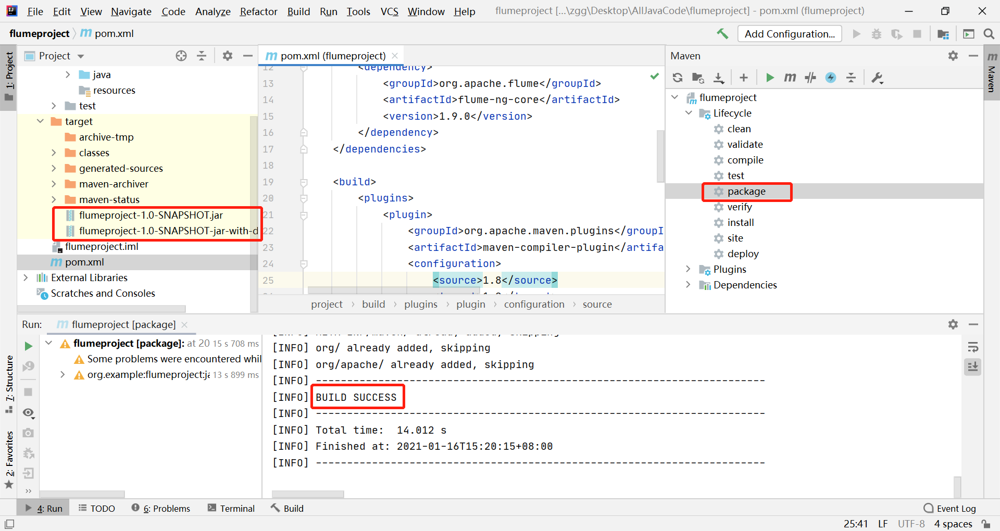

# Custom-Source

1、编写代码

```java
import org.apache.flume.Context;
import org.apache.flume.EventDeliveryException;
import org.apache.flume.PollableSource;
import org.apache.flume.conf.Configurable;
import org.apache.flume.event.SimpleEvent;
import org.apache.flume.source.AbstractSource;

import java.util.HashMap;

public class CustomSource extends AbstractSource implements Configurable, PollableSource {

    public String url = null;

    @Override
    public Status process() throws EventDeliveryException {

        Status status = null;

        try{
            HashMap<String,String> headers = new HashMap<>();
            headers.put("appname","meituan");

            SimpleEvent event = new SimpleEvent();

            event.setHeaders(headers);
            event.setBody(url.getBytes());

            getChannelProcessor().processEvent(event);

            status = Status.READY;

        }catch (Throwable t) {
            status = Status.BACKOFF;

            // re-throw all Errors
            if (t instanceof Error) {
                throw (Error)t;
            }
        }
        return status;

    }

    @Override
    public long getBackOffSleepIncrement() {
        return 0;
    }

    @Override
    public long getMaxBackOffSleepInterval() {
        return 0;
    }

    @Override
    public void configure(Context context) {
        url = context.getString("url","www.defaultvalue.com");
    }
}

```

2、打包，上传至 flume 的 lib/ 目录下。



打包之后，只需要单独包，不需要将依赖的包上传。因为依赖包在 flume 的 lib 目录下面已经存在了。

```sh
[root@zgg lib]# rz
rz waiting to receive.
Starting zmodem transfer.  Press Ctrl+C to cancel.
Transferring flumeproject-1.0-SNAPSHOT.jar...
  100%       3 KB       3 KB/sec    00:00:01       0 Errors  
```

3、编写配置文件

```sh
[root@zgg flume-1.9.0]# vi jobs/flume-custorm-source.conf
# Name the components on this agent
a1.sources = r1
a1.sinks = k1
a1.channels = c1

# Describe/configure the source
a1.sources.r1.type = CustomSource
a1.sources.r1.url = www.meituan.com

# Describe the sink
a1.sinks.k1.type = logger

# Use a channel which buffers events in memory
a1.channels.c1.type = memory
a1.channels.c1.capacity = 1000
a1.channels.c1.transactionCapacity = 100

# Bind the source and sink to the channel
a1.sources.r1.channels = c1
a1.sinks.k1.channel = c1

----------------------------------------------------

# 启动 Flume 任务
[root@zgg flume-1.9.0]# bin/flume-ng agent --conf conf --conf-file jobs/flume-custorm-source.conf --name a1 -Dflume.root.logger=INFO,console
....
2021-01-16 13:58:04,060 (SinkRunner-PollingRunner-DefaultSinkProcessor) [INFO - org.apache.flume.sink.LoggerSink.process(LoggerSink.java:95)] Event: { headers:{appname=meituan} body: 77 77 77 2E 6D 65 69 74 75 61 6E 2E 63 6F 6D    www.meituan.com }
2021-01-16 13:58:04,060 (SinkRunner-PollingRunner-DefaultSinkProcessor) [INFO - org.apache.flume.sink.LoggerSink.process(LoggerSink.java:95)] Event: { headers:{appname=meituan} body: 77 77 77 2E 6D 65 69 74 75 61 6E 2E 63 6F 6D    www.meituan.com }
....
```

4、pom.xml 文件

```xml
<?xml version="1.0" encoding="UTF-8"?>
<project xmlns="http://maven.apache.org/POM/4.0.0"
         xmlns:xsi="http://www.w3.org/2001/XMLSchema-instance"
         xsi:schemaLocation="http://maven.apache.org/POM/4.0.0 http://maven.apache.org/xsd/maven-4.0.0.xsd">
    <modelVersion>4.0.0</modelVersion>

    <groupId>org.example</groupId>
    <artifactId>flumeproject</artifactId>
    <version>1.0-SNAPSHOT</version>

    <dependencies>
        <dependency>
            <groupId>org.apache.flume</groupId>
            <artifactId>flume-ng-core</artifactId>
            <version>1.9.0</version>
        </dependency>
    </dependencies>

    <build>
        <plugins>
            <plugin>
                <groupId>org.apache.maven.plugins</groupId>
                <artifactId>maven-compiler-plugin</artifactId>
                <configuration>
                    <source>1.8</source>
                    <target>1.8</target>
                 </configuration>
            </plugin>
            <plugin>
                <artifactId>maven-assembly-plugin</artifactId>
                <configuration>
                    <descriptorRefs>
                        <descriptorRef>jar-with-dependencies</descriptorRef>
                    </descriptorRefs>
                </configuration>
                <executions>
                    <execution>
                        <id>make-assembly</id>
                        <phase>package</phase>
                        <goals>
                            <goal>single</goal>
                        </goals>
                    </execution>
                </executions>
            </plugin>
        </plugins>
    </build>

</project>
```