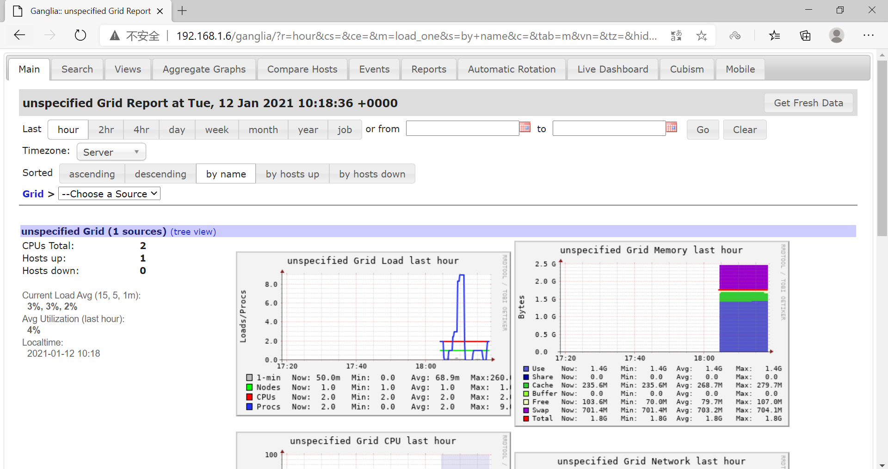
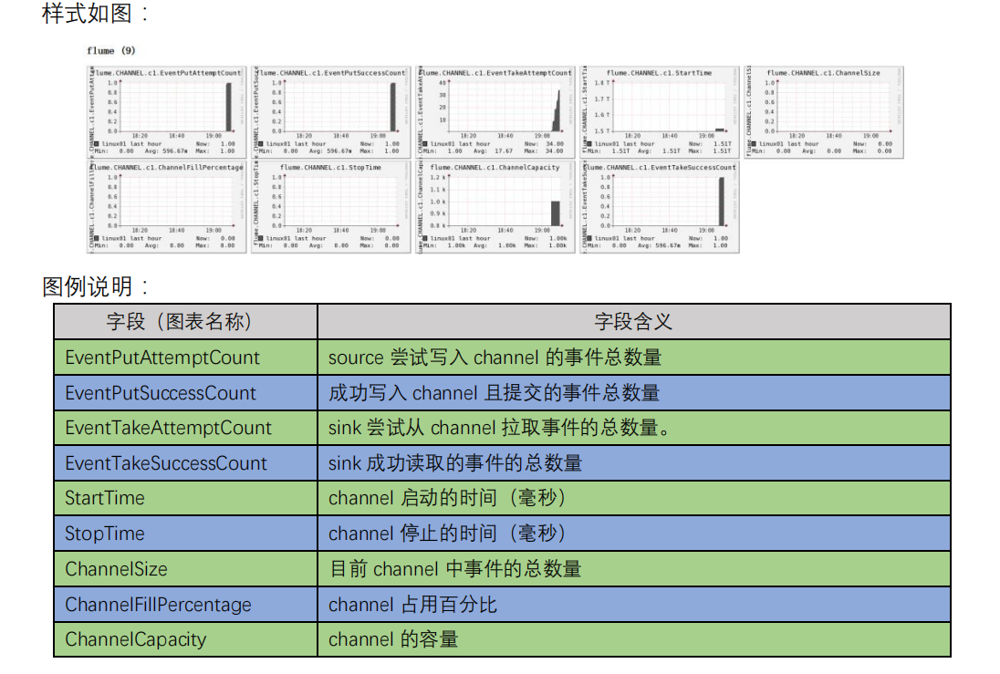

# Flume安装及ganglia监控

[TOC]

## 1、Flume安装

1、下载、解压、重命名

下载地址：[http://archive.apache.org/dist/flume/](http://archive.apache.org/dist/flume/)

```sh
[root@zgg opt]# tar -zxvf apache-flume-1.9.0-bin.tar.gz
....

[root@zgg opt]# mv apache-flume-1.9.0-bin flume-1.9.0
[root@zgg opt]# ls
apache-flume-1.9.0-bin.tar.gz  flume-1.9.0
```

2、配置环境变量

```sh
[root@zgg opt]# vi /etc/profile
...
export FLUME_HOME=/opt/flume-1.9.0
export PATH=.:$FLUME_HOME/bin:$PATH

[root@zgg opt]# source /etc/profile 
```

3、配置配置文件

```sh
[root@zgg conf]# mv flume-env.sh.template flume-env.sh 
[root@zgg conf]# vi flume-env.sh
....
export JAVA_HOME=/opt/jdk1.8.0_271
....
```

4、测试

	cd /opt/flume-1.9.0/conf
	cp flume-conf.properties.template  flume-conf.properties
	vi flume-conf.properties

把没注释的内容注释，并添加

	# Name the components on this agent
	a1.sources = r1
	a1.sinks = k1
	a1.channels = c1

	# Describe/configure the source
	a1.sources.r1.type = netcat
	a1.sources.r1.bind = localhost
	a1.sources.r1.port = 44444

	# Describe the sink
	a1.sinks.k1.type = logger

	# Use a channel which buffers events in memory
	a1.channels.c1.type = memory
	a1.channels.c1.capacity = 1000
	a1.channels.c1.transactionCapacity = 100

	# Bind the source and sink to the channel
	a1.sources.r1.channels = c1
	a1.sinks.k1.channel = c1

5、启动

	bin/flume-ng agent --conf conf --conf-file conf/flume-conf.properties --name a1 -Dflume.root.logger=INFO,console

打开另一个shell，输入：

	telnet localhost 44444

输入 hellooooooooo

## 2、ganglia安装

1、安装 httpd 服务与 php

	yum -y install httpd php

2、安装其他依赖

	yum -y install rrdtool perl-rrdtool rrdtool-devel 
	yum -y install apr-devel

3、安装 ganglia

	rpm -Uvh http://dl.fedoraproject.org/pub/epel/7/x86_64/Packages/e/epel-release-7-13.noarch.rpm   

	yum -y install ganglia-gmetad 
	yum -y install ganglia-web
	yum -y install ganglia-gmond

Ganglia 由 gmond、gmetad 和 gweb 三部分组成。

gmond（Ganglia Monitoring Daemon）是一种轻量级服务，安装在每台需要收集指标数据的节点主机上。使用 gmond，你可以很容易收集很多系统指标数据，如 CPU、内存、磁盘、网络和活跃进程的数据等。

gmetad（Ganglia Meta Daemon）整合所有信息，并将其以 RRD 格式存储至磁盘的服务。

gweb（Ganglia Web）Ganglia 可视化工具，gweb 是一种利用浏览器显示 gmetad 所存储数据的 PHP 前端。在 Web 界面中以图表方式展现集群的运行状态下收集的多种不同指标数据。

4、修改配置文件 `/etc/httpd/conf.d/ganglia.conf` 

	vi /etc/httpd/conf.d/ganglia.conf

修改为红颜色的配置：

	# Ganglia monitoring system php web frontend
	Alias /ganglia /usr/share/ganglia
	<Location /ganglia>
	 Order deny,allow
	 #Deny from all
	 Allow from all
	 # Allow from 127.0.0.1
	 # Allow from ::1
	 # Allow from .example.com
	</Location>

5、修改配置文件 `/etc/ganglia/gmetad.conf` 

	vi /etc/ganglia/gmetad.conf

修改内容：

	data_source "zgg" 192.168.1.6

6、修改配置文件 `/etc/ganglia/gmond.conf` 

	vi /etc/ganglia/gmond.conf 

修改为：

	cluster {
	 name = "zgg"   **
	 owner = "unspecified"
	 latlong = "unspecified"
	 url = "unspecified"
	}
	udp_send_channel {
	 #bind_hostname = yes # Highly recommended, soon to be default.
	 # This option tells gmond to use a source 
	address
	 # that resolves to the machine's hostname. 
	Without
	 # this, the metrics may appear to come from any
	 # interface and the DNS names associated with
	 # those IPs will be used to create the RRDs.
	 # mcast_join = 239.2.11.71 **
	 host = 192.168.1.6 **
	 port = 8649
	 ttl = 1
	}
	udp_recv_channel {
	 # mcast_join = 239.2.11.71 **
	 port = 8649
	 bind = 192.168.1.6  **
	 retry_bind = true
	 # Size of the UDP buffer. If you are handling lots of metrics you 
	really
	 # should bump it up to e.g. 10MB or even higher.
	 # buffer = 10485760
	}

7、修改配置文件 `/etc/selinux/config` 

	vi /etc/selinux/config

修改为：

	# This file controls the state of SELinux on the system.
	# SELINUX= can take one of these three values:
	# enforcing - SELinux security policy is enforced.
	# permissive - SELinux prints warnings instead of enforcing.
	# disabled - No SELinux policy is loaded.
	SELINUX=disabled
	# SELINUXTYPE= can take one of these two values:
	# targeted - Targeted processes are protected,
	# mls - Multi Level Security protection.
	SELINUXTYPE=targeted

提示：selinux 本次生效关闭必须重启，如果此时不想重启，可以临时生效之：

	setenforce 0

8、启动 ganglia 

	service httpd start
	service gmetad start
	service gmond start

9、web 查看

打开网页浏览 ganglia 页面 

	http://192.168.1.6/ganglia



提示：如果完成以上操作依然出现权限不足错误，请修改 `/var/lib/ganglia` 目录的权限：

	chmod -R 777 /var/lib/ganglia

如果在 `/etc/httpd/conf.d/ganglia.conf` 中修改了 `Allow from all`，还是出现权限不足错误，那么就将其注释掉，添加 `Require all granted`，再重启服务即可。

10、测试

修改 `/opt/flume-1.9.0/conf` 目录下的 flume-env.sh 配置： 

	JAVA_OPTS="-Dflume.monitoring.type=ganglia
	-Dflume.monitoring.hosts=192.168.1.6:8649
	-Xms100m
	-Xmx200m"

启动 Flume 任务

	bin/flume-ng agent 
	--conf conf/ 
	--name a1 
	--conf-file jobs/flume-netcat-conf.properties 
	-Dflume.root.logger==INFO,console 
	-Dflume.monitoring.type=ganglia 
	-Dflume.monitoring.hosts=192.168.1.6:8649

打开另一个shell，输入：

```sh
[root@zgg ~]# telnet localhost 44444
Trying ::1...
telnet: connect to address ::1: Connection refused
Trying 127.0.0.1...
Connected to localhost.
Escape character is '^]'.
heloooooo^[[D^[[D^[[D
OK
```

查看执行任务的日志：

```sh
....
2021-01-12 18:39:01,223 (netcat-handler-0) [DEBUG - org.apache.flume.source.NetcatSource$NetcatSocketHandler.run(NetcatSource.java:328)] Chars read = 20
2021-01-12 18:39:01,239 (netcat-handler-0) [DEBUG - org.apache.flume.source.NetcatSource$NetcatSocketHandler.run(NetcatSource.java:332)] Events processed = 1
2021-01-12 18:39:05,242 (SinkRunner-PollingRunner-DefaultSinkProcessor) [INFO - org.apache.flume.sink.LoggerSink.process(LoggerSink.java:95)] Event: { headers:{} body: 68 65 6C 6F 6F 6F 6F 6F 6F 1B 5B 44 1B 5B 44 1B heloooooo.[D.[D. }
....
```

查看 ganglia web 页面：

