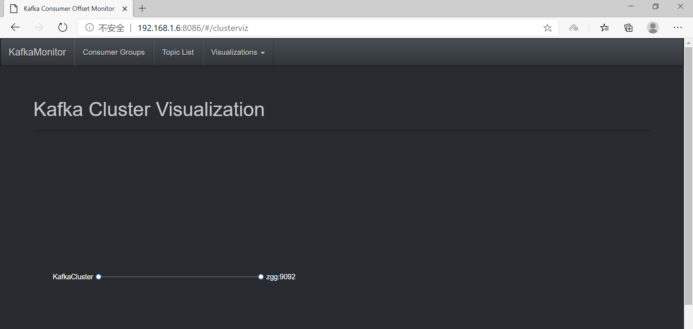

# KafkaOffsetMonitor

## 1、下载 jar 包

下载 `KafkaOffsetMonitor-assembly-0.2.0.jar` 包

新建目录，将 jar 包复制到这个目录下

```sh
[root@zgg kafka_2.11-2.4.1]# mkdir kafka-offset-console
[root@zgg kafka_2.11-2.4.1]# rz
rz waiting to receive.
Starting zmodem transfer.  Press Ctrl+C to cancel.
Transferring KafkaOffsetMonitor-assembly-0.2.0.jar...
  100%   56553 KB    5141 KB/sec    00:00:11       0 Errors  
```

## 2、写启动暂停脚本

```sh
[root@zgg script]# vi kafka_monitor_start.sh
#!/bin/bash

java -Xms512M -Xmx512M -Xss1024K -XX:PermSize=256m -XX:MaxPermSize=512m 
	 -cp /opt/kafka_2.11-2.4.1/kafka-offset-console/KafkaOffsetMonitor-assembly-0.2.0.jar com.quantifind.kafka.offsetapp.OffsetGetterWeb 
	 --zk zgg:2181 
	 --port 8086 
	 --refresh 10.seconds 
	 --retain 7.days 
	 1>/opt/kafka_2.11-2.4.1/kafka-offset-console/kafkamonitorlogs/stdout.log 
	 2>/opt/kafka_2.11-2.4.1/kafka-offset-console/kafkamonitorlogs/stderr.log &
```

```sh
[root@zgg script]# vi kafka_monitor_stop.sh
#!/bin/bash

killnum=`jps | grep OffsetGetterWeb | awk '{print $1}'`
kill -9 ${killnum}
echo "OK...."
```

**注意路径**

## 3、启动
	
```sh
[root@zgg script]# chmod +x kafka_monitor_start.sh
[root@zgg script]# sh kafka_monitor_start.sh 
[root@zgg script]# jps
7878 Kafka
8424 OffsetGetterWeb
8446 Jps
7855 QuorumPeerMain
```

在浏览器中输入：http://ip:port 即可以查看 KafkaOffsetMonitor Web UI




出现的问题：如果界面一直处在 `loading` 的状态，可能是启动脚本有错误。

-----------------------------------------------------------------

另一种监控：[KafkaManager](https://www.bilibili.com/video/BV1L4411K7hW?p=38)