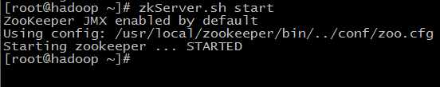
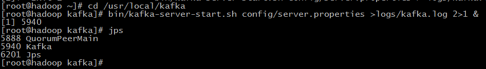
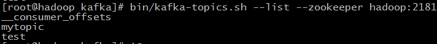

# 环境搭建

[TOC]

要先安装 jdk 和 zookeeper

## 1、单机

### 1.1、下载、解压、[重命名]、配置环境变量

下载：[http://kafka.apache.org/downloads](http://kafka.apache.org/downloads)

解压：`tar -zxvf kafka_2.12-2.6.0.tgz`
	
[重命名]：`mv kafka_2.12-2.6.0 kafka`

配置环境变量：`export KAFKA_HOME=/opt/kafka_2.12-2.6.0`、`export PATH=$PATH:$KAFKA_HOME/bin`

### 1.2、启动

zookeeper：`zkServer.sh start`

kafka：`bin/kafka-server-start.sh config/server.properties >logs/kafka.log 2>1 &`





### 1.3、创建topic

创建一个名为 mytopic 的 topic

```sh
bin/kafka-topics.sh --create --zookeeper hadoop:2181 --replication-factor 1 --partitions 1 --topic mytopic
```

	--replication-factor：副本数
	--partitions：分区数

列出所有的 topic

```sh
bin/kafka-topics.sh --list --zookeeper hadoop:2181
```



当往不存在的 topic 中发送数据时，kafka 会自动创建。

### 1.4、发送消息

kafka 提供了命令行工具，可以从文件或标准输入中得到输入，封装成消息发送到集群中。

默认情况下，一行发送一条消息。

```sh
bin/kafka-console-producer.sh --broker-list hadoop:9092 --topic mytopic
>This is a message
>This is another message
```

### 1.5、消费消息

kafka 也提供消费者命令行，读取消息，在标准输出上显示。

```sh
bin/kafka-console-consumer.sh --zookeeper hadoop:9092 --topic mytopic --from-beginning
```

## 2、集群

集群包含 3 个 broker 节点。

### 2.1、下载、解压、[重命名]、配置环境变量

### 2.2、配置文件

在 /opt/kafka_2.12-2.6.0 目录下创建 logs 文件夹

```sh
[root@node1 kafka_2.12-2.6.0]# mkdir logs
```

修改配置文件

```sh
[root@node1 config]# vi server.properties 
broker.id=0
delete.topic.enable=true
log.dirs=/opt/kafka_2.12-2.6.0/logs
zookeeper.connect=node1:2181,node2:2181,node3:2181
```

分发到其他节点

```sh
[root@node1 opt]# scp -r kafka_2.12-2.6.0 node2:/opt
[root@node1 opt]# scp -r kafka_2.12-2.6.0 node3:/opt
```

分发配置文件后，在 node2 和 node3 上分别修改下列配置

	broker.id=1
	broker.id=2

broker.id为集群中节点唯一的持久性的名字，不得重复。

### 2.3、启动脚本

```sh
#! /bin/bash
case $1 in
"start"){
	for i in node1 node2 node3
	do
		echo " --------启动 $i Kafka-------"
		ssh $i "/opt/kafka_2.12-2.6.0/bin/kafka-server-start.sh -daemon /opt/kafka_2.12-2.6.0/config/server.properties "
		echo "yes!!!"
	done
};;
"stop"){
 	for i in node1 node2 node3
 	do
 		echo " --------停止 $i Kafka-------"
 		ssh $i "/opt/kafka_2.12-2.6.0/bin/kafka-server-stop.sh stop"
 		echo "yes!!!"
 	done
};;
esac
```

启动集群

```sh
[root@node1 script]# sh kafka.sh start
 --------启动 node1 Kafka-------
yes!!!
 --------启动 node2 Kafka-------
yes!!!
 --------启动 node3 Kafka-------
yes!!!
```

现在创建一个新的 topic，具有 3 个副本

```sh
bin/kafka-topics.sh --create --zookeeper hadoop:2181 --replication-factor 3 --partitions 1 --topic my-replicated-topic
```

使用 describe topics 命令来查看 topic 的信息

```sh
> bin/kafka-topics.sh --describe --zookeeper hadoop:2181 --topic my-replicated-topic
Topic:my-replicated-topic   PartitionCount:1    ReplicationFactor:3 Configs:
Topic: my-replicated-topic  Partition: 0    Leader: 1   Replicas: 1,2,0 Isr: 1,2,0
```

第一行给出了所有分区的概要信息，其余的每一行给出了一个分区的信息。这个例子中只有一个分区，所以只有一行。

* leader：负责所有读写请求。每一个节点都可能会是一个leader。
* replicas：包含某一分区的节点的列表。
* isr：备份节点的集合，也就是活着的节点集合。

查看一下刚开始创建的 topic 的信息

```sh
> bin/kafka-topics.sh --describe --zookeeper hadoop:2181 --topic mytopic
Topic:mytopic  PartitionCount:1    ReplicationFactor:1 Configs:
Topic: mytopic Partition: 0    Leader: 0   Replicas: 0 Isr: 0
```

往新创建的 topic 中发布一些消息

```sh
> bin/kafka-console-producer.sh --broker-list hadoop:9092 --topic my-replicated-topic
...
my test message 1
my test message 2
```

消费消息

```sh
> bin/kafka-console-consumer.sh --bootstrap-server hadoop:9092 --from-beginning --topic my-replicated-topic
...
my test message 1
my test message 2
```

测试集群的容错，kill 掉 leader，Broker1 作为当前的 leader，也就是 kill 掉 Broker1。

```sh
> ps aux | grep server-1.properties
7564 ttys002    0:15.91 /System/Library/Frameworks/JavaVM.framework/Versions/1.8/Home/bin/java...
> kill -9 7564
```

其中的节点成为新的 leader，而 broker1 已经不在同步备份集合里了。 

```sh
> bin/kafka-topics.sh --describe --zookeeper hadoop:2181 --topic my-replicated-topic
Topic:my-replicated-topic   PartitionCount:1    ReplicationFactor:3 Configs:
Topic: my-replicated-topic  Partition: 0    Leader: 2   Replicas: 1,2,0 Isr: 2,0
```

但是消息仍然可用

```sh
> bin/kafka-console-consumer.sh --bootstrap-server hadoop:9092 --from-beginning --topic my-replicated-topic
...
my test message 1
my test message 2
```