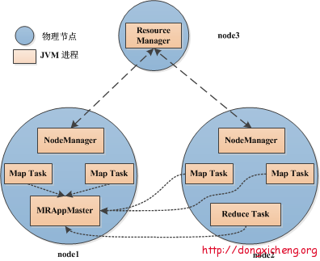
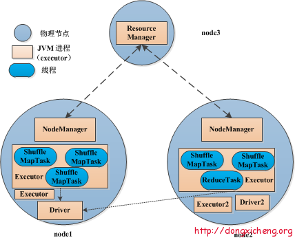

# mapreduce task的进程模型与spark task的线程模型

MapReduce 的 map task 和 reduce task 都是进程级别的；而 Spark task 则是基于线程模型的。

## 1、多进程模型和多线程模型

多进程模型和多线程模型，指的是同一个节点上多个任务的运行模式。

无论是 MapReduce 和 Spark，整体上看都是多进程的：

- MapReduce 应用程序是由多个独立的 Task 进程组成的；

- Spark 应用程序的运行环境是由多个独立的 executor 进程(每个应用程序使用一个 executor 进程)构建的临时资源池构成的。

多进程模型便于细粒度控制每个任务占用的资源，但会消耗较多的启动时间，不适合运行低延迟类型的作业，这是 MapReduce 广为诟病的原因之一。 而多线程模型则相反，该模型使得 Spark 很适合运行低延迟类型的作业。

## 2、异步并发模型

Apache Spark 的高性能一定程度上取决于它采用的异步并发模型（这里指server/driver端采用的模型），这与 Hadoop 2.0（包括YARN和MapReduce）是一致的。

Hadoop 2.0 自己实现了类似 Actor 的异步并发模型，实现方式是 epoll+状态机，而 Apache Spark 则直接采用了开源软件 Akka，该软件实现了 Actor 模型，性能非常高。尽管二者在 server 端采用了一致的并发模型，但在任务级别（特指 Spark 任务和 MapReduce 任务）上却采用了不同的并行机制：

	Hadoop MapReduce 采用了多进程模型，而 Spark 采用了多线程模型。
 

Hadoop MapReduce任务的进程模型：

Spark任务的线程模型：

## 3、Hadoop任务的进程模型特点：

- 每个 Task 运行在一个独立的 JVM 进程中；

- 可单独为不同类型的 Task 设置不同的资源量，目前支持内存和CPU两种资源；

- 每个 Task 运行完后，将释放所占用的资源，这些资源不能被其他 Task 复用，即使是同一个作业相同类型的 Task 。也就是说，每个 Task 都要经历"申请资源—> 运行Task –> 释放资源"的过程。

- 进程特点决定了启动一个 Task 将是一个很 expensive 的操作，对于迭代计算而言，无疑是噩梦。

## 4、Spark任务的线程模型特点：

- 每个节点上可以运行一个或多个 Executor 服务。每个应用程序在一个工作节点上只会有一个 Executor 。多个应用程序则会有多个 Executor；

- 每个 Executor 配有一定数量的 slot ，表示该 Executor 中可以同时运行多少个 ShuffleMapTask 或者 ReduceTask；

- 每个 Executor 单独运行在一个JVM进程中，每个 Task 则是运行在 Executor 中的一个线程；

- 同一个 Executor 内部的 Task 可共享内存，比如通过函数 `SparkContext.broadcast` 广播的数据如文件或者数据结构只会在每个 Executor 中加载一次，而不会像 MapReduce 那样，每个 Task 加载一次；

- Executor 一旦启动后，将一直运行，且它的资源可以一直被 Task 复用，直到 Spark 程序运行完成后才释放退出。

总体上看，Spark 采用的是经典的 scheduler/workers 模式，每个 Spark 应用程序运行的第一步是构建一个可重用的资源池，然后 在这个资源池里运行所有的 ShuffleMapTask 和 ReduceTask（注意，尽管Spark编程方式十分灵活，不再局限于编写Mapper和 Reducer，但是在Spark引擎内部只用两类Task便可表示出一个复杂的应用程序，即ShuffleMapTask和ResultTask）。

而 MapReduce 应用程序则不同，它不会构建一个可重用的资源池，而是让每个 Task 动态申请资源，且运行完后马上释放资源

## 5、Hadoop 任务与 Spark 任务的执行模型优劣势对比

### 5.1、任务线程模型的优点

Spark 同节点上的任务以多线程的方式运行在一个 JVM 进程中，可带来以下好处：

- 任务启动速度快，与之相反的是 MapReduce Task 进程的慢启动速度，通常需要1s左右；

- 同节点上同一个应用程序的所有任务运行在一个进程中，有利于共享内存。这非常适合内存密集型任务，尤其对于那些需要加载大量词典的应用程序，可大大节省内存。

- 同节点上所有任务可运行在一个 JVM 进程(Executor)中，且 Executor 所占资源可连续被多批任务使用，不会在运行部分任务后释放掉，这避免了每个任务重复申请资源带来的时间开销，对于任务数目非常多的应用，可大大降低运行时间。与之对比的是 MapReduce 中的 Task：每个 Task 单独申请资源，用完后马上释放，不能被其他任务重用，尽管 1.0 支持 JVM 重用在一定程度上弥补了该问题，但 2.0 尚未支持该功能。

### 5.2、任务线程模型的不足

尽管 Spark 的多线程模型带来了很多好处，但同样存在不足，主要有：

由于同节点上所有任务运行在一个进程中，因此，会出现严重的资源争用，难以细粒度控制每个任务占用资源。与之相反的是 MapReduce，它允许用户单独为 Map Task 和 Reduce Task 设置不同的资源，进而细粒度控制任务占用资源量，有利于大作业的正常平稳运行。

也就是说，Spark 适用于任务数多，但每个任务耗时不那么长的作业；而 Hadoop 则使用于任务数少，任务时间久的作业。

[原文链接](https://blog.csdn.net/axxbc123/article/details/84702288)