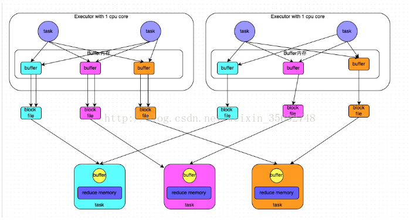

# spark shuffle

## 1、什么是shuffle 

数据从 map task 输出到 reduce task 输入的过程。
【shuffle read task 从 shuffle write task 复制数据的过程】

shuffle 的性能高低直接影响了整个程序的性能和吞吐量。

因为在分布式情况下，reduce task需要跨节点(或分区)去拉取其它节点上的map task结果。这一过程将会产生网络资源消耗和内存，磁盘IO的消耗。

## 2、spark shuffle

宽依赖之间会划分 stage，而 stage 间需要进行 Shuffle，如图中的stage1 、 stage3 之间就会产生 Shuffle。

在 Spark 中，负责 shuffle 过程的执行、计算和处理的组件主要就是 ShuffleManager。

ShuffleManager随着Spark的发展有两种实现的方式，分别为 HashShuffleManager 和 SortShuffleManager ，因此spark的Shuffle有 Hash Shuffle 和 Sort Shuffle 两种。

在 Spark 1.2 以后的版本中，默认的 ShuffleManager 由 HashShuffleManager 改成了 SortShuffleManager。

## 3、Hash shuffle

分成两种，一种是普通运行机制，另一种是合并的运行机制。

### 3.1、普通运行机制

**假设前提：每个 Executor 只有1个 CPU core ，也就是说，无论这个 Executor 上分配多少个 task 线程，同一时间都只能执行一个 task 线程。**

**一个Executor上有多少个CPU core，就可以并行执行多少个task。**

(1)shuffle write阶段

在一个stage结束计算之后，为了下一个stage可以执行shuffle类的算子(比如reduceByKey，groupByKey)。

将每个 task 输出的数据按 key 进行**分区**，即执行 hash 算法后，将相同 key 都写入同一个磁盘文件中。

每一个磁盘文件都只属于 reduce 端的 stage 的一个 task 。

在将数据写入磁盘之前，会先将数据**写入内存缓冲**中，当内存缓冲填满之后，才会**溢写到磁盘文件**中去。

(2)shuffle read阶段

一个 stage 刚开始时要做的事情。

该 stage 的每个 task 将上一个 stage 的计算结果中的所有相同 key，从各个节点上通过网络都**拉取到自己所在的节点**上，然后进行 **key 的聚合或连接**等操作。即，每个 task 从上游 stage 的所有 task 所在节点上，拉取属于自己的那一个磁盘文件。

shuffle read 是**一边拉取一边进行聚合**的。每个 shuffle read task 都会有一个自己的 buffer 缓冲，每次都只能拉取与 buffer 缓冲相同大小的数据，然后通过内存中的一个 Map 进行聚合等操作。聚合完一批数据后，再拉取下一批数据，并放到buffer缓冲中进行聚合操作。以此类推，直到最后将所有数据到拉取完，并得到最终的结果。

#### 3.1.1、注意

buffer起到的是缓存作用，缓存能够加速写磁盘，提高计算的效率,buffer的默认大小32k。

磁盘小文件的个数计算公式：

	block file=M*R

		M为map task的数量，
		R为Reduce的数量，一般Reduce的数量等于buffer的数量，都是由分区器决定的.

**下一个 stage 的 task 有多少个，当前 stage 的每个 task 就要创建多少份磁盘文件。**

	比如下一个stage总共有100个task，那么当前stage的每个task都要创建100份磁盘文件。如果当前stage有50个task，总共有10个Executor，每个Executor执行5个Task，那么每个Executor上总共就要创建500个磁盘文件，所有Executor上会创建5000个磁盘文件。

#### 3.1.2、存在的问题

(1) Shuffle前在磁盘上会产生海量的小文件，建立通信和拉取数据的次数变多,此时会产生大量耗时低效的 IO 操作 (因為产生过多的小文件)

(2) 可能导致OOM，大量耗时低效的 IO 操作 ，导致写磁盘时的对象过多，读磁盘时候的对象也过多，这些对象存储在堆内存中，会导致堆内存不足，相应会导致频繁的GC，GC会导致OOM。由于内存中需要保存海量文件操作句柄和临时信息，如果数据处理的规模比较庞大的话，内存不可承受，会出现 OOM 等问题。

### 3.2、合并的运行机制

设置 `spark.shuffle.consolidateFiles=true` ，开启合并机制。

**合并机制就是复用buffer**，如果我们使用HashShuffleManager，那么都建议开启这个选项。

同样，将每个 task 输出的数据按key进行**分区**，在将数据写入磁盘之前，会先将数据**写入内存缓冲**中，当内存缓冲填满之后，才会**溢写到磁盘文件**中去。

**不同之处在于**：

在合并的模式下，出现了 shuffleFileGroup 的概念，每个 shuffleFileGroup 会对应一批磁盘文件，磁盘文件的数量与下游 stage 的 task 数量是相同的。

Executor 的 CPU core 执行完一批 task，接着执行下一批 task 时，下一批 task 就会复用之前已有的 shuffleFileGroup ，包括其中的磁盘文件。也就是说，此时 task 会将数据写入已有的磁盘文件中，而不会写入新的磁盘文件中。因此，consolidate 机制允许不同的 task 复用同一批磁盘文件，

假设第二个 stage 有100个 task，第一个 stage 有50个 task ，总共还是有10个 Executor ，每个 Executor 执行5个 task 。经过优化之后，每个 Executor 创建的磁盘文件的数量的计算公式为：`CPU core的数量 * 下一个stage的task数量`。也就是说，每个 Executor 此时只会创建100个磁盘文件，所有 Executor 只会创建1000个磁盘文件。

#### 3、2.1、存在的问题问题

如果 Reducer 端的并行任务或者是数据分片过多的话，则 `Core * Reducer Task` 依旧过大，也会产生很多小文件。

## 4、sort shuffle

主要分成两种，一种是普通运行机制，另一种是bypass运行机制。

当 shuffle read task 的数量小于等于 `spark.shuffle.sort.bypassMergeThreshold` 参数的值时(默认为200)，就会启用 bypass 机制。

### 4.1、普通运行机制

**shuffle write阶段**

(1)写入内存数据结构

数据会先写入一个内存数据结构中(默认5M)，接着，**每写一条数据进入内存数据结构之后，就会判断一下，是否达到了某个临界阈值**。如果达到临界阈值的话，那么就会尝试将内存数据结构中的数据**溢写到磁盘，然后清空内存数据结构**。

此时根据不同的 shuffle 算子，可能选用不同的数据结构。如果是 reduceByKey 这种聚合类的 shuffle 算子，那么会选用 Map 数据结构，一边通过 Map 进行聚合，一边写入内存；如果是 join 这种普通的 shuffle 算子，那么会选用 Array 数据结构，直接写入内存。

注意：

shuffle 中的定时器：定时器会检查内存数据结构的大小，如果内存数据结构空间不够，那么会申请额外的内存，申请的大小满足如下公式：

	applyMemory=nowMenory*2-oldMemory

	申请的内存=当前的内存情况*2-上一次的内嵌情况

意思就是说内存数据结构的大小的动态变化，如果存储的数据超出内存数据结构的大小，将申请`内存数据结构存储的数据*2-内存数据结构的设定值的内存大小空间`。**申请到了，内存数据结构的大小变大，内存不够，申请不到，则发生溢写**

(2)排序

在溢写到磁盘文件之前，会先**根据 key 对内存数据结构中已有的数据进行排序**。

(3)溢写

排序过后，会**分批将数据写入磁盘文件**。默认的 batch 数量是10000条，也就是说，排序好的数据，会以每批1万条数据的形式分批写入磁盘文件。

写入磁盘文件是通过Java的 BufferedOutputStream 实现的。BufferedOutputStream 是 Java 的缓冲输出流，首先会将数据缓冲在内存中，当内存缓冲满溢之后再一次写入磁盘文件中，这样可以减少磁盘IO次数，提升性能。

(4)合并

一个task将所有数据写入内存数据结构的过程中，会发生多次磁盘溢写操作，也就会产生多个临时文件。最后会**将之前所有的临时磁盘文件都进行合并，这就是merge过程**。

此时会将之前所有临时磁盘文件中的数据读取出来，然后依次写入最终的磁盘文件之中。

SortShuffleManager 由于有一个磁盘文件 merge 的过程，因此大大减少了文件数量。比如第一个stage有50个task，总共有10个Executor，每个Executor执行5个task，而第二个stage有100个task。由于每个task最终只有一个磁盘文件，因此此时每个Executor上只有5个磁盘文件，所有Executor只有50个磁盘文件。

**最终每个 Task 会产生数据和索引两个文件。**其中，数据文件会按照分区进行存储，即相同分区的数据在文件中是连续的，而索引文件记录了每个分区在文件中的起始和结束位置。

**shuffle read阶段**

首先可能需要通过网络从各个 Write 任务节点获取给定分区的数据，即数据文件中某一段连续的区域，然后经过排序，归并等过程，最终形成计算结果。具体为：

数据获取分为远程获取和本地获取。本地获取将直接从本地的 BlockManager 取数据， 而对于远程数据，需要走网络。在远程获取过程中，数据会存到内存，达到一个阈值，也会溢写磁盘。

整个插入、溢写 和 Merge 和 Write 阶段差不多。总体上，这块也是比较消耗内存的，但是因为有 Spill 操作，当内存不足时，可以将内存数据刷到磁盘，从而释放内存空间。

在获取到数据以后，默认情况下会对获取的数据进行校验，这个过程也增加了一定的内存消耗。

### 4.1、bypass运行机制

bypass 运行机制的触发条件如下：

  1) shuffle map task 数量小于 `spark.shuffle.sort.bypassMergeThreshold` 参数的值。

  2)不是聚合类的 shuffle 算子(比如reduceByKey)。

将每个 task 将数据按 key 进行 hash 分区，进入内存缓冲，缓冲写满之后再溢写到磁盘文件的。最后，同样会将所有临时磁盘文件都合并成一个磁盘文件，并创建一个单独的索引文件。

该过程的磁盘写机制其实跟未经优化的 HashShuffleManager 是一模一样的，因为都要创建数量惊人的磁盘文件，只是在最后会做一个磁盘文件的合并而已。因此少量的最终磁盘文件，也让该机制相对未经优化的 HashShuffleManager 来说，shuffle read 的性能会更好。

而该机制与普通 SortShuffleManager 运行机制的不同在于：

	第一，磁盘写机制不同;

	第二，不会进行排序。也就是说，启用该机制的最大好处在于，shuffle write过程中，不需要进行数据的排序操作，也就节省掉了这部分的性能开销。

## 5、优化方向

- 压缩：对数据进行压缩，减少写读数据量；

- 内存化：对于具有较大内存的集群来讲，还是尽量地往内存上写吧，内存放不下了再放磁盘。

参考：

[spark中的spark Shuffle详解](https://www.2cto.com/net/201712/703242.html)

[Spark Shuffle 内存使用](https://www.jianshu.com/p/4b53992e6b38)

[Spark3.0.0 中shuffle原理](https://blog.csdn.net/newhandnew413/article/details/107730608)

[腾讯大数据之TDW计算引擎解析——Shuffle](https://data.qq.com/article?id=543)
