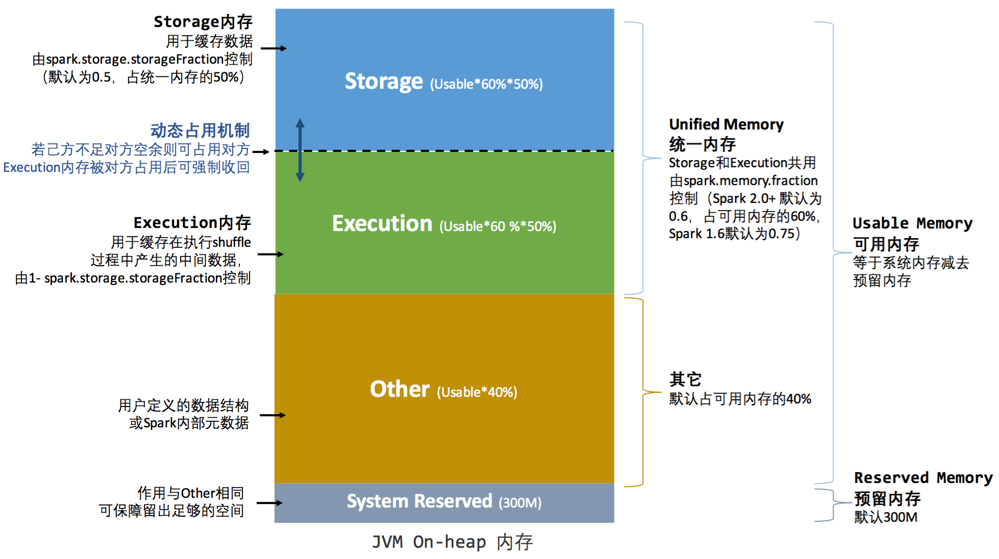

# spark 内存模型01--堆内和堆外内存

[原文链接](https://developer.ibm.com/zh/articles/ba-cn-apache-spark-memory-management/)

本文中阐述的原理基于 Spark 2.1 版本。

在执行 Spark 的应用程序时，Spark 集群会启动 Driver 和 Executor 两种 JVM 进程。

	Driver 为主控进程，负责创建 Spark 上下文，提交 Spark 作业（Job），并将作业转化为计算任务（Task），在各个 Executor 进程间协调任务的调度。

	Executor 负责在工作节点上执行具体的计算任务，并将结果返回给 Driver，同时为需要持久化的 RDD 提供存储功能[1]。

由于 Driver 的内存管理相对来说较为简单，本文主要对 Executor 的内存管理进行分析，下文中的 Spark 内存均特指 Executor 的内存。

## 1、堆内和堆外内存规划

作为一个 JVM 进程，Executor 的内存管理建立在 JVM 的内存管理之上，Spark 对 JVM 的堆内（On-heap）空间进行了更为详细的分配，以充分利用内存。同时，Spark 引入了堆外（Off-heap）内存，使之可以直接在工作节点的系统内存中开辟空间，进一步优化了内存的使用。


### 1.1、堆内内存

堆内内存的大小由 Spark 应用程序启动时的 `–executor-memory` 或 `spark.executor.memory` 参数配置。

Executor 内运行的并发任务共享 JVM 堆内内存，这些任务在缓存 RDD 数据和广播（Broadcast）数据时占用的内存被规划为 **存储（Storage）内存**，而这些任务在执行 Shuffle 时占用的内存被规划为 **执行（Execution）内存**，**剩余的部分不做特殊规划**，那些 Spark 内部的对象实例，或者用户定义的 Spark 应用程序中的对象实例，均占用剩余的空间。

不同的管理模式下，这三部分占用的空间大小各不相同（下面第 2 小节会进行介绍）。

Spark 对堆内内存的管理是一种逻辑上的”规划式”的管理，**因为对象实例占用内存的申请和释放都由 JVM 完成，Spark 只能在申请后和释放前记录这些内存**，我们来看其具体流程：

	申请内存 ：

		Spark 在代码中 new 一个对象实例
		JVM 从堆内内存分配空间，创建对象并返回对象引用
		Spark 保存该对象的引用，记录该对象占用的内存
	
	释放内存 ：

		Spark 记录该对象释放的内存，删除该对象的引用
		等待 JVM 的垃圾回收机制释放该对象占用的堆内内存

JVM 的对象可以以序列化的方式存储，**序列化的过程是将对象转换为二进制字节流**，本质上可以理解为将非连续空间的链式存储转化为连续空间或块存储，在访问时则需要进行序列化的逆过程——反序列化，将字节流转化为对象，序列化的方式**可以节省存储空间，但增加了存储和读取时候的计算开销。**

对于 Spark 中序列化的对象，由于是字节流的形式，其占用的内存大小可直接计算，而对于非序列化的对象，其占用的内存是通过周期性地采样近似估算而得，即并不是每次新增的数据项都会计算一次占用的内存大小，这种方法**降低了时间开销但是有可能误差较大，导致某一时刻的实际内存有可能远远超出预期**。此外，在被 Spark 标记为释放的对象实例，很有可能在实际上并没有被 JVM 回收，导致实际可用的内存小于 Spark 记录的可用内存。所以 Spark 并不能准确记录实际可用的堆内内存，从而也就无法完全避免内存溢出（OOM, Out of Memory）的异常。

虽然不能精准控制堆内内存的申请和释放，但 **Spark 通过对存储内存和执行内存各自独立的规划管理，可以决定是否要在存储内存里缓存新的 RDD，以及是否为新的任务分配执行内存**，在一定程度上可以提升内存的利用率，减少异常的出现。

### 1.2、堆外内存

为了进一步优化内存的使用以及提高 Shuffle 时排序的效率，Spark 引入了堆外（Off-heap）内存，使之可以**直接在工作节点的系统内存中开辟空间**，存储经过序列化的二进制数据。利用 JDK Unsafe API（从 Spark 2.0 开始，在管理堆外的存储内存时不再基于 Tachyon，而是与堆外的执行内存一样，基于 JDK Unsafe API 实现），Spark 可以直接操作系统堆外内存，减少了不必要的内存开销，以及频繁的 GC 扫描和回收，提升了处理性能。**堆外内存可以被精确地申请和释放，而且序列化的数据占用的空间可以被精确计算，所以相比堆内内存来说降低了管理的难度，也降低了误差。**

在默认情况下堆外内存并不启用，可通过配置 `spark.memory.offHeap.enabled`参数启用，并由 `spark.memory.offHeap.size` 参数设定堆外空间的大小。**除了没有 other 空间，堆外内存与堆内内存的划分方式相同，所有运行中的并发任务共享存储内存和执行内存**。

## 2、内存空间分配

Spark 为存储内存和执行内存的管理提供了统一的接口 `MemoryManager`，**同一个 Executor 内的任务都调用这个接口的方法来申请或释放内存**。

内存管理接口的主要方法：

```scala
//申请存储内存
def acquireStorageMemory(blockId: BlockId, numBytes: Long, memoryMode: MemoryMode): Boolean
//申请展开内存
def acquireUnrollMemory(blockId: BlockId, numBytes: Long, memoryMode: MemoryMode): Boolean
//申请执行内存
def acquireExecutionMemory(numBytes: Long, taskAttemptId: Long, memoryMode: MemoryMode): Long
//释放存储内存
def releaseStorageMemory(numBytes: Long, memoryMode: MemoryMode): Unit
//释放执行内存
def releaseExecutionMemory(numBytes: Long, taskAttemptId: Long, memoryMode: MemoryMode): Unit
//释放展开内存
def releaseUnrollMemory(numBytes: Long, memoryMode: MemoryMode): Unit
```

在调用这些方法时都需要**指定其内存模式（MemoryMode）**，这个参数决定了是在堆内还是堆外完成这次操作。

MemoryManager 的具体实现上，Spark 1.6 之后默认为统一管理（ Unified Memory Manager ）方式，1.6 之前采用的静态管理（ Static Memory Manager ）方式仍被保留，可通过配置 spark.memory.useLegacyMode 参数启用。两种方式的区别在于对空间分配的方式。

### 2.1、统一内存管理

Spark 1.6 之后引入的统一内存管理机制，与静态内存管理的区别在于**存储内存和执行内存共享同一块空间，可以动态占用对方的空闲区域**

> 统一内存管理图示:堆内 ↓



> 统一内存管理图示:堆外 ↓


其中最重要的优化在于动态占用机制，其规则如下：

- 设定基本的存储内存和执行内存区域（spark.storage.storageFraction 参数），该设定确定了双方各自拥有的空间的范围

- 双方的空间都不足时，则存储到硬盘；若己方空间不足而对方空余时，可借用对方的空间;（存储空间不足是指不足以放下一个完整的 Block）

- 执行内存的空间被对方占用后，可让对方将占用的部分转存到硬盘，然后”归还”借用的空间

- 存储内存的空间被对方占用后，无法让对方”归还”，因为需要考虑 Shuffle 过程中的很多因素，实现起来较为复杂

> 动态占用机制图示 ↓


凭借统一内存管理机制，Spark 在一定程度上提高了堆内和堆外内存资源的利用率，降低了开发者维护 Spark 内存的难度，但并不意味着开发者可以高枕无忧。譬如，所以如果存储内存的空间太大或者说缓存的数据过多，反而会导致频繁的全量垃圾回收，降低任务执行时的性能，因为缓存的 RDD 数据通常都是长期驻留内存的。所以要想充分发挥 Spark 的性能，需要开发者进一步了解存储内存和执行内存各自的管理方式和实现原理。

### 2.2、静态内存管理

在 Spark 最初采用的静态内存管理机制下，**存储内存、执行内存和其他内存的大小在 Spark 应用程序运行期间均为固定的**，但用户可以应用程序启动前进行配置。

> 静态内存管理图示:堆内 ↓


可用的堆内内存的大小需要按照下面的方式计算：

```
可用的存储内存 = systemMaxMemory * spark.storage.memoryFraction * spark.storage.safetyFraction
	
可用的执行内存 = systemMaxMemory * spark.shuffle.memoryFraction * spark.shuffle.safetyFraction
```

	systemMaxMemory：取决于当前 JVM 堆内内存的大小

	safetyFraction：其意义在于在逻辑上预留出 1-safetyFraction 这么一块保险区域，降低因实际内存超出当前预设范围而导致 OOM 的风险（上文提到，对于非序列化对象的内存采样估算会产生误差）。

	值得注意的是，这个预留的保险区域仅仅是一种逻辑上的规划，在具体使用时 Spark 并没有区别对待，和”其它内存”一样交给了 JVM 去管理。

堆外的空间分配只有存储内存和执行内存。

可用的执行内存和存储内存占用的空间大小直接由参数 `spark.memory.storageFraction` 决定，由于堆外内存占用的空间可以被精确计算，所以无需再设定保险区域

> 静态内存管理图示:堆外 ↓


静态内存管理机制实现起来较为简单，但如果用户不熟悉 Spark 的存储机制，或没有根据具体的数据规模和计算任务或做相应的配置，很容易造成”一半海水，一半火焰”的局面，即存储内存和执行内存中的一方剩余大量的空间，而另一方却早早被占满，不得不淘汰或移出旧的内容以存储新的内容。由于新的内存管理机制的出现，这种方式目前已经很少有开发者使用，出于兼容旧版本的应用程序的目的，Spark 仍然保留了它的实现。