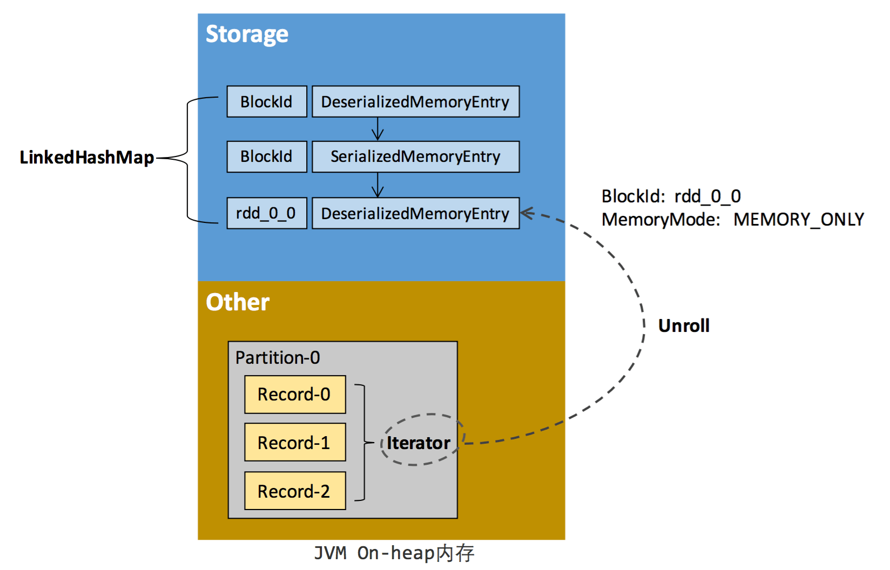

# spark 内存模型03--存储内存管理

## 1、RDD 的持久化机制

弹性分布式数据集（RDD）作为 Spark 最根本的数据抽象，是只读的分区记录（Partition）的集合，只能基于在稳定物理存储中的数据集上创建，或者在其他已有的 RDD 上执行转换（Transformation）操作产生一个新的 RDD。

转换后的 RDD 与原始的 RDD 之间产生的依赖关系，构成了血统（Lineage）。凭借血统，Spark 保证了每一个 RDD 都可以被重新恢复。但 RDD 的所有转换都是惰性的，即只有当一个返回结果给 Driver 的行动（Action）发生时，Spark 才会创建任务读取 RDD，然后真正触发转换的执行。

Task 在启动之初读取一个分区时，会先判断这个分区是否已经被持久化，如果没有则需要检查 Checkpoint 或按照血统重新计算。所以如果一个 RDD 上要执行多次行动，可以在第一次行动中使用 persist 或 cache 方法，在内存或磁盘中持久化或缓存这个 RDD，从而在后面的行动时提升计算速度。

事实上，cache 方法是使用默认的 MEMORY_ONLY 的存储级别将 RDD 持久化到内存，故缓存是一种特殊的持久化。 **堆内和堆外存储内存的设计，便可以对缓存 RDD 时使用的内存做统一的规划和管理** （存储内存的其他应用场景，如缓存 broadcast 数据，暂时不在本文的讨论范围之内）。

**RDD 的持久化由 Spark 的 Storage 模块负责**，实现了 RDD 与物理存储的解耦合。Storage 模块负责管理 Spark 在计算过程中产生的数据，将那些在内存或磁盘、在本地或远程存取数据的功能封装了起来。

在具体实现时， **Driver 端和 Executor 端的 Storage 模块构成了主从式的架构**，即 Driver 端的 BlockManager 为 Master，Executor 端的 BlockManager 为 Slave。

**Storage 模块在逻辑上以 Block 为基本存储单位，RDD 的每个 Partition 经过处理后唯一对应一个 Block（BlockId 的格式为 rdd_RDD-ID_PARTITION-ID ）。**

Master 负责整个 Spark 应用程序的 Block 的元数据信息的管理和维护，而 Slave 需要将 Block 的更新等状态上报到 Master，同时接收 Master 的命令，例如新增或删除一个 RDD。

在对 RDD 持久化时，Spark 规定了 7 种不同的存储级别。

存储级别|含义
---|:---
MEMORY_ONLY | 将 RDD 以反序列化的 Java 对象的形式存储在 JVM 中。如果内存空间不够，部分分区将不再缓存，而是在每次需要用到这些数据时重新进行计算。这是默认的级别。
MEMORY_AND_DISK | 将 RDD 以反序列化的 Java 对象的形式存储在 JVM 中。如果内存空间不够，将未缓存的分区存储到磁盘，在需要使用时从磁盘读取。(If the RDD does not fit in memory, store the partitions that don't fit on disk)
MEMORY_ONLY_SER (Java and Scala) | 将 RDD 以序列化的 Java 对象的形式进行存储（每个分区为一个字节 数组）。这种方式会比反序列化对象的方式节省很多空间，尤其是在使用 fast serializer 时会节省更多的空间，但是在读取时会增加 CPU 的计算负担
MEMORY_AND_DISK_SER (Java and Scala) | 类似于 MEMORY_ONLY_SER, 但是溢出的分区会存储到磁盘，而不是在用到它们时重新计算。  
DISK_ONLY | 只在磁盘上缓存 RDD。
MEMORY_ONLY_2, MEMORY_AND_DISK_2, etc | 与上面的级别功能相同，只不过每个分区只在集群的两个节点上建立副本。
OFF_HEAP (experimental) | 类似于 MEMORY_ONLY_SER，但是将数据存储在 off-heap memory 中。这需要启用 off-heap 内存。

存储级别是以下 5 个变量的组合：

	class StorageLevel private(
		private var _useDisk: Boolean, //磁盘
		private var _useMemory: Boolean, //这里其实是指堆内内存
		private var _useOffHeap: Boolean, //堆外内存
		private var _deserialized: Boolean, //是否为非序列化
		private var _replication: Int = 1 //副本个数
	)

通过对数据结构的分析，可以看出存储级别从三个维度定义了 RDD 的 Partition（同时也就是 Block）的存储方式：

- 存储位置：磁盘／堆内内存／堆外内存。如 MEMORY_AND_DISK 是同时在磁盘和堆内内存上存储，实现了冗余备份。OFF_HEAP 则是只在堆外内存存储，目前选择堆外内存时不能同时存储到其他位置。

- 存储形式：Block 缓存到存储内存后，是否为非序列化的形式。如 MEMORY_ONLY 是非序列化方式存储，OFF_HEAP 是序列化方式存储。

- 副本数量：大于 1 时需要远程冗余备份到其他节点。如 DISK_ONLY_2 需要远程备份 1 个副本。

## 2、RDD 缓存的过程

RDD 在缓存到存储内存之前，Partition 中的数据一般**以迭代器（ Iterator ）的数据结构来访问**，这是 Scala 语言中一种遍历数据集合的方法。

通过迭代器可以获取分区中每一条序列化或者非序列化的数据项(Record)，**这些 Record 的对象实例在逻辑上占用了 JVM 堆内内存的 other 部分的空间，同一 Partition 的不同 Record 的空间并不连续。**

**RDD 在缓存到存储内存之后，Partition 被转换成 Block，Record 在堆内或堆外存储内存中占用一块连续的空间**。 将 Partition 由不连续的存储空间转换为连续存储空间的过程，Spark 称之为 **展开（Unroll）**

**Block 有序列化和非序列化两种存储格式，具体以哪种方式取决于该 RDD 的存储级别**。非序列化的 Block 以一种 DeserializedMemoryEntry 的数据结构定义，用一个数组存储所有的对象实例，序列化的 Block 则以 SerializedMemoryEntry的数据结构定义，用字节缓冲区（ByteBuffer）来存储二进制数据。

每个 Executor 的 Storage 模块用一个 **链式 Map 结构（LinkedHashMap）来管理堆内和堆外存储内存中所有的 Block 对象的实例，对这个 LinkedHashMap 新增和删除间接记录了内存的申请和释放。**

因为不能保证存储空间可以一次容纳 Iterator 中的所有数据，当前的计算任务在 Unroll 时要向 MemoryManager 申请足够的 Unroll 空间来临时占位，空间不足则 Unroll 失败，空间足够时可以继续进行。

- 对于序列化的 Partition，其所需的 Unroll 空间可以直接累加计算，一次申请。

- 非序列化的 Partition 则要在遍历 Record 的过程中依次申请，即每读取一条 Record，采样估算其所需的 Unroll 空间并进行申请，空间不足时可以中断，释放已占用的 Unroll 空间。

如果最终 Unroll 成功，当前 Partition 所占用的 Unroll 空间被转换为正常的缓存 RDD 的存储空间。

在静态内存管理时，Spark 在存储内存中专门划分了一块 Unroll 空间，其大小是固定的，统一内存管理时则没有对 Unroll 空间进行特别区分，当存储空间不足时会根据动态占用机制进行处理。

## 3、淘汰和落盘

由于同一个 Executor 的所有的计算任务共享有限的存储内存空间，当有新的 Block 需要缓存但是剩余空间不足且无法动态占用时，就要对 LinkedHashMap 中的旧 Block 进行 **淘汰（Eviction）**，而被淘汰的 Block 如果其存储级别中同时包含存储到磁盘的要求，则要对其进行**落盘（Drop）**，否则直接删除该 Block。

存储内存的淘汰规则为：

- 被淘汰的旧 Block 要与新 Block 的 MemoryMode 相同，即同属于堆外或堆内内存

- 新旧 Block 不能属于同一个 RDD，避免循环淘汰

- 旧 Block 所属 RDD 不能处于被读状态，避免引发一致性问题

- 遍历 LinkedHashMap 中 Block，按照最近最少使用（LRU）的顺序淘汰，直到满足新 Block 所需的空间。其中 LRU 是 LinkedHashMap 的特性。

落盘的流程则比较简单，如果其存储级别符合_useDisk 为 true 的条件，再根据其_deserialized 判断是否是非序列化的形式，若是则对其进行序列化，最后将数据存储到磁盘，在 Storage 模块中更新其信息。