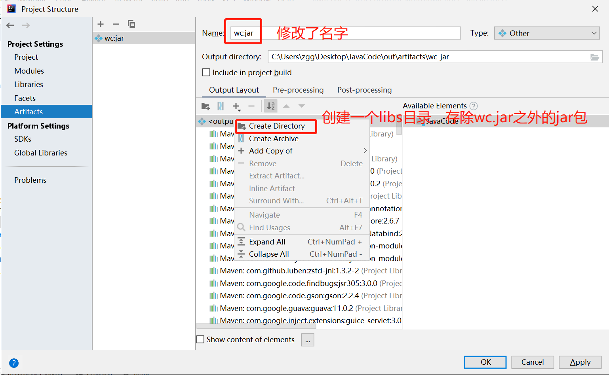

# 提交集群运行操作过程

**问题：在使用如下方式打包，再在集群运行时，一直出现`java.lang.ClassNotFoundException: sparkbase.wordcount`错误。**


**解决：采用了另外一种打包方式，执行成功。如下：**

**下图中注意三点：**

- 记住这个 Main Class

- 选择第二行的打包方式 

- 下图中的META-INF所在目录选择了resources


**下图中，选择除wc.jar之外的所有jar包，鼠标右键移动到libs目录下。**




**点击左下角的 Class Path，查看下。点击 Apply、OK**


**然后再build**


**最后完成打包**


**打包完成后，上传虚拟机：**

```sh
[root@zgg ~]# mkdir run_env
[root@zgg ~]# cd run_env/     # 放jar包和libs目录
[root@zgg run_env]# mkdir libs
[root@zgg run_env]# rz
rz waiting to receive.
Starting zmodem transfer.  Press Ctrl+C to cancel.
Transferring wc.jar...
  100%     204 KB     204 KB/sec    00:00:01       0 Errors  

[root@zgg run_env]# cd libs
[root@zgg libs]# rz
rz waiting to receive.
Starting zmodem transfer.  Press Ctrl+C to cancel.
Transferring activation-1.1.1.jar...
  100%      67 KB      67 KB/sec    00:00:01       0 Errors  
...
```

**执行提交命令**

```sh
[root@zgg run_env]# spark-submit --class sparkbase.wordcount --master spark://zgg:7077  wc.jar hdfs://zgg:9000/in/wc.txt

20/09/03 00:22:05 WARN util.NativeCodeLoader: Unable to load native-hadoop library for your platform... using builtin-java classes where applicable
20/09/03 00:22:05 INFO spark.SparkContext: Running Spark version 2.4.4
20/09/03 00:22:05 INFO spark.SparkContext: Submitted application: wordcount
20/09/03 00:22:05 INFO spark.SecurityManager: Changing view acls to: root
....
flink: 1
hello: 2
spark: 1
hadoop: 3
....
```

**另，如果出现其他问题，看下是不是pom文件里的依赖问题，如：**

```xml
<groupId>org.apache.maven.plugins</groupId>
<artifactId>maven-compiler-plugin</artifactId>

<groupId>net.alchim31.maven</groupId>
<artifactId>scala-maven-plugin</artifactId>

<artifactId>maven-assembly-plugin</artifactId>
```

**具体内容为：**

**注意版本**

```xml
<build>
        <plugins>
            <plugin>
                <groupId>org.apache.maven.plugins</groupId>
                <artifactId>maven-compiler-plugin</artifactId>
                <configuration>
                    <source>8</source>
                    <target>8</target>
                </configuration>
            </plugin>

            <plugin>
                <groupId>net.alchim31.maven</groupId>
                <artifactId>scala-maven-plugin</artifactId>
                <version>3.2.2</version>
                <executions>
                    <execution>
                        <id>compile-scala</id>
                        <phase>compile</phase>
                        <goals>
                            <goal>add-source</goal>
                            <goal>compile</goal>
                        </goals>
                    </execution>
                    <execution>
                        <id>test-compile-scala</id>
                        <phase>test-compile</phase>
                        <goals>
                            <goal>add-source</goal>
                            <goal>testCompile</goal>
                        </goals>
                    </execution>
                </executions>
                <configuration>
                    <scalaVersion>2.11.12</scalaVersion>
                </configuration>
            </plugin>

            <plugin>
                <artifactId>maven-assembly-plugin</artifactId>
                <configuration>
                    <descriptorRefs>
                        <descriptorRef>jar-with-dependencies</descriptorRef>
                    </descriptorRefs>
                    <archive>
                        <manifest>
                            <mainClass></mainClass>
                        </manifest>
                    </archive>
                </configuration>
                <executions>
                    <execution>
                        <id>make-assembly</id>
                        <phase>package</phase>
                        <goals>
                            <goal>single</goal>
                        </goals>
                    </execution>
                </executions>
            </plugin>
        </plugins>
    </build>
```
