# 环境搭建：单机、伪分布、完全分布、高可用

[TOC]

## 1、单机

### 1.1、安装jdk、hadoop

### 1.2、安装scala

### 1.3、安装Spark

(1)下载、解压

(2)配置环境变量

(3)要打开 Python 版本的 Spark shell，进入你的 Spark 目录然后输入： 

	bin/pyspark

如果要打开 Scala 版本的 shell，输入：

	bin/spark-shell

(4)如果觉得shell中输出的日志信息过多，可以调整日志的级别来控制输出的信息量。 可以重新配置conf 目录下的`log4j.properties.template`文件。把下面这行修改为：

	log4j.rootCategory=INFO, console  
	log4j.rootCategory=WARN, console

(5)测试

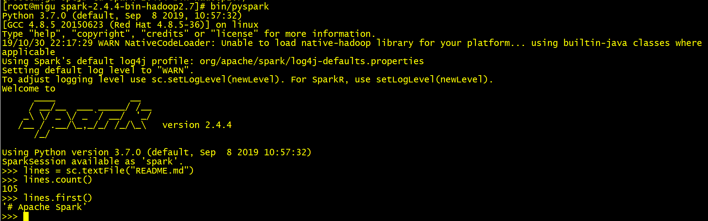

## 2、Standalone伪分布

### 2.1、安装jdk、hadoop

jdk：1.8.0_271

hadoop：hadoop-3.2.1

### 2.2、安装scala

版本：2.12.12

(1)下载、解压

[https://www.scala-lang.org/download/2.12.12.html](https://www.scala-lang.org/download/2.12.12.html)

(2)配置环境变量

```sh
[root@zgg ~]# cat /etc/profile   
# /etc/profile
...

export SCALA_HOME=/opt/scala-2.12.12
export JAVA_HOME=/opt/jdk1.8.0_271
export HADOOP_HOME=/opt/hadoop-3.2.1

export PATH=.:$HADOOP_HOME/bin:$JAVA_HOME/bin:$SCALA_HOME/bin:$PATH

[root@zgg ~]# source /etc/profile 
```

### 2.3、安装Spark

版本：3.0.1

(1)下载、解压

[http://archive.apache.org/dist/spark/spark-3.0.1/](http://archive.apache.org/dist/spark/spark-3.0.1/)

(2)配置环境变量

```sh
[root@zgg ~]# cat /etc/profile   
# /etc/profile
...

export SCALA_HOME=/opt/scala-2.12.12
export JAVA_HOME=/opt/jdk1.8.0_271
export HADOOP_HOME=/opt/hadoop-3.2.1
export SPARK_HOME=/opt/spark-2.4.4-bin-hadoop2.7

export PATH=.:$HADOOP_HOME/bin:$JAVA_HOME/bin:$SCALA_HOME/bin:$SPARK_HOME/bin:$PATH

[root@zgg ~]# source /etc/profile 
```

(3)配置配置文件

```sh
[root@zgg conf]# ls
fairscheduler.xml.template  metrics.properties.template  spark-defaults.conf.template
log4j.properties.template   slaves.template              spark-env.sh.template
[root@zgg conf]# mv slaves.template slaves
[root@zgg conf]# ls
fairscheduler.xml.template  metrics.properties.template  spark-defaults.conf.template
log4j.properties.template   slaves                       spark-env.sh.template
[root@zgg conf]# vi slaves   # 将localhost改成自己的主机名
[root@zgg conf]# cat slaves 
...
zgg
```

```sh
[root@zgg conf]# mv spark-env.sh.template spark-env.sh
[root@zgg conf]# vi spark-env.sh 
[root@zgg conf]# cat spark-env.sh
#!/usr/bin/env bash
...
export JAVA_HOME=/opt/jdk1.8.0_271
export SCALA_HOME=/opt/scala-2.12.12
export HADOOP_HOME=/opt/hadoop-3.2.1
export HADOOP_CONF_DIR=/opt/hadoop-3.2.1/etc/hadoop
export SPARK_HOME=/opt/spark-3.0.1-bin-hadoop3.2
export SPARK_MASTER_HOST=zgg
```

(4)启动

先启动 hadoop，后启动 spark。

进入 spark 的 sbin 目录下执行 start-all.sh 启动 spark，出现了 master 和 worker 

```sh
[root@zgg spark-3.0.1-bin-hadoop3.2]# sbin/start-all.sh  
starting org.apache.spark.deploy.master.Master, logging to /opt/spark-3.0.1-bin-hadoop3.2/logs/spark-root-org.apache.spark.deploy.master.Master-1-zgg.out
zgg: starting org.apache.spark.deploy.worker.Worker, logging to /opt/spark-3.0.1-bin-hadoop3.2/logs/spark-root-org.apache.spark.deploy.worker.Worker-1-zgg.out
[root@zgg spark-3.0.1-bin-hadoop3.2]# jps
21696 NameNode
22323 ResourceManager
22467 NodeManager
23381 Worker
23431 Jps
22074 SecondaryNameNode
21836 DataNode
23310 Master
```

在浏览器输出 `zgg:8080/` ，进入 spark 的 web 控制台页面。

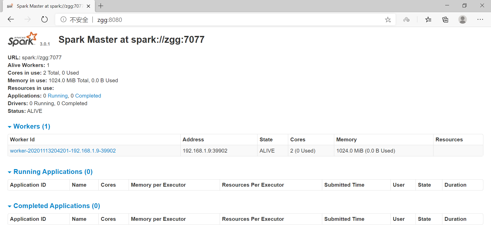

`bin/spark-shell` 启动 shell，然后在浏览器输出 `zgg:4040`

```sh
[root@zgg spark-3.0.1-bin-hadoop3.2]# bin/spark-shell
2020-11-13 20:45:19,703 WARN util.NativeCodeLoader: Unable to load native-hadoop library for your platform... using builtin-java classes where applicable
Setting default log level to "WARN".
To adjust logging level use sc.setLogLevel(newLevel). For SparkR, use setLogLevel(newLevel).
Spark context Web UI available at http://zgg:4040
Spark context available as 'sc' (master = local[*], app id = local-1605271529580).
Spark session available as 'spark'.
Welcome to
      ____              __
     / __/__  ___ _____/ /__
    _\ \/ _ \/ _ `/ __/  '_/
   /___/ .__/\_,_/_/ /_/\_\   version 3.0.1
      /_/
         
Using Scala version 2.12.10 (Java HotSpot(TM) 64-Bit Server VM, Java 1.8.0_271)
Type in expressions to have them evaluated.
Type :help for more information.

scala> val lines = sc.textFile("/in/wc.txt")
lines: org.apache.spark.rdd.RDD[String] = /in/wc.txt MapPartitionsRDD[1] at textFile at <console>:24

scala> lines.count()
res0: Long = 1    
```

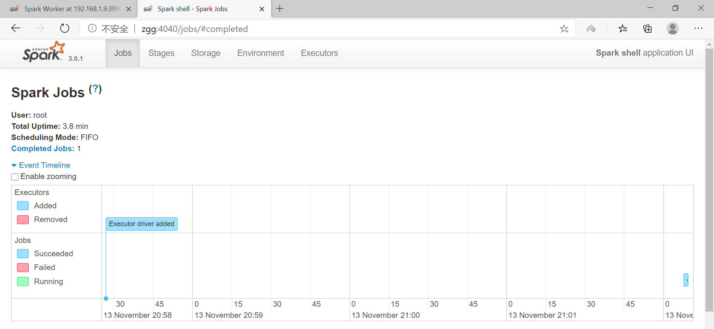

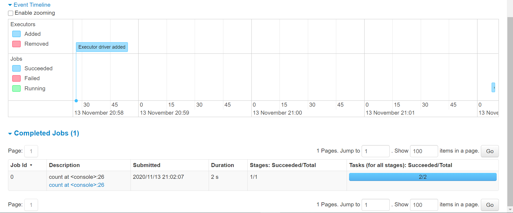

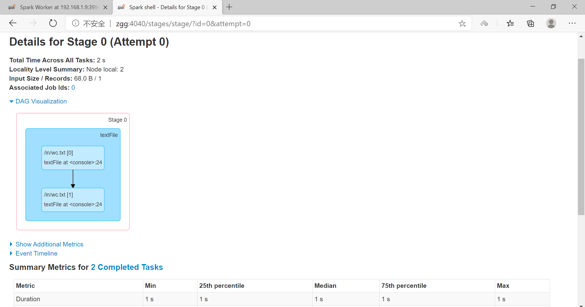

(5)测试

```sh
[root@zgg spark-3.0.1-bin-hadoop3.2]# spark-submit --master spark://zgg:7077 --class org.apache.spark.examples.SparkPi /opt/spark-3.0.1-bin-hadoop3.2/examples/jars/spark-examples_2.12-3.0.1.jar 10
2020-11-13 20:55:43,379 WARN util.NativeCodeLoader: Unable to load native-hadoop library for your platform... using builtin-java classes where applicable
2020-11-13 20:55:43,591 INFO spark.SparkContext: Running Spark version 3.0.1
2020-11-13 20:55:43,642 INFO resource.ResourceUtils: ==============================================================
2020-11-13 20:55:43,644 INFO resource.ResourceUtils: Resources for spark.driver:

2020-11-13 20:55:43,644 INFO resource.ResourceUtils: ==============================================================
2020-11-13 20:55:43,645 INFO spark.SparkContext: Submitted application: Spark Pi
...
2020-11-13 20:55:51,544 INFO scheduler.DAGScheduler: Job 0 finished: reduce at SparkPi.scala:38, took 5.056344 s
Pi is roughly 3.1436471436471436
...
```

## 3、完全分布:Standalone

### 3.1、硬件配置

采用3台虚拟机

节点名称 | IP地址      | 内存 | 硬盘   | 节点角色
---|:---|:---|:---|:---
node1   | 192.168.1.6 | 2GB | 10GB   | MASTER
node2   | 192.168.1.7 | 2GB | 10GB   | WORKER
node3   | 192.168.1.8 | 2GB | 10GB   | WORKER

### 3.2、软件版本

软件   |  版本
---|:---
JDK    | jdk-8u271
HADOOP | hadoop-3.2.1
SPARK  | spark-3.0.1-bin-hadoop3.2

### 3.3、准备工作

[详细见hadoop完全分布式安装]

#### 3.3.1、建立虚拟机，网络设置为桥接模式

#### 3.3.2、更改主机名

#### 3.3.3、绑定主机名和IP，建立各主机间的联系 

#### 3.3.4、关闭防火墙

#### 3.3.5、配置宿主机hosts文件

#### 3.3.6、配置SSH，实现节点间的无密码登录

#### 3.3.7、各节点安装jdk、scala、hadoop

### 3.4、安装Spark

在 node1 上，下载，解压，并配置环境变量：

```sh
[root@node1 opt]# vi /etc/profile
[root@node1 opt]# source /etc/profile
[root@node1 opt]# cat /etc/profile
# /etc/profile

...
export JAVA_HOME=/opt/jdk1.8.0_271
export HADOOP_HOME=/opt/hadoop-3.2.1
export SCALA_HOME=/opt/scala-2.12.12
export SPARK_HOME=/opt/spark-3.0.1-bin-hadoop3.2

export PATH=.:$HADOOP_HOME/bin:$SPARK_HOME/bin:$JAVA_HOME/bin:$SCALA_HOME/bin:$PATH
```

将 /etc/profile 复制到 node2 和 node3

```sh
[root@node1 opt]# scp  /etc/profile  node2:/etc/
profile                                                                                           100% 2010     1.9MB/s   00:00    
[root@node1 opt]# scp  /etc/profile  node3:/etc/
profile
[root@node2 opt]# source /etc/profile 
[root@node3 opt]# source /etc/profile
```

配置配置文件

```sh
[root@node1 conf]# ls
fairscheduler.xml.template  metrics.properties.template  spark-defaults.conf.template
log4j.properties.template   slaves.template              spark-env.sh.template
[root@node1 conf]# mv slaves.template slaves
[root@node1 conf]# vi slaves 
[root@node1 conf]# cat slaves 
...

# A Spark Worker will be started on each of the machines listed below.
node2
node3
```

```sh
[root@node1 conf]# mv spark-env.sh.template spark-env.sh
[root@node1 conf]# vi spark-env.sh 
[root@node1 conf]# cat spark-env.sh
#!/usr/bin/env bash
...
export JAVA_HOME=/opt/jdk1.8.0_271
export SCALA_HOME=/opt/scala-2.12.12
export HADOOP_HOME=/opt/hadoop-3.2.1
export HADOOP_CONF_DIR=/opt/hadoop-3.2.1/etc/hadoop
export SPARK_HOME=/opt/spark-3.0.1-bin-hadoop3.2
export SPARK_MASTER_HOST=node1
export SPARK_LOCAL_DIRS=/opt/spark-3.0.1-bin-hadoop3.2/scratch-space
```
将 node1 的 spark 目录拷贝到 node2 和 node3 上

```sh
[root@node1 opt]# scp -r spark-3.0.1-bin-hadoop3.2/ root@node2:/opt
[root@node1 opt]# scp -r spark-3.0.1-bin-hadoop3.2/ root@node3:/opt
```
   
启动

先启动 hadoop，再启动 spark。

在 node1 中执行 `sbin/start-all.sh` 启动 spark:

```sh
[root@node1 spark-3.0.1-bin-hadoop3.2]# sbin/start-all.sh
starting org.apache.spark.deploy.master.Master, logging to /opt/spark-3.0.1-bin-hadoop3.2/logs/spark-root-org.apache.spark.deploy.master.Master-1-node1.out
node2: starting org.apache.spark.deploy.worker.Worker, logging to /opt/spark-3.0.1-bin-hadoop3.2/logs/spark-root-org.apache.spark.deploy.worker.Worker-1-node2.out
node3: starting org.apache.spark.deploy.worker.Worker, logging to /opt/spark-3.0.1-bin-hadoop3.2/logs/spark-root-org.apache.spark.deploy.worker.Worker-1-node3.out
[root@node1 spark-3.0.1-bin-hadoop3.2]# jps
11524 ResourceManager
12424 Master
11899 JobHistoryServer
11100 NameNode
12477 Jps

[root@node2 opt]# jps
8210 DataNode
8312 SecondaryNameNode
8761 Jps
8716 Worker

[root@node3 opt]# jps
8355 Jps
8310 Worker
7997 DataNode
```

在浏览器输出 `node1:8080/` ，进入 spark 的 web 控制台页面。

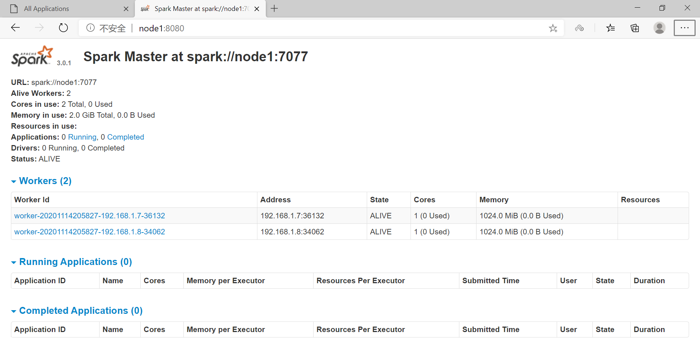

在 node1 执行 `bin/spark-shell` 启动 shell，然后在浏览器输出 `node1:4040`

```sh
[root@node1 spark-3.0.1-bin-hadoop3.2]# bin/spark-shell
2020-11-14 21:01:41,971 WARN util.NativeCodeLoader: Unable to load native-hadoop library for your platform... using builtin-java classes where applicable
Setting default log level to "WARN".
To adjust logging level use sc.setLogLevel(newLevel). For SparkR, use setLogLevel(newLevel).
Spark context Web UI available at http://node1:4040
Spark context available as 'sc' (master = local[*], app id = local-1605358913099).
Spark session available as 'spark'.
Welcome to
      ____              __
     / __/__  ___ _____/ /__
    _\ \/ _ \/ _ `/ __/  '_/
   /___/ .__/\_,_/_/ /_/\_\   version 3.0.1
      /_/
         
Using Scala version 2.12.10 (Java HotSpot(TM) 64-Bit Server VM, Java 1.8.0_271)
Type in expressions to have them evaluated.
Type :help for more information.

scala> val lines = sc.textFile("/in/wc.txt")
lines: org.apache.spark.rdd.RDD[String] = /in/wc.txt MapPartitionsRDD[1] at textFile at <console>:24

scala> lines.count()
res0: Long = 3   
```

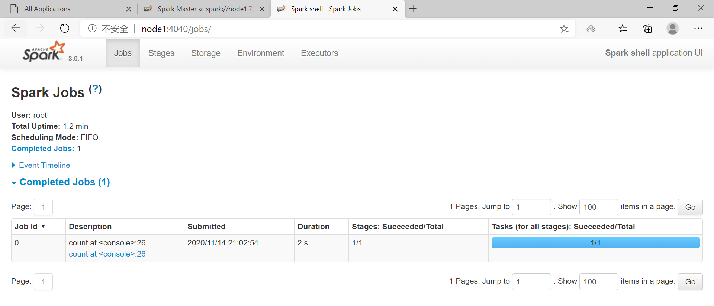

应用程序测试:

```sh
# 客户端模式：driver 在提交应用程序的客户端的相同进程中启动。
[root@node1 spark-3.0.1-bin-hadoop3.2]# spark-submit --master spark://node1:7077 --class org.apache.spark.examples.SparkPi /opt/spark-3.0.1-bin-hadoop3.2/examples/jars/spark-examples_2.12-3.0.1.jar 10   
2020-11-14 21:05:51,424 WARN util.NativeCodeLoader: Unable to load native-hadoop library for your platform... using builtin-java classes where applicable
2020-11-14 21:05:51,727 INFO spark.SparkContext: Running Spark version 3.0.1
2020-11-14 21:05:51,823 INFO resource.ResourceUtils: ==============================================================
2020-11-14 21:05:51,825 INFO resource.ResourceUtils: Resources for spark.driver:

2020-11-14 21:05:51,825 INFO resource.ResourceUtils: ==============================================================
2020-11-14 21:05:51,826 INFO spark.SparkContext: Submitted application: Spark Pi
...
2020-11-14 21:05:52,240 INFO util.Utils: Successfully started service 'sparkDriver' on port 35290.
2020-11-14 21:05:52,756 INFO ui.SparkUI: Bound SparkUI to 0.0.0.0, and started at http://node1:4040
...
2020-11-14 21:05:53,505 INFO util.Utils: Successfully started service 'org.apache.spark.network.netty.NettyBlockTransferService' on port 43800.
2020-11-14 21:05:53,507 INFO netty.NettyBlockTransferService: Server created on node1:43800
...
2020-11-14 21:06:00,001 INFO scheduler.DAGScheduler: Job 0 finished: reduce at SparkPi.scala:38, took 4.985278 s
Pi is roughly 3.1416191416191417

# 集群模式：driver 在集群的一个 worker 进程中启动，客户端进程一旦完成提交应用程序的职责，而不用等待应用程序完成，就会立即退出。
[root@node2 spark-3.0.1-bin-hadoop3.2]# spark-submit --master spark://node1:7077 --class org.apache.spark.examples.SparkPi /opt/spark-3.0.1-bin-hadoop3.2/examples/jars/spark-examples_2.12-3.0.1.jar 10    
2020-11-14 21:06:59,403 WARN util.NativeCodeLoader: Unable to load native-hadoop library for your platform... using builtin-java classes where applicable
2020-11-14 21:06:59,745 INFO spark.SparkContext: Running Spark version 3.0.1
2020-11-14 21:06:59,803 INFO resource.ResourceUtils: ==============================================================
2020-11-14 21:06:59,804 INFO resource.ResourceUtils: Resources for spark.driver:

2020-11-14 21:06:59,805 INFO resource.ResourceUtils: ==============================================================
2020-11-14 21:06:59,807 INFO spark.SparkContext: Submitted application: Spark Pi
...
2020-11-14 21:07:00,307 INFO util.Utils: Successfully started service 'sparkDriver' on port 35886.
...
2020-11-14 21:07:00,870 INFO ui.SparkUI: Bound SparkUI to 0.0.0.0, and started at http://node2:4040

2020-11-14 21:07:01,501 INFO util.Utils: Successfully started service 'org.apache.spark.network.netty.NettyBlockTransferService' on port 38834.
2020-11-14 21:07:01,501 INFO netty.NettyBlockTransferService: Server created on node2:38834
...
2020-11-14 21:07:07,876 INFO scheduler.DAGScheduler: Job 0 finished: reduce at SparkPi.scala:38, took 4.318627 s
Pi is roughly 3.1425431425431425
```

## 4、完全分布:YARN

下载解压后，增加如下配置即可。

在 hadoop 集群上提前创建 spark_directory 日志路径 

```sh
hadoop fs -mkdir /spark_directory
```
在 spark-default.conf 文件中配置 Spark 日志路径 

```sh
[root@node1 conf]$ vi spark-defaults.conf 
spark.eventLog.enabled true 
spark.eventLog.dir hdfs://node1:9000/spark_directory
```

在 `conf/spark-env.sh` 文件中配置 YARN 配置文件路径、配置历史服务器 相关参数

```sh
[root@node1 spark-3.0.1-bin-hadoop3.2]# cat conf/spark-env.sh    
#!/usr/bin/env bash
...
export YARN_CONF_DIR=/opt/hadoop-3.2.1/etc/hadoop
export SPARK_CONF_DIR=/opt/spark-3.0.1-bin-hadoop3.2/conf
export SPARK_HISTORY_OPTS="-Dspark.history.ui.port=18080 -Dspark.history.retainedApplications=30 -Dspark.history.fs.logDirectory=hdfs://node1:9000/spark_di rectory"
```

把 hive 中 `lib/datanucleus-*.jar` 包拷贝到 spark 的 `jars/` 路径下。

把 hive 中 `conf/hive-site.xml` 包拷贝到 spark 的 `conf/` 路径下。

应用程序测试:

```sh
[root@node1 spark-3.0.1-bin-hadoop3.2]# bin/spark-submit --master yarn --deploy-mode cluster --class org.apache.spark.examples.SparkPi /opt/spark-3.0.1-bin-hadoop3.2/examples/jars/spark-examples_2.12-3.0.1.jar 10
...
```

进入 `node1:8088` 查看，如下：

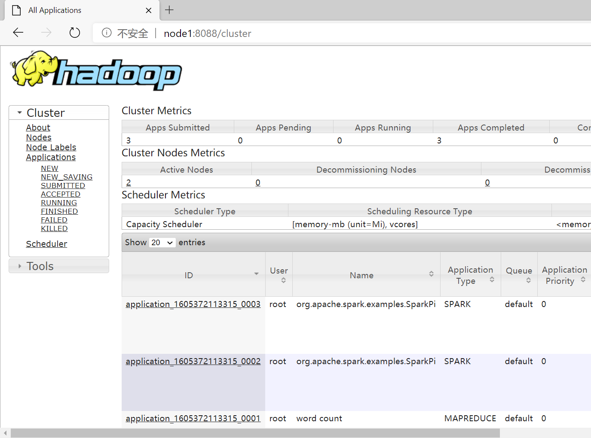


## 5、高可用

节点规划：

节点名称 | IP地址      | 内存 | 硬盘   | 节点角色
---|:---|:---|:---|:---
node1   | 192.168.1.6 | 2GB | 10GB   | MASTER
node2   | 192.168.1.7 | 2GB | 10GB   | MASTER、WORKER
node3   | 192.168.1.8 | 2GB | 10GB   | WORKER

### 5.1、安装ZOOKEEPER

参考 [ZOOKEEPER完全分布式](https://github.com/ZGG2016/knowledgesystem/blob/master/19%20Zookeeper/%E7%8E%AF%E5%A2%83%E6%90%AD%E5%BB%BA.md)

### 5.2、重新配置配置文件

`slave` 不变。【要根据节点规划来设置】

对 `conf/spark-env.sh`:

```sh
# 1.先注释掉 export SPARK_MASTER_IP=node1
# 2.其他保持不变，添加如下内容：
[root@node1 spark-3.0.1-bin-hadoop3.2]# vi conf/spark-env.sh  
....
export SPARK_DAEMON_JAVA_OPTS="-Dspark.deploy.recoveryMode=ZOOKEEPER -Dspark.deploy.zookeeper.url=node1:2181,node2:2181,node3:2181 -Dspark.deploy.zookeeper.dir=/opt/spark-3.0.1-bin-hadoop3.2/zkspark"
```

### 5.3、启动

```sh
[root@node1 sbin]# start-all.sh
starting org.apache.spark.deploy.master.Master, logging to /opt/spark-3.0.1-bin-hadoop3.2/logs/spark-root-org.apache.spark.deploy.master.Master-1-node1.out
node2: starting org.apache.spark.deploy.worker.Worker, logging to /opt/spark-3.0.1-bin-hadoop3.2/logs/spark-root-org.apache.spark.deploy.worker.Worker-1-node2.out
node3: starting org.apache.spark.deploy.worker.Worker, logging to /opt/spark-3.0.1-bin-hadoop3.2/logs/spark-root-org.apache.spark.deploy.worker.Worker-1-node3.out

[root@node2 spark-3.0.1-bin-hadoop3.2]# sbin/start-master.sh
starting org.apache.spark.deploy.master.Master, logging to /opt/spark-3.0.1-bin-hadoop3.2/logs/spark-root-org.apache.spark.deploy.master.Master-1-node2.out

[root@node1 sbin]# jps
7666 QuorumPeerMain
11666 JournalNode
12722 NodeManager
13683 Master
12580 ResourceManager
11910 NameNode
13769 Jps
12924 DFSZKFailoverController
12062 DataNode

[root@node2 spark-3.0.1-bin-hadoop3.2]# jps
10112 ResourceManager
11250 Worker
11394 Jps
10533 DFSZKFailoverController
9878 NameNode
10198 NodeManager
9975 DataNode
11308 Master
7629 QuorumPeerMain
9791 JournalNode

[root@node3 spark-3.0.1-bin-hadoop3.2]# jps
9713 Jps
8930 DataNode
8835 JournalNode
9044 NodeManager
7562 QuorumPeerMain
9663 Worker
```

### 5.4、web 查看

分别在浏览器输入 `node1:8080` 、`node2:8080`，如下所示，发现 node1 为 `ALIVE`， node2 为 `STANDBY`。

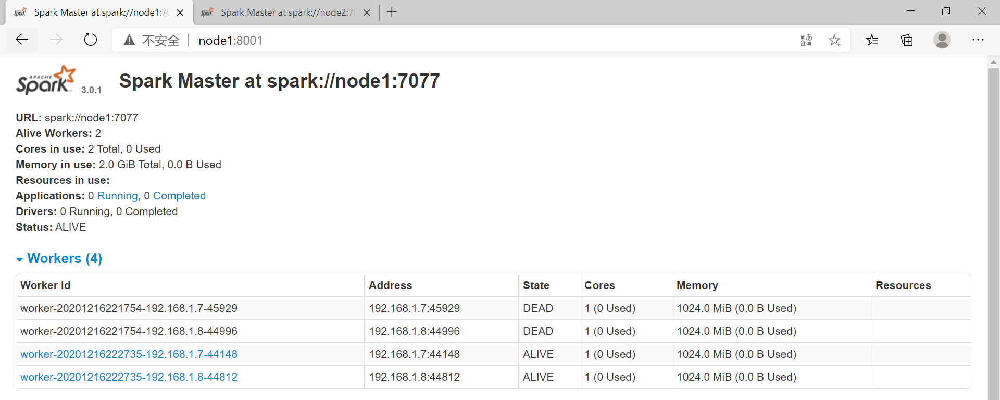

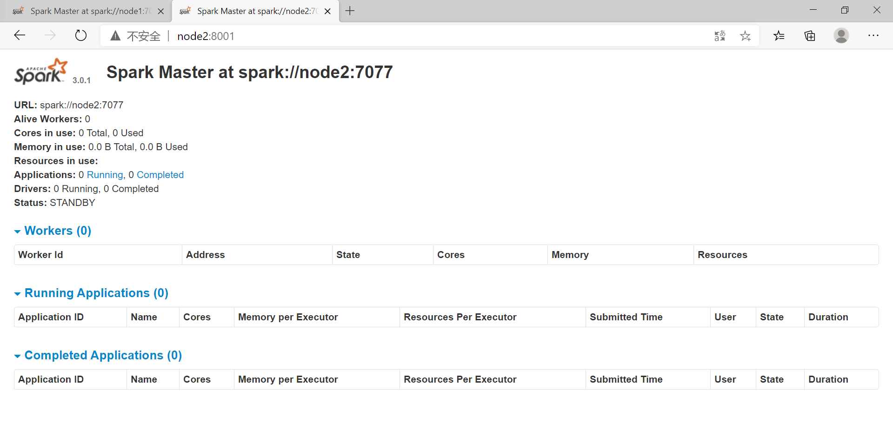

此时，kill 掉 node1 上的 master 

```sh
[root@node1 spark-3.0.1-bin-hadoop3.2]# kill -9 13683
[root@node1 spark-3.0.1-bin-hadoop3.2]# jps
7666 QuorumPeerMain
11666 JournalNode
12722 NodeManager
12580 ResourceManager
11910 NameNode
12924 DFSZKFailoverController
12062 DataNode
13807 Jps
```

再查看，发现 node1 已打不开，node2 成为 `ALIVE`。说明 node2 代替 node1 成为 `Master`。


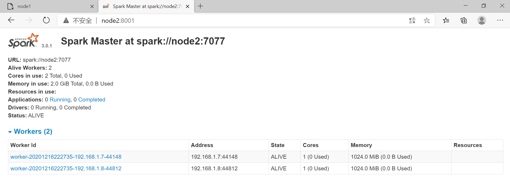
