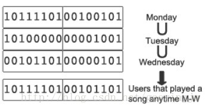

# setbit(bitmap) 统计活跃用户

[TOC]

redis 用 setbit(bitmap) 统计活跃用户

## 1、用 bitmap 实时统计数据

Bitmap，即 Bitset，是**一串连续的0或1的二进制数字**，每一位所在的位置称为偏移(offset)。在 bitmap 上可执行 AND、OR、XOR 以及其它位操作。

## 2、位图计数（Population Count）

位图计数统计的是**bitmap中值为1的位的个数**。

位图计数的效率很高，例如，一个 bitmap 包含 10 亿个位，90% 的位都置为 1，在一台 MacBook Pro 上对其做位图计数需要 21.1ms。SSE4甚至有对整形(integer)做位图计数的硬件指令。


## 3、Redis Bitmaps

Redis 允许使用二进制数据的 Key(binary keys) 和二进制数据的 Value(binary values)。Redis 的 Bitmap 就是二进制数据的 value。

Redis 的 setbit(key, offset, value) 操作对指定的 key 的 value 的指定偏移(offset)的位置设置1或0，时间复杂度是 O(1)。

## 4、例子：日活跃用户

为了统计今日登录的用户数，我们建立了一个 bitmap，每一位标识一个用户 ID。当某个用户访问我们的网页或执行了某个操作，就在 bitmap 中把标识此用户的位置为1。

在 Redis 中，此 bitmap 的 key 值是**用户执行操作的类型和时间戳**。


这个简单的例子中，每次用户登录时会执行一次 redis.setbit(daily_active_users, user_id, 1)。将 bitmap 中对应位置的位置为1，时间复杂度是 O(1)。

统计 bitmap 结果显示有今天有9个用户登录。Bitmap 的 key 是 daily_active_users，它的值是 1011110100100101。
                
因为日活跃用户每天都变化，所以需要每天创建一个新的 bitmap。我们简单地把日期添加到key后面，实现了这个功能。

例如，要统计某一天有多少个用户至少听了一个音乐app中的一首歌曲，可以把这个 bitmap 的 redis key 设计为 play:yyyy-mm-dd-hh。当用户听了一首歌曲，我们只是简单地在 bitmap 中把标识这个用户的位置为1，时间复杂度是 O(1)。

	Redis.setbit(play:yyyy-mm-dd, user_id, 1)

今天听过歌曲的用户就是key是play:yyyy-mm-dd的bitmap的位图计数。如果要按周或月统计，只要对这周或这个月的所有bitmap求并集，得出新的bitmap，再对它做位图计数。


        
利用这些bitmap做其它复杂的统计也非常容易。例如，统计11月听过歌曲的高级用户 (premium user)：
(play:2011-11-01∪ play:2011-11-02∪ … ∪ play:2011-11-30)∩premium:2011-11

## 4、优化

前面的例子中，我们把日统计，周统计，月统计缓存到Redis，以加快统计速度。

这是一种非常灵活的方法。这样进行缓存的额外红利是可以进行更多的统计，如每周活跃的手机用户：求手机用户的 bitmap 与周活跃用户的交集。

或者，如果要统计过去n天的活跃用户数，缓存的日活跃用户使这样的统计变得简单—：从 cache 中获取过去 n-1 天的日活跃用户 bitma 和今天的 bitmap ，对它们做并集(Union)，时间消耗是 50ms。

下面的Java代码用来统计某个用户操作在某天的活跃用户。

```java
import redis.clients.jedis.Jedis;  
import java.util.BitSet;  
...  
    Jedis redis = new Jedis("localhost");  
    ...  
    public int uniqueCount(String action, String date) {  
        String key = action + ":" + date;  
        BitSet users = BitSet.valueOf(redis.get(key.getBytes()));  
        return users.cardinality();  
    }
```
     
下面的Java代码用来统计某个用户操作在一个指定多个日期的活跃用户。

```java
import redis.clients.jedis.Jedis;
import java.util.BitSet;
...
    Jedis redis = new Jedis("localhost");
    ...
    public int uniqueCount(String action, String... dates) {
        BitSet all = new BitSet();
        for (String date : dates) {
            String key = action + ":" + date;
            BitSet users = BitSet.valueOf(redis.get(key.getBytes()));
            all.or(users);
        }
        return all.cardinality();
    }  
```

[原文链接](https://www.cnblogs.com/devilwind/p/7374017.html)
