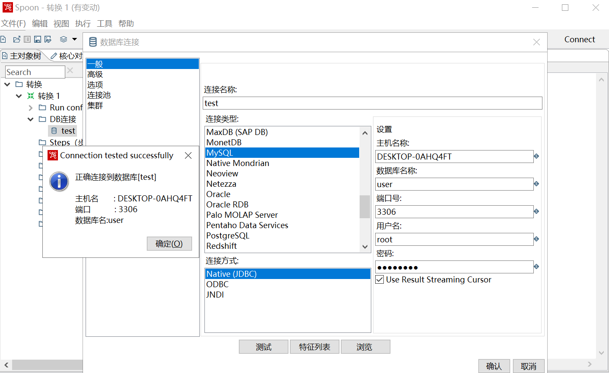
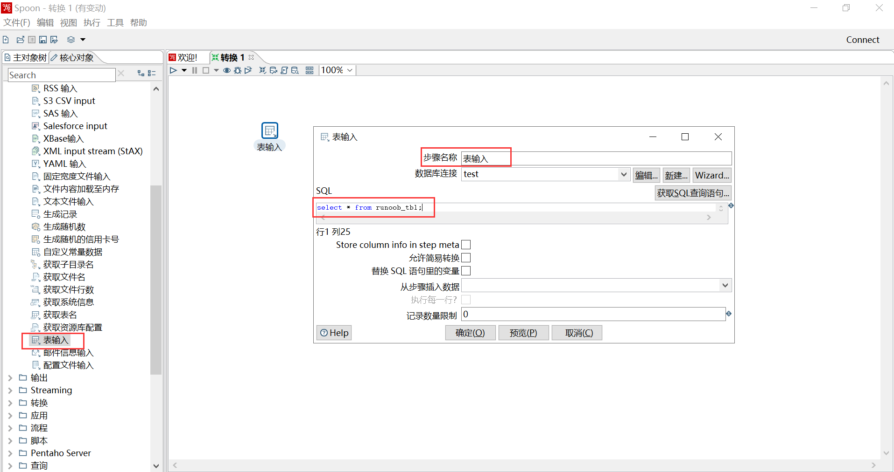
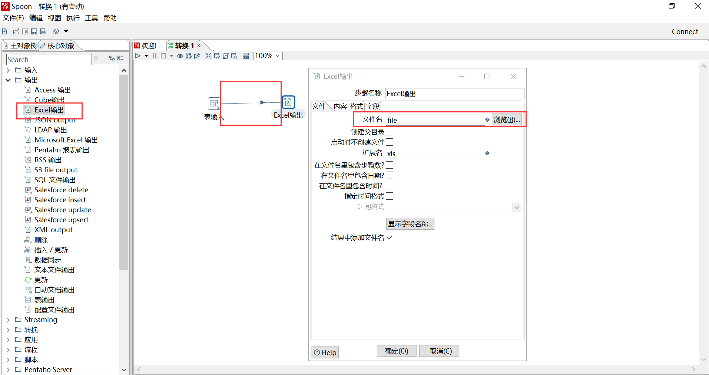
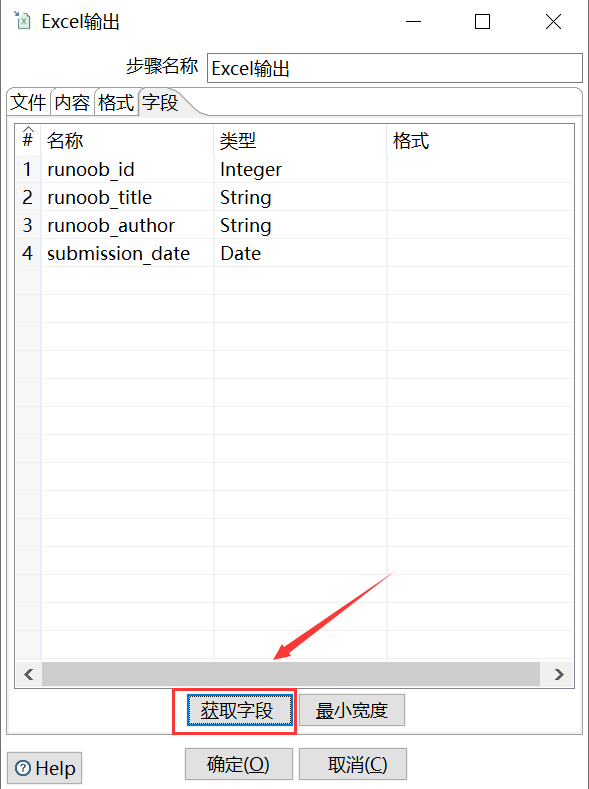
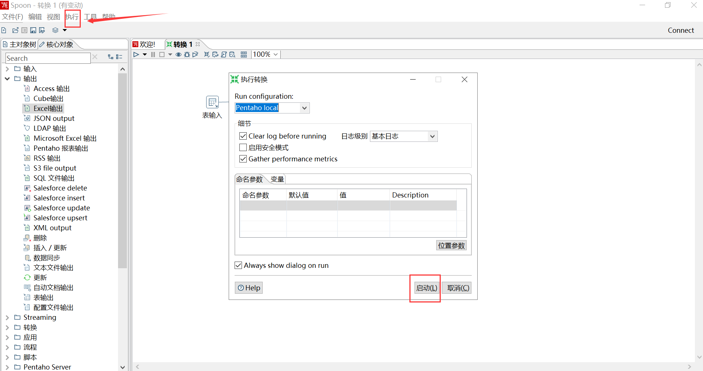
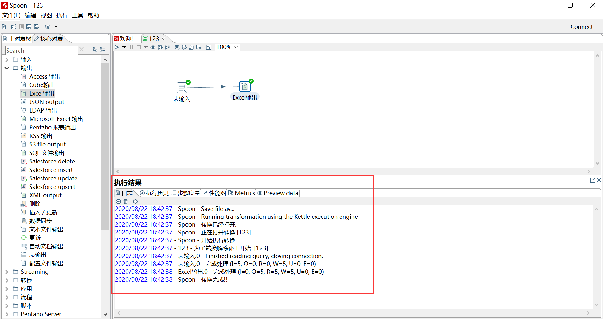
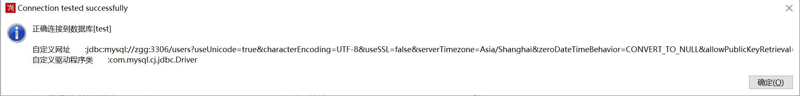
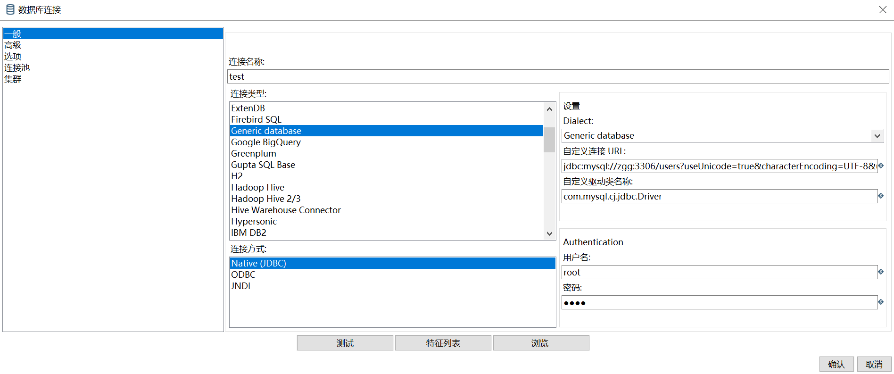

# kettle初体验：windows环境下安装和使用

[TOC]

## 1、安装jdk

	C:\Users\zgg>java -version
	java version "1.8.0_161"
	Java(TM) SE Runtime Environment (build 1.8.0_161-b12)
	Java HotSpot(TM) 64-Bit Server VM (build 25.161-b12, mixed mode)

## 2、安装kettle

(1)下载、解压

[https://community.hitachivantara.com/s/article/data-integration-kettle](https://community.hitachivantara.com/s/article/data-integration-kettle)

(2)下载 MySQL 驱动 JAR 包，并复制到 lib 目录下。

要注意版本

[mysql-connector-java-5.1.49-bin.jar](https://dev.mysql.com/downloads/connector/j/5.1.html)

(3)启动kettle

包含两个启动的脚本命令：`spoon.bat`、`spoon.sh`。

`spoon.bat`适用于 windows 系统，通过双击文件来启动图形化界面。

`spoon.sh`适用于 Linux 系统，通过在终端执行下列命令来启动图形化界面。

## 3、使用kettle

需求：从 mysql 下的 user 数据库的 runoob_tbl 表读取数据，写到 excel.

(1)连接mysql

文件 --> 新建 --> 转换 --> 主对象树 --> DB连接 --> 新建



要注意主机名称不要错了【DESKTOP-0AHQ4FT】。

出现了如下问题：


	Unable to load authentication plugin 'caching_sha2_password'. ==> 更新MySQL驱动JAR包

	Error connecting to database: (using class org.gjt.mm.mysql.Driver) Could not create connection to database server.  ==> 主机名称写错了

	Driver class 'org.gjt.mm.mysql.Driver' could not be found, make sure the 'MySQL' driver (jar file) is installed.org.gjt.mm.mysql.Driver  ==> jar包没复制到lib目录下

(2)建立输入输出

在 `核心对象` tab下，分别设置。



**按住shift键，将输入指向输出。**









## 4、问题

(1)mysql 更新到 8.0.21 后，再执行如下操作，出现了 `Driver class 'org.gjt.mm.mysql.Driver' could not be found, make sure the 'MySQL' driver (jar file) is installed.org.gjt.mm.mysql.Driver` 错误。

经一番百度后，8.x 的 jdbc 连接驱动方式有所变化，需要使用自定义 jdbc 连接方式(数据库类型选择Generic Database)，且 `mysql..jar`也要更新到 8.x。连接后，如下图：



配置页面如下：



这里的用户名密码是登录mysql的用户名和密码

	自定义连接URL:jdbc:mysql://zgg:3306/users?useUnicode=true&characterEncoding=UTF-8&useSSL=false&serverTimezone=Asia/Shanghai&zeroDateTimeBehavior=CONVERT_TO_NULL&allowPublicKeyRetrieval=true
	【这里的`users`是要连接的数据库名称】

	自定义驱动类:com.mysql.cj.jdbc.Driver

(2)连接中，出现过 `Public Key Retrieval is not allowed` 错误，需要添加上述URL的最后一项`&allowPublicKeyRetrieval=true`

(3)连接中，出现过 `Host 'desktop-0ahq4ft' is not allowed to connect to this MySQL server"`。

需要创建一个用户，并赋予权限

```sql
mysql> CREATE USER 'root'@'desktop-0ahq4ft' IDENTIFIED BY '1234'; 
Query OK, 0 rows affected (0.01 sec)

mysql> grant all privileges on *.* to 'root'@'desktop-0ahq4ft';
Query OK, 0 rows affected (0.01 sec)
```

[参考](http://dblab.xmu.edu.cn/blog/kettle/)