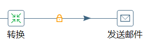
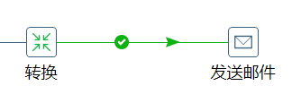
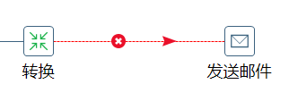
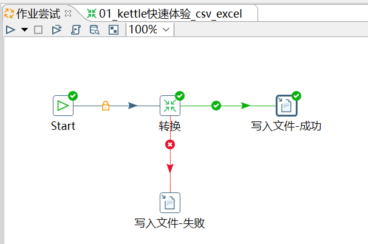
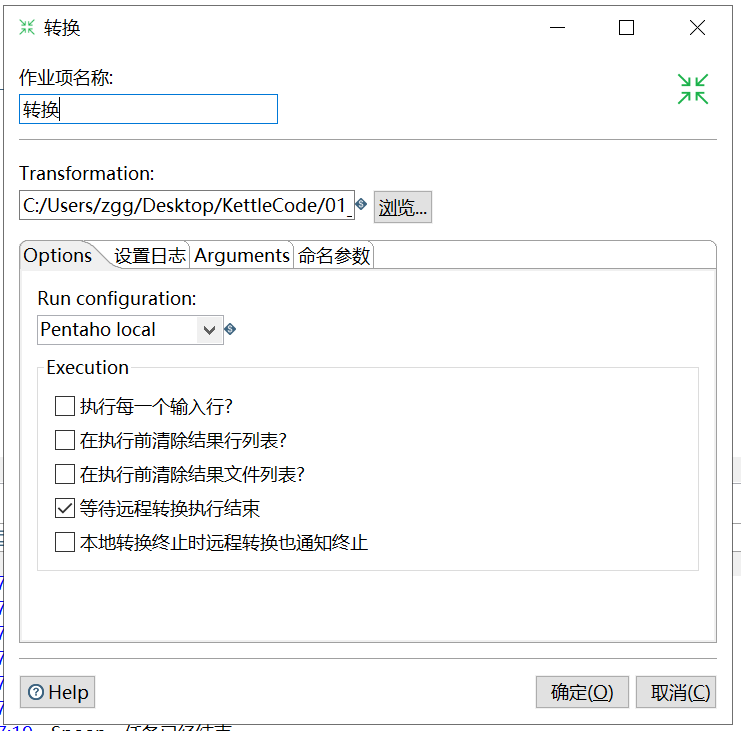
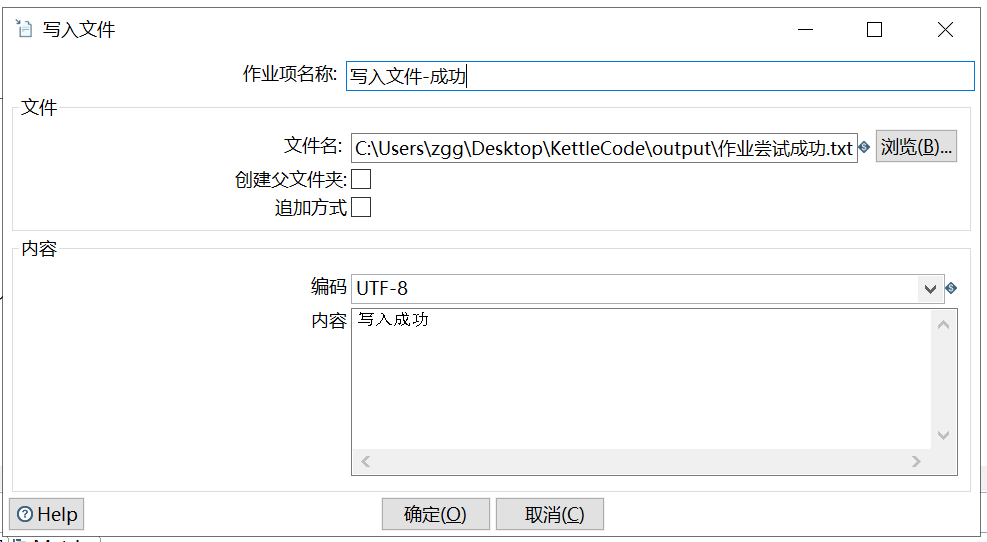

# 作业

[TOC]

## 1、作业简介

大多数 ETL 项目都需要完成各种各样的维护工作。例如，如何传送文件；验证数据库表是否存在等等。而这些操作都是按照一定顺序完成。

因为**转换以并行方式执行**，就需要一个可以**串行执行的作业**来处理这些操作。

**一个作业包含一个或者多个作业项，这些作业项以某种顺序来执行。作业执行顺序由作业项之间的跳（job hop）和每个作业项的执行结果来决定**。

### 1.1、作业项

作业项是作业的基本构成部分。如同转换的步骤，作业项也可以使用图标的方式图形化展示。但是，**作业项和转换步骤有下面几点不同：**

1. 转换步骤与步骤之间是数据流，作业项之间是步骤流。

2. 转换启动以后，所有步骤一起并行启动等待数据行的输入，而作业项是严格按照执行顺序启动，一个作业项执行完以后，再执行下一个作业项。

3. 在作业项之间可以传递一个结果对象（result object）。这个结果对象里面包含了数据行，它们不是以数据流的方式来传递的。而是等待一个作业项执行完了，再传递个下一个作业项。

4. 因为作业顺序执行作业项，所以必须定义一个起点。有一个叫“开始”的作业项就定义了这个点。一个作业只能定一个开始作业项。

### 1.2、作业跳

作业的跳是作业项之间的连接线，他定义了作业的执行路径。作业里每个作业项的不同运行结果决定了做作业的不同执行路径。作业跳一共分为下面三种情况：

①无条件执行：**不论上一个作业项执行成功还是失败，下一个作业项都会执行**。这是一种蓝色的连接线，上面有一个锁的图标。

②当运行结果为真时执行：**当上一个作业项的执行结果为真时，执行下一个作业项**。通常在需要无错误执行的情况下使用。这是一种绿色的连接线，上面有一个对钩号的图标。

③当运行结果为假时执行：**当上一个作业项的执行结果为假或者没有成功执行时，执行下一个作业项**。这是一种红色的连接线，上面有一个红色的停止图标。在图标上单击就可以对跳进行设置。

## 2、作业初体验

案例1：将 3.10.1 章节的转换嵌入作业中执行，执行成功或者失败都发送邮件提醒。【见尚硅谷教程】

案例2：将快速体验的转换嵌入作业中执行，执行成功后写入文件。

