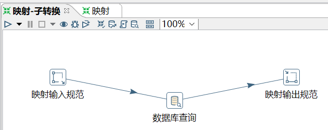
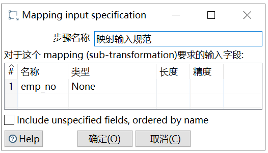
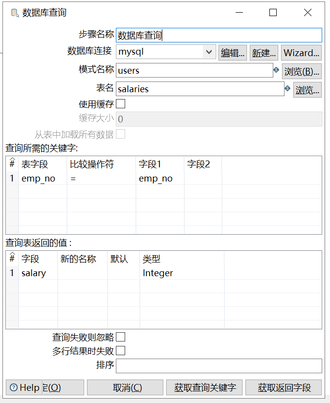
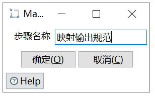
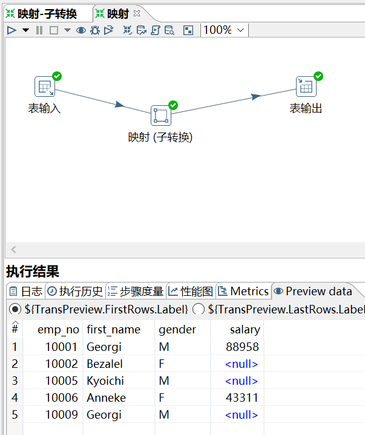
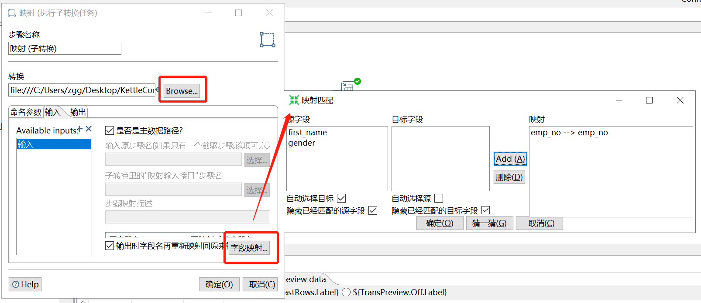

# 映射（子转换）

[TOC]

功能：用来配置子转换，对子转换进行调用。

映射包含了如下三个组件：


映射可以类比方法：

	 新建的子转换   --  方法
	 映射输入规范   --  参数
	 映射输输出规范 --  返回值

使用方法：需要先新建、配置一个子转换，再由主转换在`映射（子转换）`中调用。

需求：为 employees_bk 表匹配 salaries 表，添加 salary 列，输出一个新表中。

```sql
mysql> select * from employees_bk;
+--------+------------+------------+-----------+--------+------------+
| emp_no | birth_date | first_name | last_name | gender | hire_date  |
+--------+------------+------------+-----------+--------+------------+
|  10001 | 1953-09-02 | Georgi     | Facello   | M      | 1986-06-26 |
|  10002 | 1964-06-02 | Bezalel    | Simmel    | F      | 1985-11-21 |
|  10005 | 1955-01-21 | Kyoichi    | Maliniak  | M      | 1989-09-12 |
|  10006 | 1953-04-20 | Anneke     | Preusig   | F      | 1989-06-02 |
|  10009 | 1953-09-02 | Georgi     | Facello   | M      | 1986-06-26 |
+--------+------------+------------+-----------+--------+------------+
5 rows in set (0.00 sec)

mysql> select * from salaries;
+--------+--------+------------+------------+
| emp_no | salary | from_date  | to_date    |
+--------+--------+------------+------------+
|  10001 |  88958 | 1986-06-26 | 9999-01-01 |
|  10003 |  43311 | 2001-12-01 | 9999-01-01 |
|  10004 |  70698 | 1986-12-01 | 1995-12-01 |
|  10004 |  74057 | 1995-12-01 | 9999-01-01 |
|  10006 |  43311 | 2001-08-02 | 9999-01-01 |
|  10007 |  88070 | 2002-02-07 | 9999-01-01 |
+--------+--------+------------+------------+
6 rows in set (0.00 sec)
```

操作过程：

（1）新建一个子转换，并进行配置。







这里是薪水所在表。



（2）建立主转换，并进行配置。





要注意：输出表中的字段，不要多了，也不要少了。