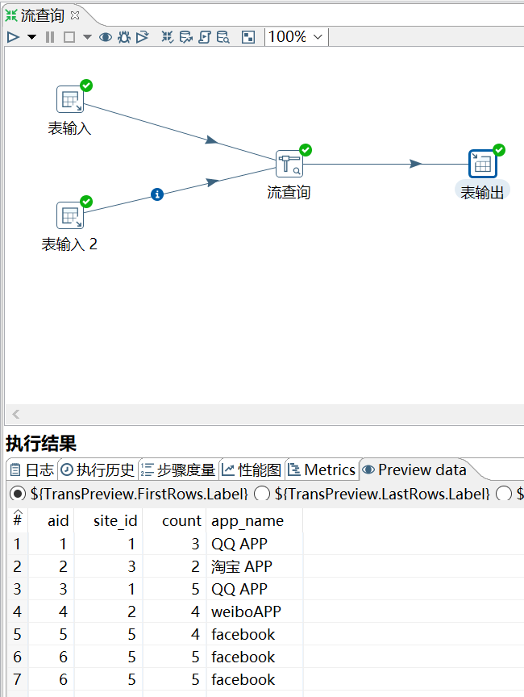
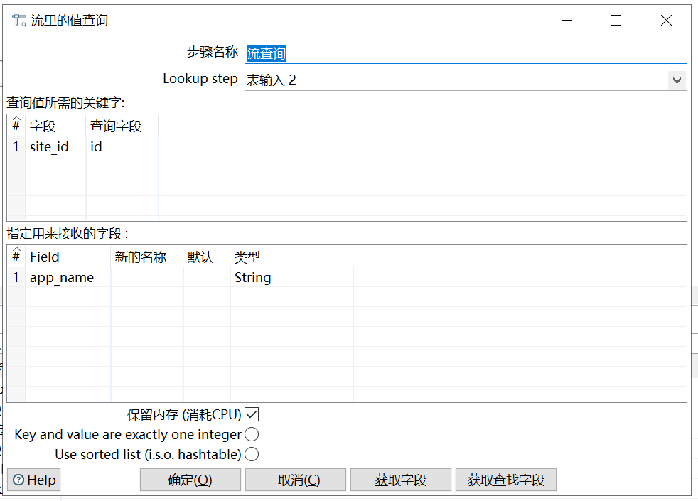

# 流查询

功能：查询两条数据流中的数据，然后按照指定的字段做等值匹配。

注意：流查询在查询前把数据都加载到内存中，并且只能进行等值查询。

需求：让 access_log_bk 表和 apps_bk 表，根据 site_id 和 id 匹配，输出 aid、app_name、count字段到新表中。

```sql
mysql> select * from access_log_bk;
+-----+---------+-------+------------+
| aid | site_id | count | date       |
+-----+---------+-------+------------+
|   1 |       1 |     3 | 2016-05-10 |
|   2 |       3 |     2 | 2016-05-13 |
|   3 |       1 |     5 | 2016-05-14 |
|   4 |       2 |     4 | 2016-05-14 |
|   5 |       5 |     4 | 2016-05-14 |
|   6 |       5 |     5 | 2016-05-12 |
|   6 |       5 |     5 | 2016-05-12 |
+-----+---------+-------+------------+
7 rows in set (0.00 sec)

mysql> select * from apps_bk;
+------+-------------+-------------------------+---------+
| id   | app_name    | url                     | country |
+------+-------------+-------------------------+---------+
|    1 | QQ APP      | http://im.qq.com/       | CN      |
|    2 | weiboAPP    | http://weibo.com/       | CN      |
|    3 | 淘宝 APP    | https://www.taobao.com/ | CN      |
|    4 | meituan APP | http://www.meituan.com  | CN      |
|    5 | facebook    | http://www.facebook.com | USA     |
+------+-------------+-------------------------+---------+
5 rows in set (0.01 sec)
```

操作过程：





`lookup step`:指定的是次表，不是主表。

`指定用来接收的字段`是次表将要添加到主表的字段。


查看结果：

```sql
mysql> select * from access_apps;
+------+------------+-------+
| aid  | app_name   | count |
+------+------------+-------+
|    1 | QQ APP     |     3 |
|    2 | 淘宝 APP   |     2 |
|    3 | QQ APP     |     5 |
|    4 | weiboAPP   |     4 |
|    5 | facebook   |     4 |
|    6 | facebook   |     5 |
|    6 | facebook   |     5 |
+------+------------+-------+
7 rows in set (0.00 sec)
```