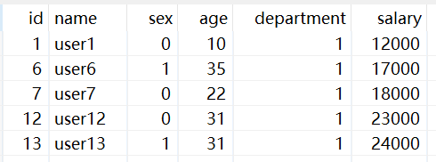

# Switch/case

[TOC]

功能：利用某一个字段的数据的不同的值，让数据流从一路到多路。【类似case when语句】

需求：将 excel：13_Switch-Case.xlsx 的数据按照部门字段进行分类，将同一个部门的数据输出到一个 excel 中。

操作过程：

先确定`Switch/case`后的输出步骤，再配置`Switch/case`

`case值`部分：第一列指定的值是多少时，进入第二列的哪个步骤。

查看结果：

