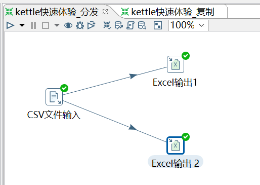
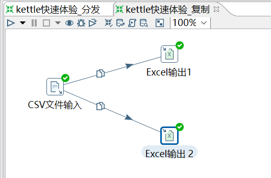

# 简介

## 1、转换

转换(transaformation)负责数据的输入、转换、校验和输出等工作。

Kettle 中使用 转换 完成数据 ETL 全部工作。

转换由多个步骤 (Step) 组成，如文本文件输入，过滤输出行，执行 SQL 脚本等。

各个步骤使用跳 (Hop) 来链接。 跳定义了一个数据流通道，即数据由一个步骤流 (跳) 向下一个步骤。

在 Kettle 中数据的最小单位是数据行（row），数据流中流动其实是缓存的行集 (RowSet) 。

## 2、步骤（Step）

步骤（控件）是转换里的基本的组成部分，快速入门的案例中就存在两个步骤，“CSV文件输入”和“Excel 输出”。

一个步骤有如下几个关键特性：

- ①步骤需要有一个名字，这个名字在同一个转换范围内唯一。
- ②每个步骤都会读、写数据行(唯一例外是“生成记录”步骤，该步骤只写数据)。
- ③步骤将数据写到与之相连的一个或多个输出跳（hop），再传送到跳的另一端的步骤。
- ④大多数的步骤都可以有多个输出跳。一个步骤的数据发送可以被设置为分发和复制，

**分发是目标步骤轮流接收记录，复制是所有的记录被同时发送到所有的目标步骤**

## 3、跳（Hop）

跳就是步骤之间带箭头的连线，跳定义了步骤之间的数据通路。

**跳实际上是两个步骤之间的被称之为行集的数据行缓存**，

行集的大小可以在转换的设置里定义。当行集满了，向行集写数据的步骤将停止写入，直到行集里又有了空间。当行集空了，从行集读取数据的步骤停止读取，直到行集里又有可读的数据行。

## 4、并行

跳的这种基于行集缓存的规则允许每个步骤都是由一个独立的线程运行，这样并发程度最高。

这一规则也允许数据以最小消耗内存的数据流的方式来处理。

在数据仓库里，我们经常要处理大量数据，所以这种高并发低消耗的方式也是 ETL 工具的核心需求。

对于 kettle 的转换，不能定义一个执行顺序，因为所有步骤都以并发方式执行：当转换启动后，所有步骤都同时启动，从它们的输入跳中读取数据，并把处理过的数据写到输出跳，直到输入跳里不再有数据，就中止步骤的运行。当所有的步骤都中止了，整个转换就中止了。

**如果你想要一个任务沿着指定的顺序执行，那么就要使用下面所讲的“作业”！**

## 5、作业

作业 (Job)，负责定义一个完成整个工作流的控制，比如将转换的结果发送邮件给相关人员。

因为转换（transformation）以并行方式执行，所以必须存在一个串行的调度工具来执行转换，这就是 Kettle 中的作业。