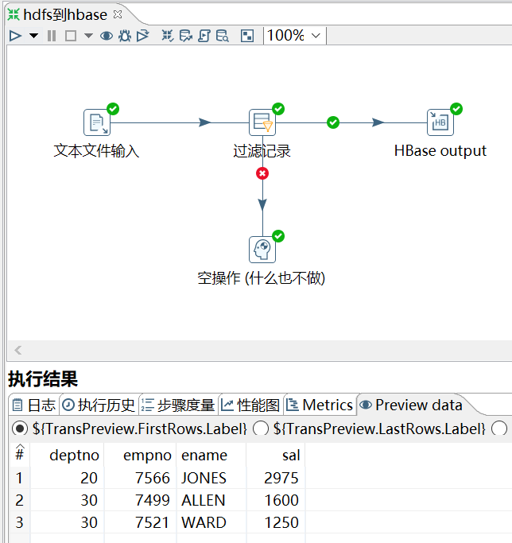
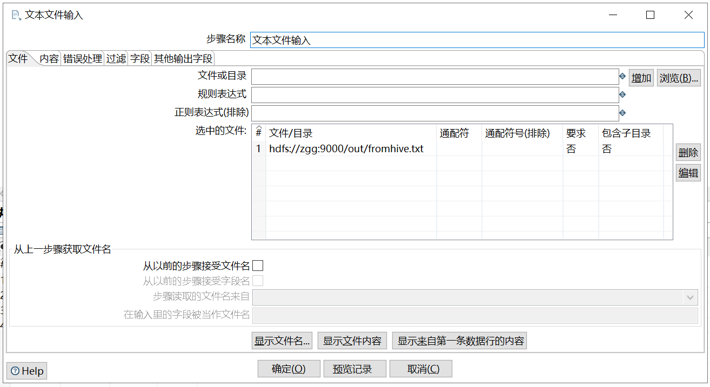
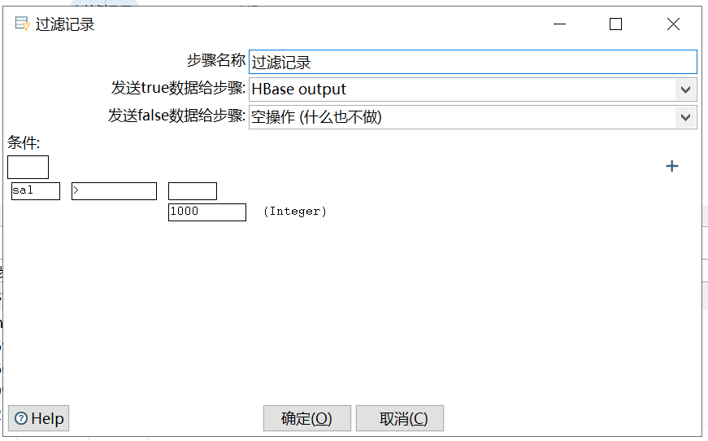
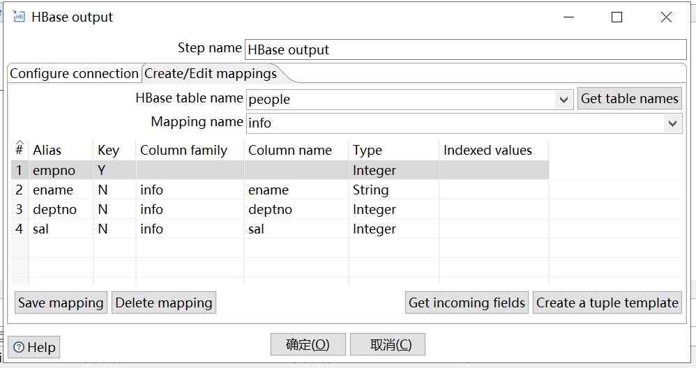

# hdfs到hbase

[TOC]

**这里采用的是 kettle8.2 版本**

## 1、需求

读取 hdfs 文件，并将 sal 大于 1000 的数据保存到 hbase 中。

## 2、准备数据

原数据是 `hive到hdfs` 任务中的输出数据。

在 HBase 中创建一张表用于存放数据。

```sh
hbase(main):001:0> create 'people','info'
Created table people
Took 3.4565 seconds                                                                                                                 
=> Hbase::Table - people
```

## 3、配置、操作

如何配置见 `hive到hdfs` 任务。



下图中，通过 `浏览` 中的 `HDFS` 选择文件，再点击 `获取字段`，配置格式。





在下图中：

（1）选择`Hadoop cluster`和`URL to hbase-site.xml`；

（2）进入`create/Edit mapping` tab 页下配置；

（3）第二步配置完后，再回来选择 `Hbase table name` 和 `Mapping name`，选择的时候，先点击`Get table name` 或 `Get mappings for specified table`，之后，就可以在下拉框中选择了。


在下图中，也是先点击 `Get table names`，再选择，配置完 `Hbase table name` 和 `mapping name` 后，点击 `Get incoming fields` 获取字段（选择 rowkey 字段），格式设置完后，点击 `Saving mapping`。



注意：

若报错，说明没有权限往 hdfs 写文件，在 Spoon.bat 中第 119 行添加参数`"-DHADOOP_USER_NAME=atguigu"`、`"-Dfile.encoding=UTF-8"`

如果点击 `Hbase table name`，显示无法连接 hbase，需要把 zookeeper 的 jar 包放到 `...pentaho-big-data-plugin\hadoop-configurations\hdp30/lib目录` 下。