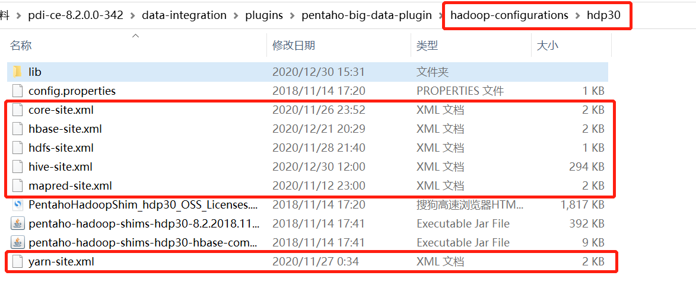
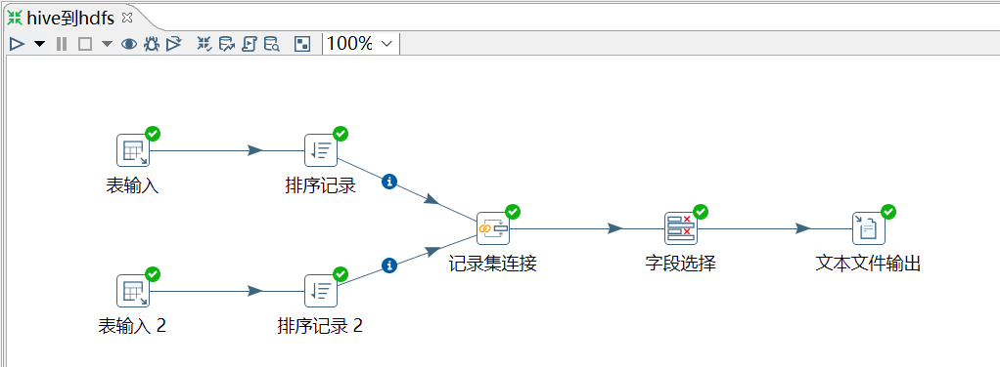
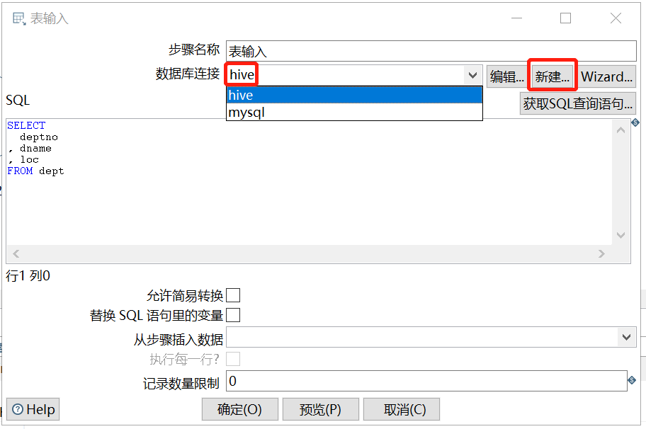
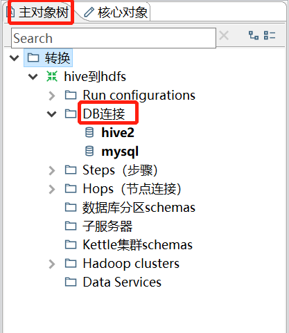
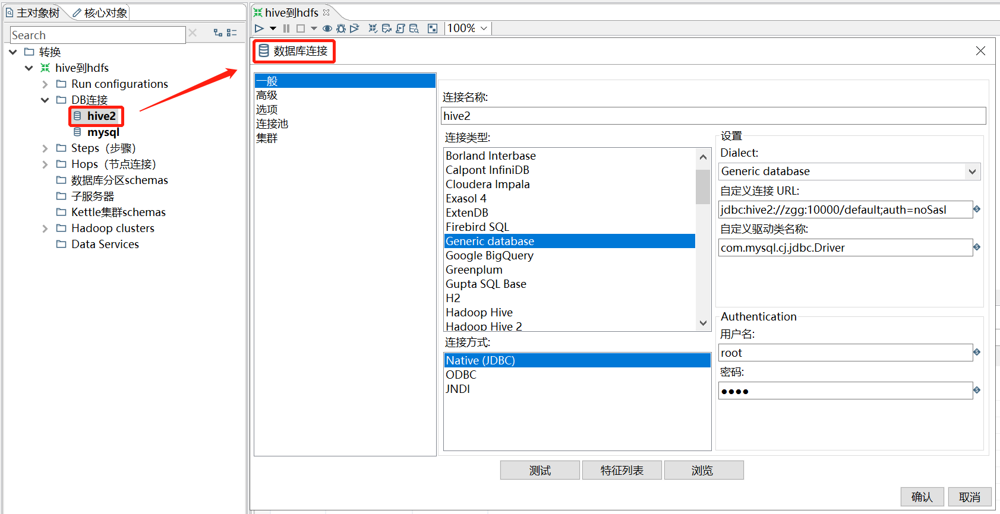
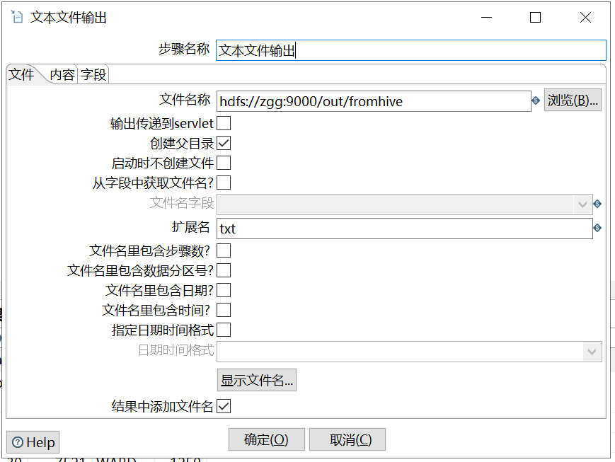
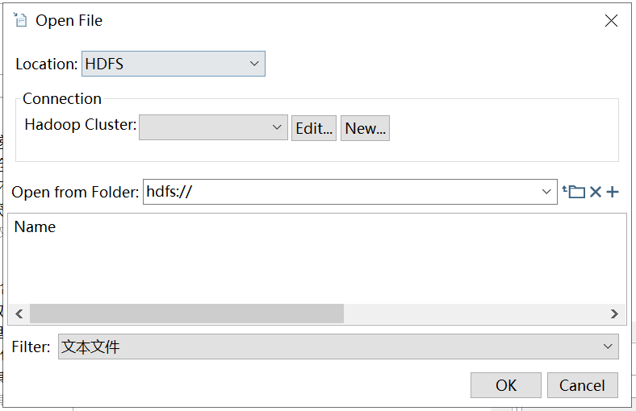
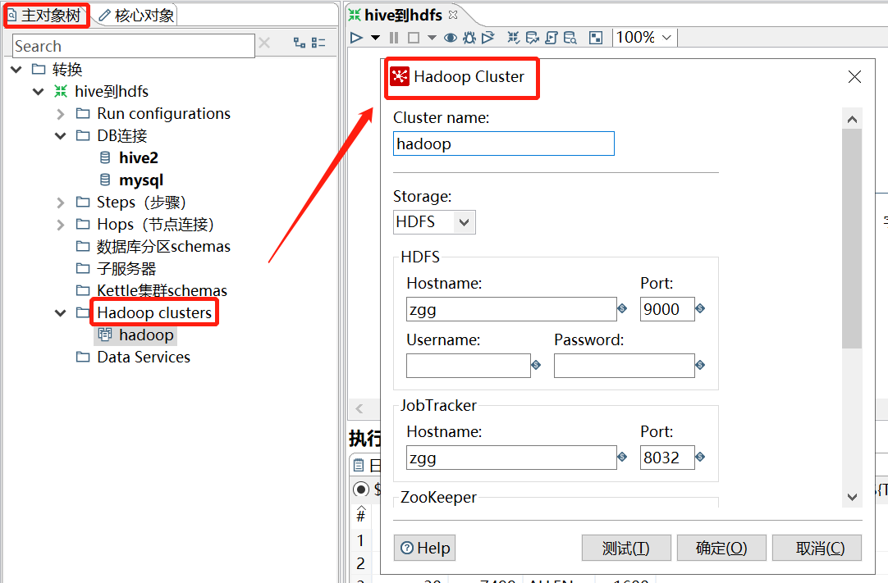

# hive到hdfs

[TOC]

**这里采用的是 kettle8.2 版本**

## 1、需求

将 hive 表的数据，经过连接后，输出到 hdfs。

## 2、准备数据

创建两张表 dept 和 emp

```sql
CREATE TABLE dept(deptno int, dname string,loc string)
ROW FORMAT DELIMITED
FIELDS TERMINATED BY '\t';

CREATE TABLE emp(
empno int,
ename string,
job string,
mgr int,
hiredate string,
sal double,
comm int,
deptno int)
ROW FORMAT DELIMITED
FIELDS TERMINATED BY '\t';
```

插入数据

```sql
insert into dept values(10,'accounting','NEW 
YORK'),(20,'RESEARCH','DALLAS'),(30,'SALES','CHICAGO'),(40,'OPERATIONS','BOSTON');

insert into emp values
(7369,'SMITH','CLERK',7902,'1980-12-17',800,NULL,20),
(7499,'ALLEN','SALESMAN',7698,'1980-12-17',1600,300,30),
(7521,'WARD','SALESMAN',7698,'1980-12-17',1250,500,30),
(7566,'JONES','MANAGER',7839,'1980-12-17',2975,NULL,20);
```

## 3、配置、操作

因为涉及到 hive 和 hbase 的读写，需要先修改相关配置文件。

（1）修改 kettle 安装目录下的 `data-integration\plugins\pentaho-big-data-plugin` 下的 `plugin.properties` 文件，设置 `active.hadoop.configuration=hdp30`；

（2）将如下配置文件，从集群中拷贝到 `data-integration\plugins\pentaho-big-data-plugin\hadoop-configurations\hdp30` 目录下。



【在`hadoop-configurations`目录下有多个目录，表示可以选择的hadoop发行版。hdp表示Hortonworks版本，但我安装的是apache原生的，却跑成功了，还没搞明白原因。】



在`表输入`步骤中，新建了一个名为`hive`的`数据库连接`。【也可以在`主对象树`下的`DB连接`新建】







【`连接类型`选择`Hadoop Hive 2`一直没连接成功，出现`Could not open client transport with JDBC Uri: jdbc:hive2://zgg:10000/default: java.net.ConnectException: 拒绝连接 (Connection refused) `错误。】



点击`浏览`后，进入如下页面。`Location`选择`HDFS`后，就可以新建一个集群。【也可以在`主对象树`下的`Hadoop clusters`新建】





这里 HDFS 的主机名和端口就是 `core-site.xml` 设置的值。其他在集群里没设置的属性就空下不填。

结果查看：

```sh
[root@zgg opt]# hadoop fs -text /out/fromhive.txt
deptno;empno;ename;sal
20;7369;SMITH;800
20;7566;JONES;2975
30;7499;ALLEN;1600
30;7521;WARD;1250
```