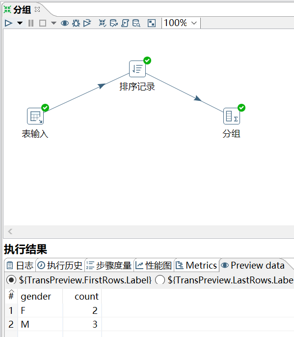
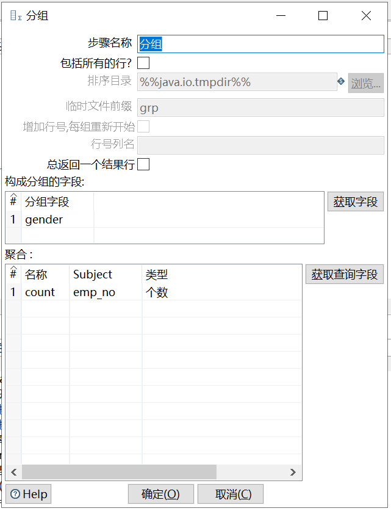

# 分组

功能：类似于 GROUP BY，可以按照指定的一个或者几个字段进行分组，然后其余字段可以按照聚合函数进行合并计算。

注意：在进行分组之前，数据最好先进行排序。

需求：对 employees_bk 表，按 gender 分组，统计每组有多少员工。

```sql
mysql> select * from employees_bk;
+--------+------------+------------+-----------+--------+------------+
| emp_no | birth_date | first_name | last_name | gender | hire_date  |
+--------+------------+------------+-----------+--------+------------+
|  10001 | 1953-09-02 | Georgi     | Facello   | M      | 1986-06-26 |
|  10002 | 1964-06-02 | Bezalel    | Simmel    | F      | 1985-11-21 |
|  10005 | 1955-01-21 | Kyoichi    | Maliniak  | M      | 1989-09-12 |
|  10006 | 1953-04-20 | Anneke     | Preusig   | F      | 1989-06-02 |
|  10009 | 1953-09-02 | Georgi     | Facello   | M      | 1986-06-26 |
+--------+------------+------------+-----------+--------+------------+
5 rows in set (0.00 sec)
```

操作过程：





`排序记录`里的排序字段应该是`聚合`里的分组字段。

`聚合`部分是指定要聚合的字段，即 `count(emp_no)` 里的 emp_no。`名称` 是聚合后的命名的一个输出字段。
