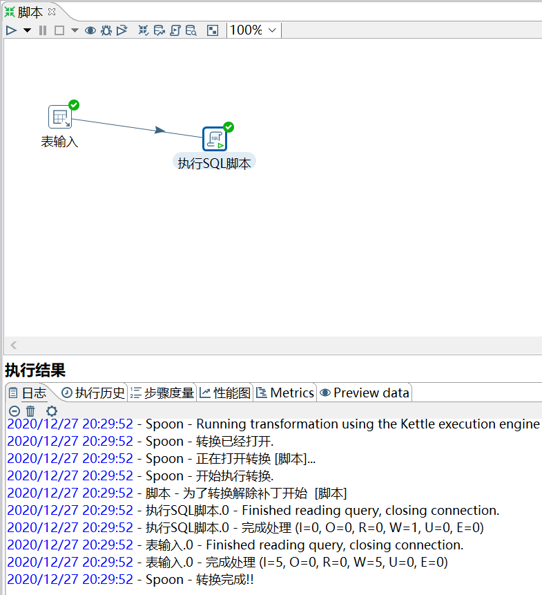
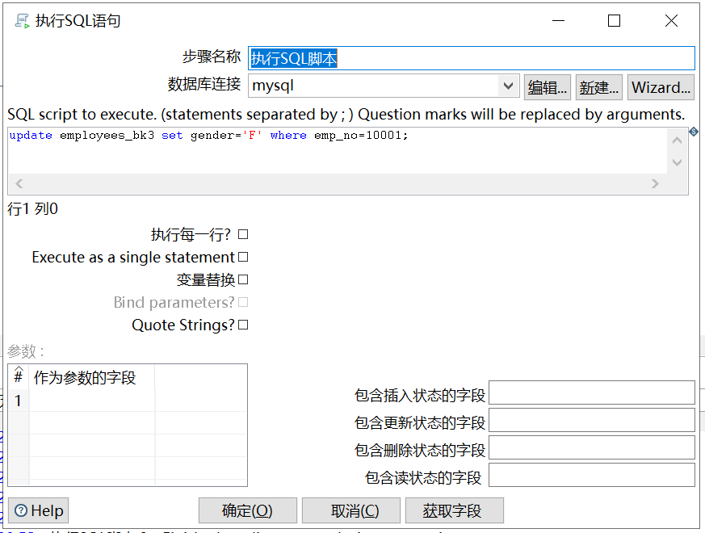

# 执行 SQL 脚本

功能：连接到数据库里面，然后执行自己写的一些 sql 语句

需求：对 employees_bk3 表，将 emp_no=10001 的员工的性别改成 F。

```sql
mysql> select * from employees_bk3;
+--------+--------+---------+----------+
| emp_no | gender | fname   | lname    |
+--------+--------+---------+----------+
|  10001 | M      | Georgi  | Facello  |
|  10002 | F      | Bezalel | Simmel   |
|  10005 | M      | Kyoichi | Maliniak |
|  10006 | F      | Anneke  | Preusig  |
|  10009 | M      | Georgi  | Facello  |
+--------+--------+---------+----------+
5 rows in set (0.01 sec)
```

操作过程：






结果查看：

```sql
mysql> select * from employees_bk3;
+--------+--------+---------+----------+
| emp_no | gender | fname   | lname    |
+--------+--------+---------+----------+
|  10001 | F      | Georgi  | Facello  |
|  10002 | F      | Bezalel | Simmel   |
|  10005 | M      | Kyoichi | Maliniak |
|  10006 | F      | Anneke  | Preusig  |
|  10009 | M      | Georgi  | Facello  |
+--------+--------+---------+----------+
5 rows in set (0.00 sec)
```