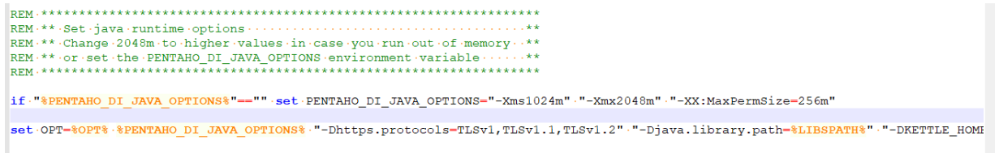

# kettle 调优

1、调整 JVM 大小进行性能优化，修改 Kettle 根目录下的 Spoon 脚本。

参数参考：

-Xmx2048m：设置 JVM 最大可用内存为 2048M。 -Xms1024m：设置 JVM 促使内存为 1024m。此值可以设置与-Xmx 相同，以避免每次垃圾回收完成后 JVM 重新分配内存。

-Xmn2g：设置年轻代大小为 2G。整个 JVM 内存大小=年轻代大小 + 年老代大小 + 持久代大小。持久代一般固定大小为 64m，所以增大年轻代后，将会减小年老代大小。此值对系统性能影响较大，Sun 官方推荐配置为整个堆的 3/8。 

-Xss128k：设置每个线程的堆栈大小。JDK5.0 以后每个线程堆栈大小为 1M，以前每个线程堆栈大小为 256K。更具应用的线程所需内存大小进行调整。在相同物理内存下，减小这个值能生成更多的线程。但是操作系统对一个进程内的线程数还是有限制的，不能无限生成，经验值在 3000 至 5000 左右。

2、 调整提交（Commit）记录数大小进行优化，Kettle 默认 Commit 数量为：1000，可以根据数据量大小来设置 Commitsize：1000 至 50000

3、尽量使用数据库连接池；

4、尽量提高批处理的 commit size；

5、尽量使用缓存，缓存尽量大一些（主要是文本文件和数据流）；

6、Kettle 是 Java 做的，尽量用大一点的内存参数启动 Kettle； 

7、可以使用 sql 来做的一些操作尽量用 sql；

Group , merge , stream lookup,split field 这些操作都是比较慢的，想办法避免他们.，能用 sql 就用 sql； 

8、插入大量数据的时候尽量把索引删掉；

9、尽量避免使用 update , delete 操作，尤其是 update,如果可以把 update 变成先 delete, 后
insert；

10、能使用 truncate table 的时候，就不要使用 deleteall row 这种类似 sql 合理的分区，如果删除操作是基于某一个分区的，就不要使用 delete row 这种方式（不管是 deletesql 还是 delete
步骤）,直接把分区 drop 掉，再重新创建；

11、尽量缩小输入的数据集的大小（增量更新也是为了这个目的）；

12、尽量使用数据库原生的方式装载文本文件(Oracle的sqlloader, mysql的bulk loader步骤)。