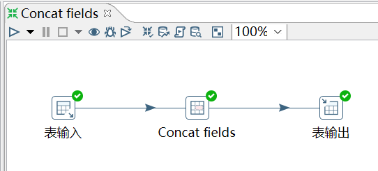
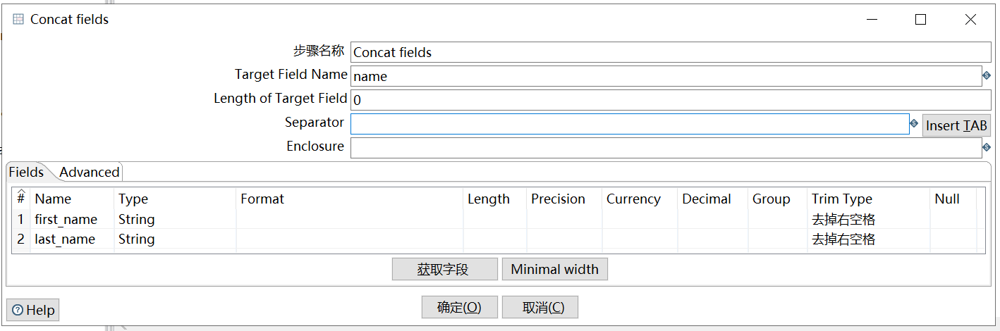

# Concat fields

功能：将多个字段连接起来形成一个新的字段。

需求：连接 employees_bk 表的 first_name 和 last_name，形成 name 字段。

```sql
mysql> select * from employees_bk;
+--------+------------+------------+-----------+--------+------------+
| emp_no | birth_date | first_name | last_name | gender | hire_date  |
+--------+------------+------------+-----------+--------+------------+
|  10001 | 1953-09-02 | Georgi     | Facello   | M      | 1986-06-26 |
|  10002 | 1964-06-02 | Bezalel    | Simmel    | F      | 1985-11-21 |
|  10005 | 1955-01-21 | Kyoichi    | Maliniak  | M      | 1989-09-12 |
|  10006 | 1953-04-20 | Anneke     | Preusig   | F      | 1989-06-02 |
|  10009 | 1953-09-02 | Georgi     | Facello   | M      | 1986-06-26 |
+--------+------------+------------+-----------+--------+------------+
5 rows in set (0.01 sec)
```

操作过程：





`Target Field Name`：字段合并后的新字段的名字。

`Length of Target Field`：给新字段设置的长度。

`Separator`：合并的字段间的分隔符，通常是 `;` 或 tab 键。

注意：合并后的字段的长度。

查看结果：

```sql
mysql> select * from employees_bk2;
+--------+------------------+--------+
| emp_no | name             | gender |
+--------+------------------+--------+
|  10001 | Georgi Facello   | M      |
|  10002 | Bezalel Simmel   | F      |
|  10005 | Kyoichi Maliniak | M      |
|  10006 | Anneke Preusig   | F      |
|  10009 | Georgi Facello   | M      |
+--------+------------------+--------+
5 rows in set (0.00 sec)
```