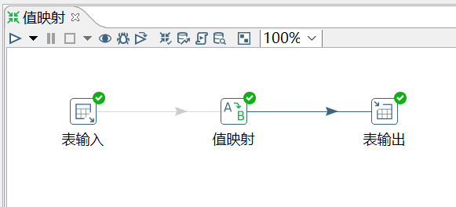
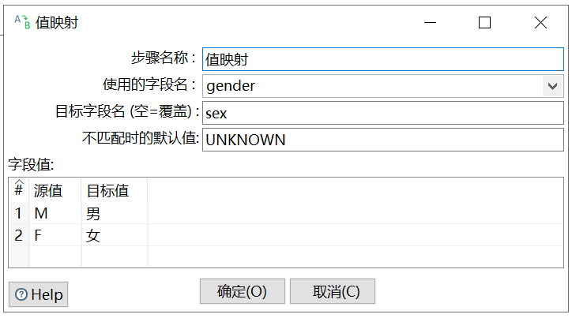

# 值映射

功能：把字段的一个值映射成其他的值。在数据质量规范上使用非常多，比如很多系统对应性别 sex 字段的定义不同。所以我们需要利用此控件，将同一个字段的不同的值，映射转换成我们需要的值。

需求：将表 employees_bk2 的 gender 字段，映射成男女。

```sql
mysql> select * from employees_bk2;
+--------+------------------+--------+
| emp_no | name             | gender |
+--------+------------------+--------+
|  10001 | Georgi Facello   | M      |
|  10002 | Bezalel Simmel   | F      |
|  10005 | Kyoichi Maliniak | M      |
|  10006 | Anneke Preusig   | F      |
|  10009 | Georgi Facello   | M      |
+--------+------------------+--------+
5 rows in set (0.00 sec)
```

操作过程：





`使用的字段名`：要进行操作的字段。

`目标字段名`：值映射后，添加的新的一列的名字。不设置的话，就是不添加新列。【在输出步骤里，建表的时候，语句会自动生成新列。】

`不匹配时的默认值`：为源值不为空，但没有匹配的目标值的情况下，定义一个默认值。

`源值`：是输入步骤里的字段值。

`目标值`：是要替换的值。

查看结果：

```sql
mysql> select * from employees_bk3;
+--------+------------------+--------+------+
| emp_no | name             | gender | sex  |
+--------+------------------+--------+------+
|  10001 | Georgi Facello   | M      | 男   |
|  10002 | Bezalel Simmel   | F      | 女   |
|  10005 | Kyoichi Maliniak | M      | 男   |
|  10006 | Anneke Preusig   | F      | 女   |
|  10009 | Georgi Facello   | M      | 男   |
+--------+------------------+--------+------+
5 rows in set (0.01 sec)
```