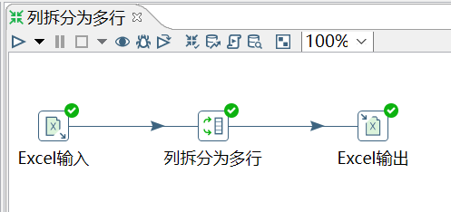
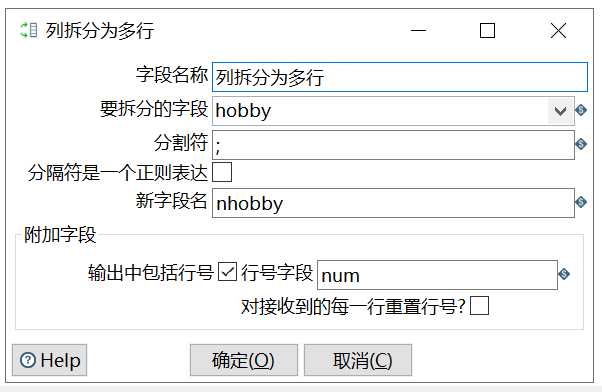

# 列拆分为多行

功能：把指定字段按指定分隔符进行拆分为多行，然后其他字段直接复制。

需求：对 08_列拆分为多行.xlsx 的数据按照 hobby 字段进行拆分为多行，然后将新数据输出到 excel 文件中，查看数据。

输入：

	id	name	   age	hobby
	1	zhangsan   20	baseball;basketball;football;pingpang
	2	lisi	   25	basketball;football;baseball
	3	wangwu	   24	football;baseball
	4	zhaoliu	   26	basketball

操作过程：

查看结果：

	id	name	    age	 nhobby	    num
	1	zhangsan	20	 baseball	1
	1	zhangsan	20	 basketball	2
	1	zhangsan	20	 football	3
	1	zhangsan	20	 pingpang	4
	2	lisi	    25	 basketball	5
	2	lisi	    25	 football	6
	2	lisi	    25	 baseball	7
	3	wangwu	    24	 football	8
	3	wangwu	    24	 baseball	9
	4	zhaoliu	    26	 basketball	10
