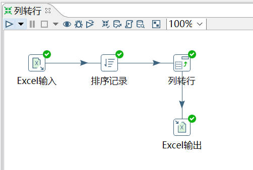
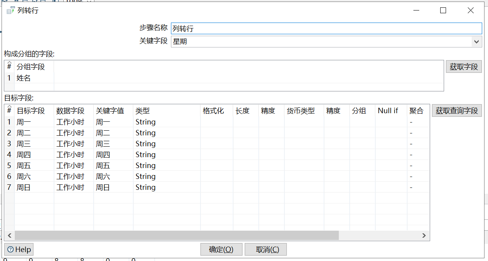

# 列转行

功能：如果数据一列有相同的值，按照指定的字段，将其中一列的字段内容变成不同的列，然后把多行数据转换为一行数据的过程。

注意：列转行之前数据流必须按照分组字段进行排序，否则数据会错乱！

需求：将 10_列转行.xlsx 的数据进行列转行。

输入：

	姓名	  星期	工作小时
	张三	  周一	8
	李四	  周一	8
	张三	  周二	9
	李四	  周二	9
	张三	  周三	9
	李四	  周三	9
	张三	  周四	8
	李四	  周四	8
	张三	  周五	8
	李四	  周五	8
	张三  周六	0
	李四	  周六	3
	张三	  周日	0
	李四	  周日	3

操作过程：

1． 关键字段：从数据内容变成列名的字段

2． 分组字段：列转行，转变以后的分组字段

3． 目标字段：增加的列的列名字段

4． 数据字段：目标字段的数据字段

5． 关键字值：数据字段查询时的关键字，也可以理解为 key

6． 类型：要给目标字段设置合适的类型，否则会报错

注意：转换前后的字段名称

查看输出：

	姓名	   周一  周二  周三  周四  周五  周六  周日
	张三      8     9	   9	  8	   8	 0	  0
	李四	    8	  9	   9	  8	   8	 3	  3
