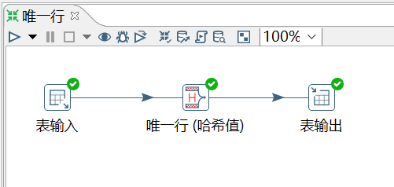
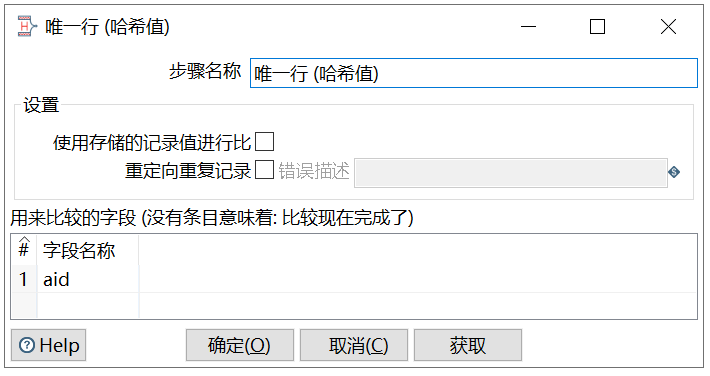

# 唯一行（哈希值）

功能：删除数据流重复的行。

此控件的效果和（排序记录+去除重复记录）的效果是一样的，但是实现的原理不同。

排序记录+去除重复记录对比的是每两行之间的数据，而唯一行（哈希值）是给每一行的数据建立哈希值，通过哈希值来比较数据是否重复，因此唯一行（哈希值）去重效率比较高，也更建议大家使用。

需求：对表 access_log_bk，按照 aid 字段去重。


```sql
mysql> select * from access_log_bk;
+-----+---------+-------+------------+
| aid | site_id | count | date       |
+-----+---------+-------+------------+
|   1 |       1 |     3 | 2016-05-10 |
|   2 |       3 |     2 | 2016-05-13 |
|   3 |       1 |     5 | 2016-05-14 |
|   4 |       2 |     4 | 2016-05-14 |
|   5 |       5 |     4 | 2016-05-14 |
|   6 |       5 |     5 | 2016-05-12 |
|   6 |       5 |     5 | 2016-05-12 |
+-----+---------+-------+------------+
7 rows in set (0.00 sec)
```

操作过程：





`使用存储的记录值进行比`：可在内存中为每条记录存储所选字段的值。存储行值需要更多内存，但如果存在散列冲突，它可以防止可能的false positives。

`重定向重复记录`：可将重复的行作为错误处理，并将它们重定向到步骤的错误流。如果不选择此选项，重复的行将被删除。

查看结果：

```sql
mysql> select * from access_log_bk2;           
+------+---------+-------+
| aid  | site_id | count |
+------+---------+-------+
|    1 |       1 |     3 |
|    2 |       3 |     2 |
|    3 |       1 |     5 |
|    4 |       2 |     4 |
|    5 |       5 |     4 |
|    6 |       5 |     5 |
+------+---------+-------+
12 rows in set (0.01 sec)
```