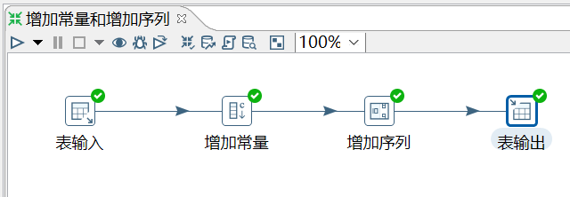
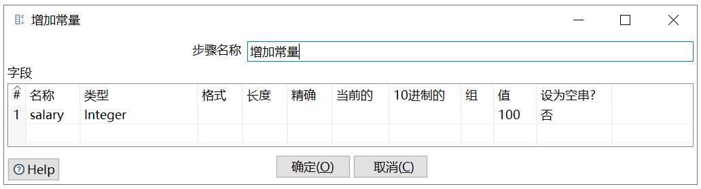
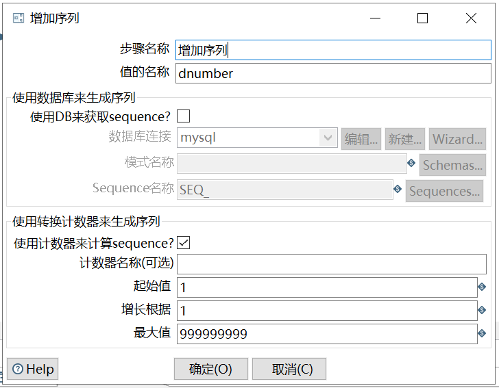

# 增加常量&增加序列

功能：

增加常量就是在本身的数据流里面添加一列数据，该列的数据都是相同的值。

增加序列是给数据流添加一个序列字段，可以自定义该序列字段的递增步长。

需求：给表 employees_bk2 的数据加一列固定值 salary 和一个递增的 dnumber 序列。

```sql
mysql> select * from employees_bk2;
+--------+------------------+--------+
| emp_no | name             | gender |
+--------+------------------+--------+
|  10001 | Georgi Facello   | M      |
|  10002 | Bezalel Simmel   | F      |
|  10005 | Kyoichi Maliniak | M      |
|  10006 | Anneke Preusig   | F      |
|  10009 | Georgi Facello   | M      |
+--------+------------------+--------+
5 rows in set (0.00 sec)
```

操作过程：







`增长根据`：是增长步长。

查看结果：

```sql
mysql> select * from employees_bk3;
+--------+--------+------------------+--------+---------+
| emp_no | gender | name             | salary | dnumber |
+--------+--------+------------------+--------+---------+
|  10001 | M      | Georgi Facello   |    100 |       1 |
|  10002 | F      | Bezalel Simmel   |    100 |       2 |
|  10005 | M      | Kyoichi Maliniak |    100 |       3 |
|  10006 | F      | Anneke Preusig   |    100 |       4 |
|  10009 | M      | Georgi Facello   |    100 |       5 |
+--------+--------+------
```