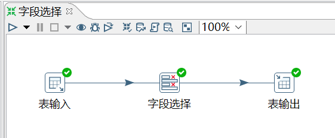
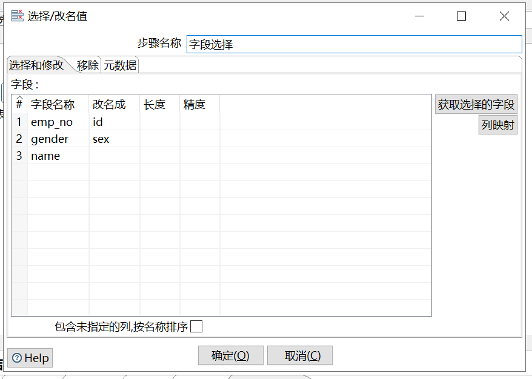
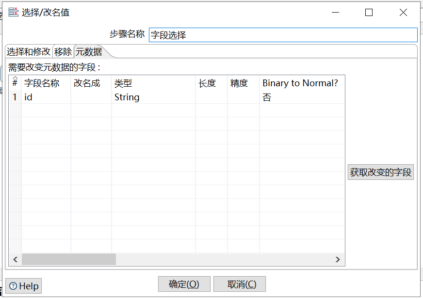

# 字段选择

功能：从数据流中选择字段、改变其名称、修改其数据类型。

需求：将 employees_bk2 表的 emp_no 改为 id，且类型改为 String，gender 改为 sex。

```sql
mysql> select * from employees_bk2;
+--------+------------------+--------+
| emp_no | name             | gender |
+--------+------------------+--------+
|  10001 | Georgi Facello   | M      |
|  10002 | Bezalel Simmel   | F      |
|  10005 | Kyoichi Maliniak | M      |
|  10006 | Anneke Preusig   | F      |
|  10009 | Georgi Facello   | M      |
+--------+------------------+--------+
5 rows in set (0.00 sec)
```

操作过程：







注意：在`选择和修改`页改名后，在`元数据`页选择的列名要是修改后的列名。要在`选择和修改`页把字段都获取后，在再后面的页面进行修改。


查看结果：

```sql
mysql> select * from employees_bk3;
+-------+------+------------------+
| id    | sex  | name             |
+-------+------+------------------+
| 10001 | M    | Georgi Facello   |
| 10002 | F    | Bezalel Simmel   |
| 10005 | M    | Kyoichi Maliniak |
| 10006 | F    | Anneke Preusig   |
| 10009 | M    | Georgi Facello   |
+-------+------+------------------+
5 rows in set (0.01 sec)

mysql> desc employees_bk3;
+-------+-------------+------+-----+---------+-------+
| Field | Type        | Null | Key | Default | Extra |
+-------+-------------+------+-----+---------+-------+
| id    | varchar(9)  | YES  |     | NULL    |       |
| sex   | varchar(10) | YES  |     | NULL    |       |
| name  | varchar(50) | YES  |     | NULL    |       |
+-------+-------------+------+-----+---------+-------+
3 rows in set (0.00 sec)
```

