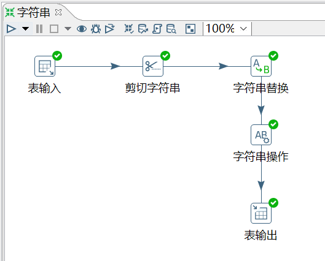
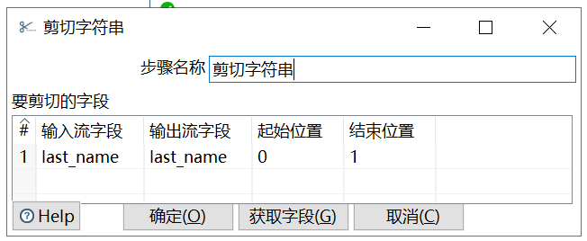
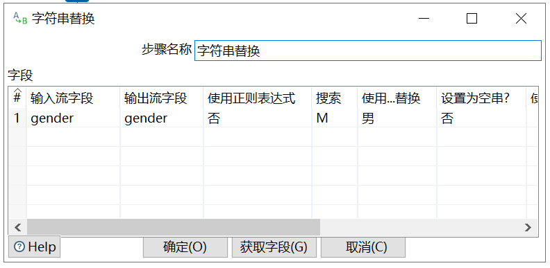
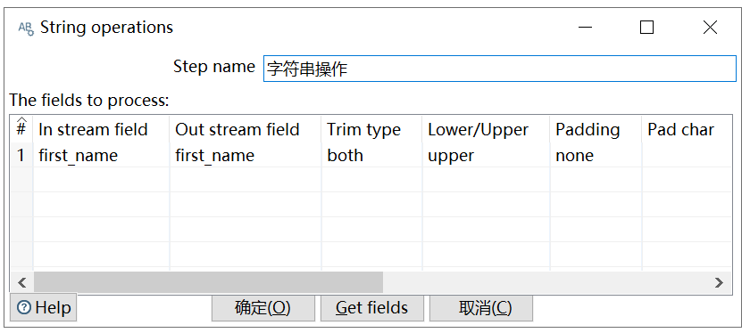

# 字符串剪切&替换&操作

功能：

- 剪切字符串：指定输入流字段裁剪的位置剪切出新的字段。

- 字符串替换：指定搜索内容和替换内容，如果输入流的字段匹配上搜索内容就进行替换生成新字段。

- 字符串操作：去除字符串两端的空格和大小写切换，并生成新的字段。

需求：对表 employees_bk，取 last_name 的首字母，将 gender 的 M 替换成 男，将 first_name 全变成大写。

```sql
mysql> select * from employees_bk;
+--------+------------------+--------+
| emp_no | name             | gender |
+--------+------------------+--------+
|  10001 | Georgi Facello   | M      |
|  10002 | Bezalel Simmel   | F      |
|  10005 | Kyoichi Maliniak | M      |
|  10006 | Anneke Preusig   | F      |
|  10009 | Georgi Facello   | M      |
+--------+------------------+--------+
5 rows in set (0.00 sec)
```

操作过程：









查看结果：

```sql
mysql> select * from employees_bk3;
+--------+-----------+--------+------------+
| emp_no | last_name | gender | first_name |
+--------+-----------+--------+------------+
|  10001 | F         | 男     | GEORGI     |
|  10002 | S         | F      | BEZALEL    |
|  10005 | M         | 男     | KYOICHI    |
|  10006 | P         | F      | ANNEKE     |
|  10009 | F         | 男     | GEORGI     |
+--------+-----------+--------+------------+
5 rows in set (0.00 sec)

```