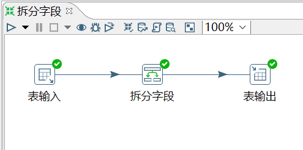
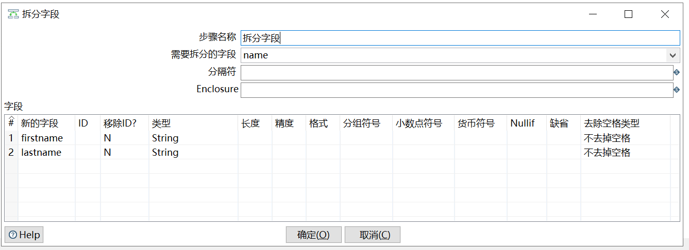

# 拆分字段

功能：把字段按照分隔符拆分成两个或多个字段。需要注意的是，字段拆分以后，原字段就会从数据流中消失。

需求：对表 employees_bk2，将 name 字段拆成 和。


```sql
mysql> select * from employees_bk2;
+--------+------------------+--------+
| emp_no | name             | gender |
+--------+------------------+--------+
|  10001 | Georgi Facello   | M      |
|  10002 | Bezalel Simmel   | F      |
|  10005 | Kyoichi Maliniak | M      |
|  10006 | Anneke Preusig   | F      |
|  10009 | Georgi Facello   | M      |
+--------+------------------+--------+
5 rows in set (0.00 sec)
```

操作过程：





`分隔符`：通过这个分隔符，拆分原字段。

参考官网的两个示例：

	Example 1

	SALES_VALUES field containing: "500,300,200,100"

	Use these settings to split the field into four new fields:
	•Delimiter: ,
	•Field: SALES1, SALES2, SALES3, SALES4
	•Id:
	•remove ID no, no, no, no
	•type: Number, Number, Number, Number
	•format: ###.##, ###.##, ###.##, ###.##
	•group:
	•decimal: .
	•currency:
	•length: 3, 3, 3, 3
	•precision: 0, 0, 0, 0

	-----------------------------

	Example 2

	SALES_VALUES field containing "Sales2=310.50, Sales4=150.23"

	Use these settings to split the field into four new fields:
	•Delimiter: ,
	•Field: SALES1, SALES2, SALES3, SALES4
	•Id: Sales1=, Sales2=, Sales3=, Sales4=
	•remove ID yes, yes, yes, yes
	•type: Number, Number, Number, Number
	•format: ###.##, ###.##, ###.##, ###.##
	•group:
	•decimal: .
	•currency:
	•length: 7, 7, 7, 7
	•precision: 2, 2, 2, 2


查看结果：

```sql
mysql> select * from employees_bk3;
+--------+--------+-----------+----------+
| emp_no | gender | firstname | lastname |
+--------+--------+-----------+----------+
|  10001 | M      | Georgi    | Facello  |
|  10002 | F      | Bezalel   | Simmel   |
|  10005 | M      | Kyoichi   | Maliniak |
|  10006 | F      | Anneke    | Preusig  |
|  10009 | M      | Georgi    | Facello  |
+--------+--------+-----------+----------+
5 rows in set (0.00 sec)
```